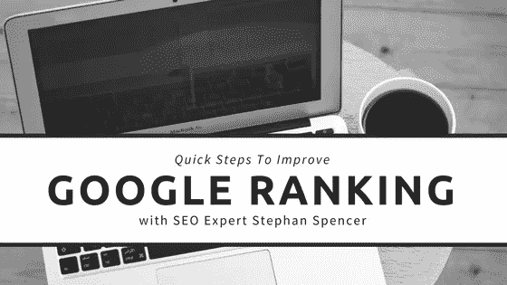

# 斯蒂芬·斯潘塞的搜索引擎优化技巧:注重结果，而不是活动

> 原文：<https://medium.com/swlh/stephan-spencers-seo-tip-be-outcome-focused-not-activity-focused-5eb5e0b188ad>

SEO

还记得你在学校的时候，你的老师非常疲惫，他们给你“繁忙的工作”去做吗？这项工作没有多大意义，没有产生任何结果。

尽管我们尽了最大努力，但当涉及到搜索引擎优化工作时，我们可能会因为做这种“繁忙的工作”而感到内疚。

谢天谢地，斯蒂芬·斯潘塞——杰出的营销大师——和我聊了聊如何做注重结果的 SEO 工作。换句话说，遵循他的建议，你花在搜索引擎优化上的时间将会真正产生效果，比如提高你的排名。

# 确保你关注结果而不是活动的三种方法

你从事 SEO 工作的目标永远不应该是忙碌的工作。换句话说，你希望[专注于能给你带来结果](https://www.amazon.com/Art-SEO-Theory-Practice/dp/1449304214)或巨大成果的工作。这里有三种简单的方法可以做到这一点。

# 1.为 SEO 和人类写好的、有思想的内容

Stephan 提出了一个关于写作内容的非常好的观点。他说:“你为人类创造的东西应该对 SEO 有好处，你为 SEO 创造的东西应该对人类有好处。”有道理，不是吗？

然而，我们中的很多人都过于关注我们的文章中有多少关键词，以及我们可以添加多少关键词的变体。

斯蒂芬的建议是:不要太担心你使用的[关键词](http://www.magnificent.com/magnificent-stuff/seo-keyword-brainstorming)的数量——担心你在哪里以及如何使用它们。

这意味着确保你的内容易于阅读，并且充满有用的信息。这也意味着你需要让你的读者马上知道[你的内容是关于](https://www.magnificent.com/magnificent-stuff/a-strategy-to-move-content-just-as-important-as-creating-content)的。

例如，Stephan 指出，如果你写一个关于蓝色小部件的页面，如果你在第一段谈论蓝色小部件，它会排名更好，而不是等到最后一段才提到它们。犯这个错误就像说，“哦，我忘了告诉你——这一整页都是关于蓝色小部件的。”

# 2.不要只在标题中使用关键词

Stephan 的另一个关键词提示与你的页面标题和关键词有关。

很多人真的很关心 H1 标题标签和使用焦点关键词。这可能是有用的，只要你在博客的其余部分使用关键词时考虑周全。

让我们回到蓝色小部件的例子。

如果你的标题使用 H1 标签，给它添加一个关键词，但是不要在页面的其他地方添加这个关键词，它看起来并不像你在标题中声称的那样。

相反，看起来你做了一点点搜索引擎优化，并认为，“哦，我想在那里工作一个额外的关键字。我希望我能排名第一。我会把它放在标题标签中最重要的地方。”但是，如果页面上没有提到这个词，甚至没有提到这个词的同义词，你就不太可能在这个关键词上排名很高。

所以是的——标题是放置关键词的最重要的地方，但是你必须确保你在页面的上下文中再次使用关键词。

# 3.在你的网站上一页一页地链接——但是要深思熟虑

在主页上，您应该链接到您最重要的服务、产品、登录页面和文章。

但是你想把这些链接有策略地放在你的页面上。

许多网站所有者在他们主页的底部放上其他页面的链接，列出“特色页面”或“特色博客”

人们没有耐心阅读你在主页上写的所有内容。他们最终不太可能会向下滚动到底部，以了解更多关于你的信息以及你能为他们提供什么。

许多网站都犯了这样的错误:有一个主页，访问者必须一页一页地滚动，直到他们最终找到靠近页面页脚的内容。

然后内容是这样的:“欢迎来到我们的[电子邮件营销服务公司](http://www.magnificent.com/email-marketing)。我们提供电子邮件营销工具和电子邮件营销咨询，我们的电子邮件服务是最好的，如果您想获得电子邮件营销最佳实践……”等等。

然后，所有的关键字都超链接到服务页面。

这不仅读起来索然无味——人们知道它是针对搜索引擎而不是人而写的。

你的访客不是唯一不会被打动的人。[搜索引擎有算法](https://www.google.com/search/howsearchworks/algorithms/)检查这种类型的超链接和关键词填充，并惩罚做这些事情的网站。

你的目标应该是让你的网站访问者尽可能地感到有趣和简单。在页面顶部的某个地方，有一些图像，人们可以将鼠标悬停在上面并点击进入服务页面。

虽然为了 SEO 的目的改变图片的 alt 属性很重要，但是当涉及到搜索引擎排名时，文本链接甚至更重要。

一个文本链接和一个有用的图片看起来像是你的网站是为人类设计的——而不仅仅是搜索引擎。例如，把你漂亮的小图片和文字“我们的电子邮件营销服务”放在一起

# 专注于基于结果的唾手可得的果实，而不是繁忙的工作

很容易被[提高你的 SEO 努力](http://www.magnificent.com/magnificent-stuff/how-to-seo-audit-your-website-and-stay-ahead-of-the-curve)的想法淹没。似乎每天都有关于如何获得更好的排名，如何从你的网站赚更多的钱，如何吸引更多的客户和顾客的新信息。

所有这些信息会让你分心，让你专注于繁忙的工作，你可以从你的任务清单上划掉，但留给你的结果却很少。

相反，关注斯蒂芬所说的“低挂”果实——就像上面的建议——你会开始看到结果而不会感到不知所措。

***你准备好接受来自国际知名营销大师的更多有用提示了吗？然后，一定要*** [***关注斯蒂芬的推特***](https://twitter.com/sspencer?ref_src=twsrc%5Egoogle%7Ctwcamp%5Eserp%7Ctwgr%5Eauthor) ***并定期阅读他的*** [***信息丰富的博客***](https://www.stephanspencer.com/blog/) ***。***

ABOUT STEPHAN SPENCER

斯蒂芬是国际公认的搜索引擎优化专家和畅销书作家。他是奥赖利出版的《搜索引擎优化的艺术》一书的合著者，也是《谷歌搜索力量》一书的合著者。《搜索引擎优化的艺术》( The Art of SEO)现在已经出了第三版，将近 1000 页，被认为是搜索引擎优化的圣经，拥有塞斯·戈丁和谢家华等行业巨头的推荐，甚至被用作大学的教科书。

Stephan 于 1995 年创建了 [Netconcepts](http://www.netconcepts.com/) ，并将其发展成为一家跨国搜索引擎优化机构，然后在 2010 年将其出售给付费和有机搜索软件/服务机构 Covario，Covario 在 2014 年被广告代理集团电通 Aegis 收购。Stephan 发明了一种名为 GravityStream 的按绩效付费的 SEO 技术，该技术也被收购，现在是 Rio SEO 的一部分。在 2010 年完成挣得后，Stephan 继续在在线营销、电子商务和 SEO 领域担任备受追捧的 SEO 和数字战略顾问。他收购后的客户包括 Zappos、索尼商店、Quiksilver、Best Buy Canada、Bed Bath & Beyond 和香奈儿等等。

史蒂芬已经在无数的互联网营销活动中发表过演讲，包括所有主要的搜索和电子商务会议(SES，SMX，PubCon，互联网零售商，Shop.org，eTail 等。).他曾为《赫芬顿邮报》、《多渠道商人》、《实用电子商务》、《搜索引擎天地》、《DM 新闻》和《营销利润》等杂志撰稿。

Stephan 还是为期三天的 SEO 研讨会[交通控制](http://trafficcontrol.co/)的创始人，与联合创始人克里斯·琼斯(Kris Jones)共同创建了为期三天的专业发展研讨会[激情转化为利润](http://www.passionsintoprofits.com/)，并主持了两个播客节目[优化极客](http://www.optimizedgeek.com/)和[营销演讲](http://www.marketingspeak.com/)。

Stephan 是 Impact Network 的董事会成员，Impact Network 是一个 501c3 非营利组织，在赞比亚建设和运营学校。

他拥有威斯康星大学麦迪逊分校的生物化学硕士学位。

如果您在内容营销、视频营销或社交媒体广告(lead gen 和/或电子商务)方面需要任何帮助，请随时联系 David@Magnificent.com Gregory Marketing 的 David Reimherr。

## 这篇文章发表在 [The Startup](https://medium.com/swlh) 上，这是 Medium 最大的创业刊物，拥有+422，678 名读者。

## 在此订阅接收[我们的头条新闻](https://growthsupply.com/the-startup-newsletter/)。

