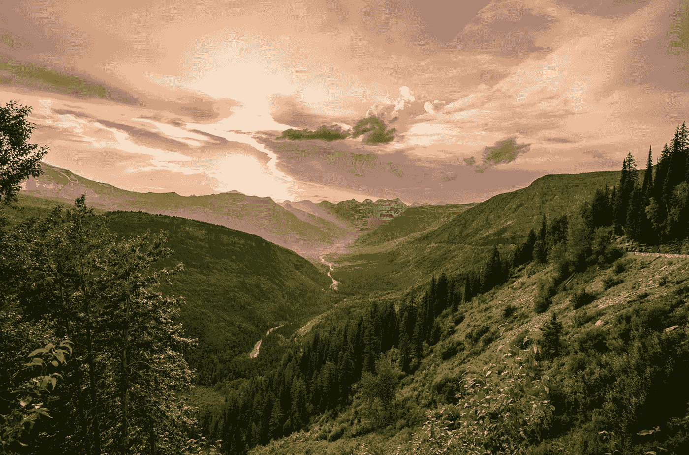

# 穿越光:走向健康的迷幻之旅

> 原文：<https://medium.com/swlh/stepping-through-light-a-psychedelic-journey-toward-health-99561a982f54>

Photo by [Tony Reid](https://unsplash.com/photos/UMJUr3st0AE?utm_source=unsplash&utm_medium=referral&utm_content=creditCopyText) on [Unsplash](https://unsplash.com/search/photos/surreal?utm_source=unsplash&utm_medium=referral&utm_content=creditCopyText)

五月标志着我开始停止服用治疗躁郁症的药物已经五个月了。快六岁了:那是圣诞节，我和男朋友去哥斯达黎加短暂度假，我决定停止服用已经服用了七年的情绪稳定剂和抗焦虑药物。我想要一种更好的生活方式。药物让我走上了这条路，但我觉得我已经准备好去看看…