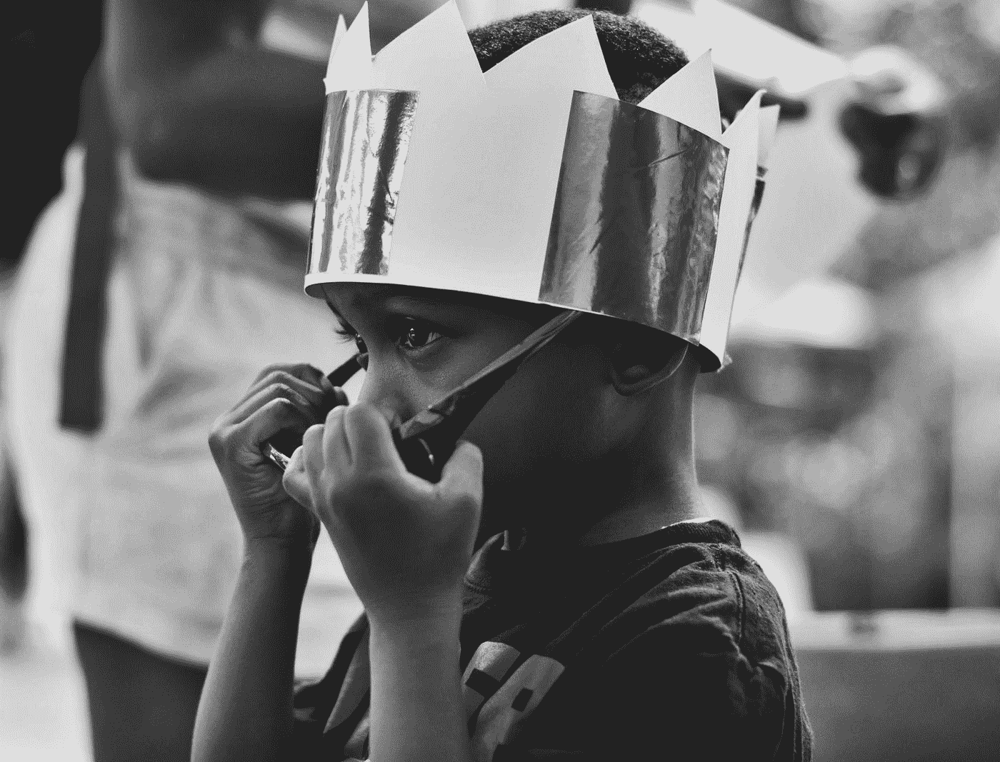

# 还觉得内容为王？你错了(有点)

> 原文：<https://medium.com/swlh/still-think-content-is-king-youre-wrong-kind-of-a0d49b23a6ff>

Photo by [Valario Davis](https://unsplash.com/@valario_davis?utm_source=medium&utm_medium=referral) on [Unsplash](https://unsplash.com?utm_source=medium&utm_medium=referral)

从互联网的早期开始，当我忙于建立报纸网站时，我只配备了一个 14k 的调制解调器和一本为傻瓜准备的常用 HTML】，我听到了“内容为王”这句话，好像它是所有已知在线营销问题的解决方案。

我非常相信内容营销的力量。伟大的内容应该是基础…