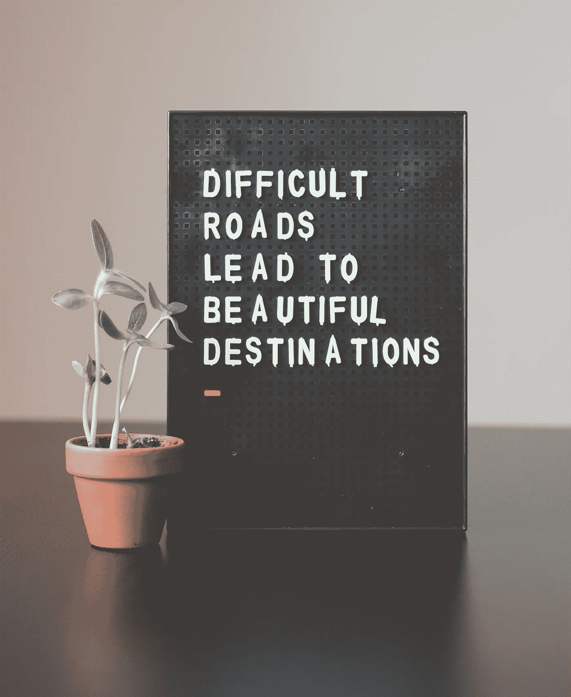
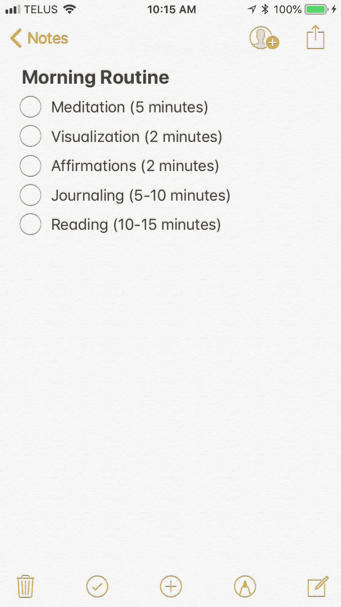
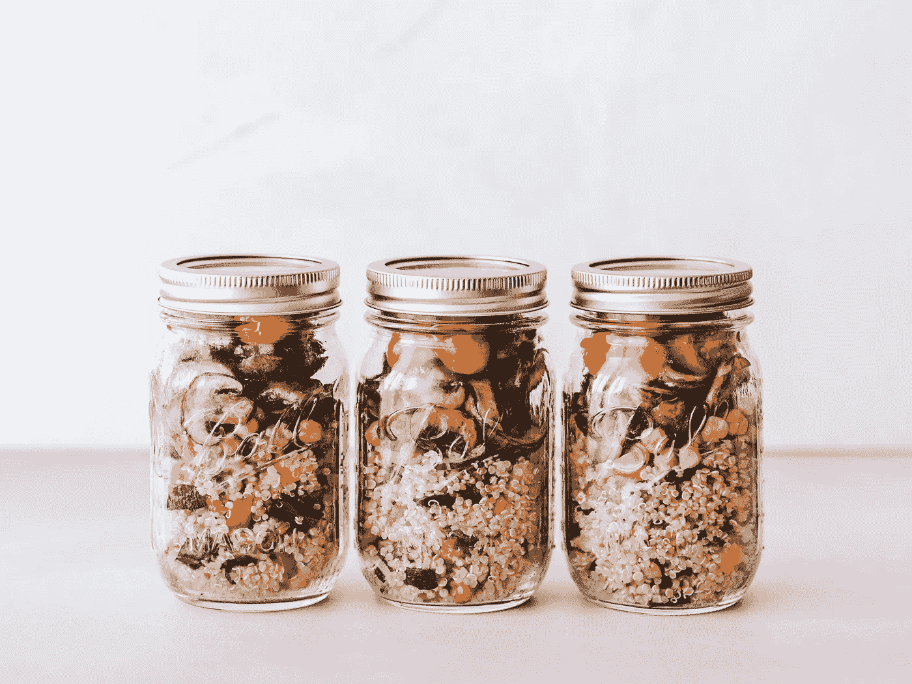

# 停止懒惰:用自律创造更多自由的 10 种方法

> 原文：<https://medium.com/swlh/stop-being-lazy-10-ways-to-create-more-freedom-using-self-discipline-d608834b1419>

Photo by [Bryan Minear](https://unsplash.com/@bryanminear?utm_source=unsplash&utm_medium=referral&utm_content=creditCopyText) on [Unsplash](https://unsplash.com/search/photos/inspiration?utm_source=unsplash&utm_medium=referral&utm_content=creditCopyText)

## 不要再做坏习惯的奴隶，去追求你应得的生活吧

> “自由源于自律。没有自我控制，任何个人、任何国家都无法实现或保持自由。不守纪律的人是自己弱点的奴隶。”~艾伦·瓦伦丁

我一生的大部分时间都在反抗权威，反抗自己，反抗这个世界。我想可以肯定地说，我对自由选择的需求是我最主要的品质之一。

我花了几年时间试图养成计划我一天的习惯，创建待办事项清单，并遵循严格的惯例。

不幸的是，我在所有这些事情都受到限制的借口下失败了。

我们花了太多的时间试图找出如何获得成功。一个健康目标，一个财务目标，一个个人目标…如此多的目标，然而 99%的时间我们都无法实现。

我们失败是因为事情变得势不可挡，我们失去了动力，我们没有做困难的事情所需要的纪律。

当我没有坚持我的目标时，我经常使用的借口是，我宁愿“自由”，而不是被单调的日常活动所束缚，这些活动是实现我想要实现的事情所必需的。

*这是一种错觉，让我告诉你为什么。*

Photo by [Ian Schneider](https://unsplash.com/@goian?utm_source=unsplash&utm_medium=referral&utm_content=creditCopyText) on [Unsplash](https://unsplash.com/search/photos/inspiring?utm_source=unsplash&utm_medium=referral&utm_content=creditCopyText)

在你读完下面的两个场景后，我希望你思考哪一个会带来更多的自由。

## 场景 1:

你想早点醒来。你讨厌别人告诉你该做什么(甚至是你自己)，结果你打了 6 次瞌睡。你最终会在需要上班前 30 分钟醒来。

你想开始一个营养计划，但你没有时间随身携带一份美味的早餐。

你匆忙走出房子，思绪万千，希望自己没有忘记任何东西。

从技术上来说，你是在“自由地”生活。你在做你此刻的感觉，而不是按照你的计划去做。

你没有让自己早起，也没有提前计划，因为这些事情需要自律，对吗？

## 场景 2:

你想早点醒来，这样你就能在闹钟第一声响起时醒来。这感觉像是一件苦差事，但是你在早上获得了额外的一个小时的“自由时间”。

你想开始一个营养计划，幸运的是前一天晚上花时间准备了一点食物。你已经成功地打包了一天需要的所有东西，还剩下 45 分钟。

你带着一本好书和一杯咖啡慢慢开始你的早晨。你有时间计划你的一天，甚至在工作前淋浴。

从技术上来说，你生活得更有规律了。你在让自己做你并不真正*想要*做的事情，但是你在你的早晨和一天中创造了更多的自由。

> 只有受过训练的人才是真正自由的。不守纪律的人是情绪、欲望和激情的奴隶。“~斯蒂芬·科维，第 8 个习惯

Photo by [Hello I’m Nik 🇬🇧](https://unsplash.com/@helloimnik?utm_source=unsplash&utm_medium=referral&utm_content=creditCopyText) on [Unsplash](https://unsplash.com/search/photos/inspiration?utm_source=unsplash&utm_medium=referral&utm_content=creditCopyText)

自律是自由的最终形式。如果你没有自律，你就成了自己弱点和懒惰的奴隶。

当我不积极实践纪律时，我会变得没有动力和懒惰。

我的早晨毫无收获，经常让我“赶着”过一天。

当我晚上回到家的时候，我已经落后了，压力很大。我行使我的“自由”,看几个小时无聊的电视，同时浏览社交媒体，以忘记我度过的糟糕的一天。

***你能联想到吗？***

如果可以，你就不自由。你生活在幻觉中。

掌控自己是你能做的最困难却最有意义的事情之一。正如教练兼顾问哈维·多夫曼曾经说过的:

> “自律是自由的一种形式。免于懒惰和昏睡，免于他人的期望和要求，免于软弱、恐惧和怀疑。自律让投手感受到自己的个性、内在力量和天赋。他是自己思想和情感的主人，而不是奴隶。”

**你想成为你思想和情感的奴隶吗？**

如果你和我一样，你的答案很可能是否定的。没有什么比感觉自己是自己糟糕习惯和借口的奴隶更糟糕的了。

相反，我想挑战你，让你以不同的方式思考实施和坚持自律的常规。

Photo by [Zac Durant](https://unsplash.com/@zacdurant?utm_source=unsplash&utm_medium=referral&utm_content=creditCopyText) on [Unsplash](https://unsplash.com/search/photos/inspiration?utm_source=unsplash&utm_medium=referral&utm_content=creditCopyText)

# 用自律创造更多自由的 10 种方法

## 1.早点醒来

这是一个显而易见的。如果你想给自己创造更多的自由，你需要在一天中创造更多的时间。没有什么比在你需要睡觉的时候醒来更没有效率和没有动力的了。

给自己创造时间醒来，做一些能确保你赢得一天的事情。

小贴士:试着比正常时间早 15 分钟起床。在接下来的几周里，你可以坚持锻炼一个小时或更多。

## 2.养成早晨的习惯

晨练现在风靡一时是有原因的。如果你读过哈尔·埃尔罗德的书《奇迹的早晨》,你会发现成千上万的成功故事和例子，这些人通过早起改变了他们的一生。

> “为了达到你从未达到过的成功水平，你必须在你从未达到过的水平上投入。”—哈尔·埃尔罗德,《奇迹的早晨》

在我个人的早晨惯例中，我留出 20-30 分钟做以下事情:

如果我有时间，我也会优先锻炼和写作。

***提示:形成让你每天早上兴奋醒来的晨间作息。也许这意味着设置你最喜欢的香味蜡烛或者设计一个新的阅读角。或者你可能会买一本新书或杂志。任何能激励你觉醒和投入的事情！***

## 3.锻炼

去年夏天，我和我的健身房玩了一把。我们只在晚上见面，我爱上了这种惯例。我觉得很有效率，很棒。今年夏天更棒了。我一直致力于在上班前早起去健身房，或者在午餐时间去。这让我的夜晚更加开放，我从未感觉如此自由。

留出时间活动身体会让你感到富有成效和动力。我强烈建议你在白天的某个时候完成锻炼，这样你回家时会感觉很有成就感，并准备好迎接晚上的锻炼。

***提示:从每天 30 分钟开始。这可以在家里、健身房或室外进行！把它安排在一个你每周能投入 5 天或更多时间的时间里。***

## 4.避免坐在电视机前

大多数人认为每天晚上有空闲时间坐在电视机前就等于自由，但事实恰恰相反。你有过除了时间什么都没有的自由之夜吗？你是怎么用的？

你学过那门课程吗？
忙你的事？
写？
阅读？
学？

如果你两年前问我这个问题，我会告诉你我每晚花大约 3-4 个小时看电视。

想想你所拥有的所有机会，来改善你自己的环境，为你自己创造更好的生活！相反，我们成了注意力分散的奴隶。

提示:只花 30-45 分钟看电视(或一集你最喜欢的节目),作为在晚上做一些有成效的事情的奖励。

## 5.花更少的时间在社交媒体上

除非你的工作是社交媒体分析师，否则你没有理由用滚动图表来打发时间。我陷入了一个恶性循环，不停地滚动，希望能找到刺激我思维的东西。

研究表明，社交媒体会释放多巴胺，让我们感觉良好。这是一个不应该每 30 分钟出现一次的浅高。

相反，给自己定个规则，只有完成了一天中最大的任务，你才能查看社交网站。

***提示:醒来后不要马上查看社交媒体。允许自己在早上、下午和晚上活动的间隙检查它(每天 3 次)。每次不应超过 5 分钟。哦，别忘了关掉你的通知！***

Photo by [Carl Heyerdahl](https://unsplash.com/@carlheyerdahl?utm_source=unsplash&utm_medium=referral&utm_content=creditCopyText) on [Unsplash](https://unsplash.com/search/photos/inspiration?utm_source=unsplash&utm_medium=referral&utm_content=creditCopyText)

## 6.指定你打扫房子的日子

有没有陷入忙碌的忙碌中？这很容易上瘾，也是拖延你应该做的事情的一个非常聪明的方法。

在大学里，我曾经在翻开课本前必须确保我的整个公寓一尘不染。为什么？因为我想在开始工作前尽可能等久一点。就在期末考试的时候，我的公寓一尘不染，但我的成绩受到了影响。

小贴士:每周选择一两天做一些事情，比如吸尘、洗衣服或者打扫浴室。对我来说，这是每周五晚上下班回家后。整个星期我都喜欢保持东西整洁，但我每天花在整理上的时间不会超过 15-20 分钟，除非是我的清洁日。

## 7.指定你去杂货店购物的日子

你知道去杂货店实际上要花多少时间吗？尤其是如果你每周去那里跑 2-5 次的话。

相反，我希望你每周指定一天去杂货店。对我来说，最理想的一天是星期天。我在去给我新买的东西腾出空间之前清理了我的冰箱，我感觉我在我的一周之上。

***小贴士:在一周开始的时候，在你的手机上列出你需要的东西。到这个周末，你会有一个需要挑选的食品杂货和家居用品的完整清单。***

## 8.膳食准备

除了每周周日的杂货店之外，我还会在周日和周三准备晚餐。这是清理我的冰箱并开始做饭的绝佳机会。我做饭的一些事情是:

1.  燕麦片
2.  大米，土豆，红薯，蒸粗麦粉
3.  鸡肉
4.  猪腰肉
5.  vegetables 蔬菜
6.  蛋

我想知道我所有的饭菜都是为这一周准备的，我不必每天晚上都做饭。我和其他人一样喜欢做一顿新鲜的晚餐，但是当你不在家工作时，打包食物从来没有这么简单过。

如果你关心你的健康和饮食习惯，你会发现当你不必每天都做早餐、午餐和晚餐时，这是非常有效的。享受你的闲暇时光！

提示:周日做一次大规模的预习，周三做一次“小型”预习。如果这两天不适合你，选择两个不同的适合你的日子。这样，你会更清楚你需要煮多少食物，你需要买什么杂货，食物会保持新鲜。更多营养健身小贴士，头至我的[***insta gram 页面***](http://www.instagram.com/lindsiescottt) ***。***

Photo by [Ella Olsson](https://unsplash.com/@ellaolsson?utm_source=unsplash&utm_medium=referral&utm_content=creditCopyText) on [Unsplash](https://unsplash.com/search/photos/meal-prep?utm_source=unsplash&utm_medium=referral&utm_content=creditCopyText)

## 9.审核你的日子

在这两天里，我要你写下你做的每一件事以及花了多长时间。我是说所有的事情。这是一个非常好的方式来回顾你的一天，找出所有阻碍你成为你想成为的人的坏习惯。

突出所有让你离目标更远的活动和习惯，然后尝试用更好的习惯和更自律来取代它们。

例如，如果你确定你每天花 2 个小时在社交媒体上，你可以做些什么来让你更接近你的目标？

小贴士:当你写下每件事的时候，不要做任何判断。好好过你的一天，就像你不在显微镜下一样。表现得完全正常是很重要的，这样你就能识别出你正在做的一切可能对你的自由有害的事情。

## 10.加入挑战小组或在某处寻找责任

聘请教练、寻找导师或加入挑战小组是你进行可持续改变和变得更加自律的一些最有效的方法。

当我试图早点醒来的时候，我加入了一个致力于帮助那些和我有同样想法的人的在线团体。我每天早上向他们报到，他们让我负责。

一些例子可以找到:

*   一个商业教练，为你的身边奔忙
*   实现你生活目标的生活教练
*   针对你健身目标的私人教练
*   一个确保你每周去健身房 4 次的健身伙伴
*   一个写作伙伴，在这里你可以交换你的作品并进行编辑，设定最后期限并互相鼓励

你明白了。

***提示:想想你刚刚完成的个人“审核清单”。有哪些让你印象深刻的坏习惯？你想做哪些改变？有没有可能找到一个负责任的伙伴或教练来帮助你找出在某个特定领域做得更好的方法？***

Photo by [Nick Abrams](https://unsplash.com/@nbabrams?utm_source=unsplash&utm_medium=referral&utm_content=creditCopyText) on [Unsplash](https://unsplash.com/search/photos/team?utm_source=unsplash&utm_medium=referral&utm_content=creditCopyText)

# 最后

自由对你意味着什么？是否意味着成为分心的奴隶？还是意味着培养追求你想要的生活的能力？

超越你被展示的幻觉，现在就开始培养自我意识和自律。

一旦你掌握了我提供的清单，你就会成为有史以来最自由的你。记住，你不需要完美，你会失败的。只要失败*前进*，就没事。

查看我的网站[www.bylindsie.com](http://www.bylindsie.com)了解更多！

如需营养指导，请联系我在 lindsiescott@gmail.com

关于日常激励，请在 insta gram @ lindsiescott 上联系我，或者点击[这里](http://www.instagram.com/lindsiescottt)