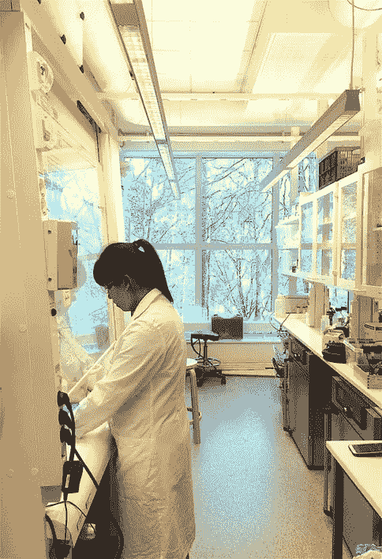

# 停止称理科生为“书呆子”🤓

> 原文：<https://medium.com/swlh/stop-calling-science-students-as-nerds-ecaa0a7d5a0d>

Photo by [Lucrezia Carnelos](https://unsplash.com/@ciabattespugnose?utm_source=unsplash&utm_medium=referral&utm_content=creditCopyText) on [Unsplash](https://unsplash.com/search/photos/study?utm_source=unsplash&utm_medium=referral&utm_content=creditCopyText)

## 有兴趣学理科的请阅读！

人们经常问我为什么决定选择化学，尤其是许多不确定职业道路的大三学生。据我观察，而且我在科学学院的许多同事也会同意，大多数人不知道被认为是科学家意味着什么**。**

好吧，我实话实说。我在学校被称为“书呆子”。我一直认真对待学校，我热爱科学。我是奶奶村的孩子，在院子里玩泥土，用一些天线、纸板和铝箔搭建“外星人探测器”😂混合随意的家庭配料来制作世界上最好的肥皂水！

> 成为一名科学家，或者渴望成为一名科学家，通常源于对我们周围世界的天然好奇心。

即使热爱科学，从事科学职业可能听起来令人生畏，这可能是许多人(或至少是新加坡人)不会考虑的。**但是为什么呢？** **怎么做才能改变这种情况？**

## 障碍 1:书呆子气

首先，我们来澄清一下书呆子污名。由于媒体的描述，许多人会从《生活大爆炸》中得出结论，科学家是一个智商超高但情商低的人，社交能力差，没有很多朋友(除了其余的书呆子)。

好吧，那我就把这个说清楚:书呆子称号是**垃圾**。

毫无疑问，有书呆子科学家。但是也有很酷的。就像任何其他职业一样，有人热爱运动，有人偏爱电影；有些是感性的，有些是理性的。

> 所有的概括都是错误的，包括这个。*😂*
> ——马克·吐温

## 障碍 2:隐形

让我猜猜看这篇文章的 95%的人不能说出 3 个或更多活着的科学家的名字。🤨

我们生活在实验室里，用我们的一生来寻找癌症的治疗方法，制造下一辆最快的汽车，或者为像我这样的人，开发未来的电池来拯救世界。✊

在现实中，作为一名科学家，你必须接受没有掌声，没有欢呼，没有尖叫。你的工作可能会被低估。你能处理好吗？

我觉得非常有必要为科学家创造能见度。允许科学家和孩子们交谈可以让他们解释为什么他们选择了这条艰难的道路，以及他们所做的将会改变世界的事情。

## **障碍 3:实用性**

人类是**务实**，没有错。从逻辑上来说，我们希望选择一个能给我们提供最好的就业机会和晋升机会的职业。

如果你有像成为百万富翁或成为公司首席执行官这样的大梦想，那么我认为成为科学家不适合你。

这是一份相当稳定的工作，收入不错，工作生活平衡。这是一项艰巨的工作，虽然很有趣，也很有回报，但科学家的薪水比不上其他高度专业化的职业。😞

## 要点 1:可转移技能

科学绝对不是那些想要回避的人的选择，只需付出最少的努力。由于其精确的性质，科学课程需要大量的预先考虑、努力和重复。

在黑与白、标准公式或理论之上，科学中还有许多灰色地带。科学的本质是不断突破界限，拒绝过去的假设，这让它充满乐趣和挑战。

因此，解决当今世界(以及未来)如此突出的问题所需的技能主要依赖于决心、承诺、效率和准确性。

## 要点 2:接受失败

科学进步是建立在失败的基础上的。在研究中，你提出一个假设，如果你不能证明它，许多人会说这是一个错误。科学家们说，“我无法反驳零假设。”

在浮华的会议和精美的演示背后，每一个新发现都是向黑暗的飞跃，在那里失败被公开讨论，韧性被鼓励。

就像企业家的世界一样，科学家应该像佩戴荣誉徽章一样佩戴他们的错误，并让其他人知道他们的研究。每个人都明白错误是创新过程的一部分。

这就是为什么我认为 stem 领域和企业家世界实际上为女性提供了很好的环境——她们通常对自己很苛刻——因为她们允许你**接受错误并继续前进。**

# 最后一次——为什么科学？

我写这篇文章的灵感是因为有人问我:你为什么选择理科？我想一劳永逸地回答这个问题。

It’s me working in the lab ^^

这是一个难题。从事科学的第一个原因是我的热情，一种永不满足的探索无法解决的问题和学习更多东西的冲动(通常学习的东西比已知的多)。我们选择科学是因为没有其他职业会付钱给我们去弄清楚世界是如何运转的。

我们知道，在大多数情况下，我们每个人的贡献都很小，但重要的是成为这一过程的一部分。如果你运气好或者真的擅长，你会大获成功，改变世界。🌎

科学也有有用的一面，与技术应用有关，与新的清洁材料和物品有关，从而改善人们的生活。

就我而言，我成为一名科学家是因为我想成为震撼世界的下一件大事的一部分，不管我扮演的角色有多小。尽管困难重重，但我认为能走到这一步并能与他人分享我一路走来所学到的东西是一种荣幸。

# 忠于自己。努力工作。但也要活下去。