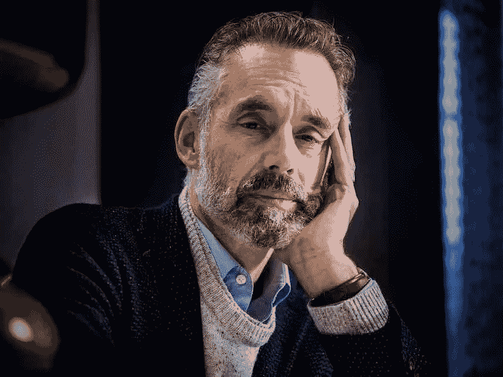

# “停止做”目标

> 原文：<https://medium.com/swlh/stop-doing-goals-a8a1ec99642f>

2019 年已经过去一半了，希望你已经朝着你的目标和抱负取得了进展。每一个新年的到来都是令人兴奋的，感觉就像是一个新的开始，通常在一年中的这个时候，我们的动力会达到前所未有的高度。

Jordan Peterson speaks extensively on what I’m about to share with you, check him out if you have some spare time!

然而，现在已经是六月了，如果我们在生活中没有取得新年伊始我们所期望的进步，我们很容易变得沮丧。