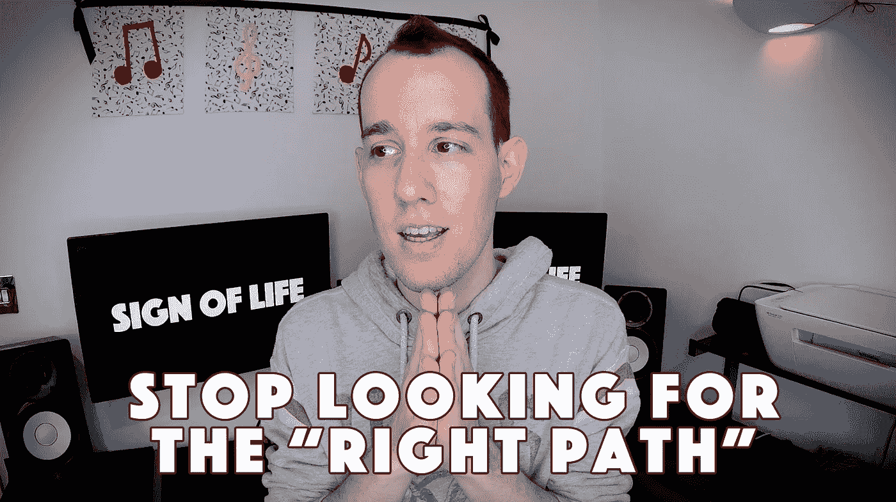

# 别找了。没有正确的道路

> 原文：<https://medium.com/swlh/stop-looking-for-it-there-is-no-right-path-bbacc5b447e9>

我们并非生来就知道所有的答案。就像稀树草原上的小狮子一样，我们依赖于亲人的支持。因此，从很小的时候起，我们的家庭就教给我们许多重要的人生课程。

随着我们的成长，我们不再仅仅依赖家庭为我们提供正确的生活答案，我们开始寻找更广泛的集体共识来帮助我们度过难关。我们相信这样做可以降低失败的风险，但事实并非如此。

**Watch my video on my Youtube channel —** [**Sign of Life**](https://www.youtube.com/channel/UC4211nC0IOB0FS6eGWM7x7g)**.**

# 原因很简单——大多数人并不总是对的。

E 即使在民主国家——如果你和大多数人一起投票，让你选择的总统或总理当选，这仍然不意味着你做出了正确的选择。流行的选择仍然只是另一种选择。不一定是适合你的。

我们往往会忘记，虽然我们是同一个部落的一部分，但我们仍然是独立的个体。我们有自己的欲望、思想、价值观、激情和信仰。
生活中什么是“对”和“错”并没有一个明确的定义。对你来说是对的，对我来说可能是错的，反之亦然。

随着我们的成长，我们获得了在生活中帮助我们的工具，**我们几乎从未被鼓励遵循个人主义的道路，**去寻找我们自己的正确答案。因此，在以后的生活中，我们甚至不知道如何或从哪里开始自己的旅程。

因此，我们倾向于跟随社会。它为我们提供了一套清晰的步骤，来完成我们寻找人生“正道”的内心愿望。以下是一些最常见的步骤:

*   去一所学校(最好是好学校)
*   取得好成绩(在“重要”的科目上——科学、数学、英语)
*   申请并上大学(最好是好大学)
*   获得巨额债务(学生贷款)
*   获得学位(能帮你找到工作的学位)完成大学学业
*   找工作(最好是报酬高的)
*   还清你的债务
*   换一份收入更高的工作(最好是有更好头衔的职位)
*   买房子
*   收购巨额债务(这次是房贷！)
*   缓慢而痛苦地偿还新债务
*   过上 10-20 年的“美好生活”(据统计为 10 年)。我很大方)
*   死亡。

# 与我们被引导去相信的不同，没有一条终极道路适合所有人。

或许上面详述的步骤对你来说是个不错的计划。这是公平的。
但是你要问问自己:
别人这么说我就觉得这是个好计划吗？我认为这是个好计划，因为这是我唯一知道的计划吗？

当我的弟弟在 15 岁的时候问自己这些问题时，他决定不再跟随。
***“我再也不去上学了，”*** 他公开宣布。自然，我的父母不高兴。但他们认为他可能会在几天内屈服。大约一个星期后，当他仍然拒绝去上学时，他们坐下来进行了一次严肃的谈话。

*“你为什么再也不想上学了？”*
- *“嗯，感觉很浪费时间。我几乎学不到任何东西，当然也学不到任何我真正感兴趣的东西，”我哥哥回答道。
*“那你有什么建议？如果你不想去上学，你必须想出一个替代方案。”**

我的父母正在努力接受我哥哥的决定。但是他接下来说的话让他们感到自豪和放心。
——*“我要自学。不过，我不打算参加任何学校考试。相反，我想申请在开放大学学习计算机科学。”*

# 他确实这么做了。

自学这门学科并不容易。但是他挺过来了。19 岁的时候，我弟弟完成了 4 年的课程，获得了学士学位。

但这对他来说还不够。他从小就对电子游戏充满热情。不像大多数孩子那样。我哥哥对那些游戏是如何开发的很感兴趣。
从写一个不同人物的故事到编码、设计。

当他 12 岁时，他开始自学如何编码。到 15 岁时，他已经开发了十几个游戏。其中一些是与来自世界各地的专业团队共同开发的。
**印象深刻**。我知道。

因此，有了新的学士学位，我哥哥准备在游戏行业找份工作。他润色了自己的简历，给几十家他个人崇拜的公司发了电子邮件和信件。这些公司大多位于国外，但这并不能阻止我哥哥。他只是想和志同道合的人一起工作，创造出令人惊叹的游戏。

# 接下来发生的事情更加不寻常

我不得不说——我持怀疑态度。我在这个世界上生活的时间比他长一点，所以我认为得到答复的可能性很小。我告诉他，大多数公司不会为一个初级程序员办理工作签证而经历漫长而昂贵的过程。

幸运的是，我完全错了。
一周之内我哥哥得到了肯定的答复。然后又是一个。然后再多几个。
*“我们很喜欢你的来信，我们想对你进行面试，看看你是否适合我们公司。”但是有一个问题:
*“然而，我们希望像往常一样进行一次面对面的采访，因为你不住在这里，我们认为这是不可能的，”他们说。**

你可能想知道我哥哥做了什么？嗯，他订了一张机票和几家酒店，付了火车票的钱，还兑换了一些外币。“我是来面试的，”他回答道。我不知道有多少人会冒这个险。
但是我哥哥做到了。毕竟，当你有了目标，没有什么能阻止你。

他有五天时间为位于三个不同城市的三家不同的公司进行三次预定的面试。长话短说，他得到了三份工作邀请。 **3/3。头奖。**

# 我可能有偏见

但是我哥哥的故事很鼓舞人心。

它告诉我们，我们每个人都有机会按照自己的选择塑造自己的生活。我们可以根据我们的价值观、激情和目标来规划一条道路。

我们也可以选择按照最流行的说法生活。但是寓意很简单:我们不需要这么做。

所以，如果你是青少年、大学生或刚毕业的学生，想想你将要采取的步骤。为自己做出正确的决定。即使你年纪大了，离最终还清抵押贷款只有几个月了，找到自己的具体答案也不会太晚。花点时间看看你一直在走的路，问问自己是否满意你的前进方向。

归根结底，从来没有一个正确的答案，也没有一条我们都必须遵循的正确道路。因为不管迄今为止你是如何生活的，也不管你对未来有什么计划，不要忘记总有另一种选择。

> 如果你读了我以前的文章(见下文)，你可能知道为什么我现在不像以前那样在 Medium 上发布了。我目前正在做一个特别的项目(不会添加到 Medium 中)，所以如果你想继续关注，请订阅 [Youtube](https://www.youtube.com/channel/UC4211nC0IOB0FS6eGWM7x7g) 或者在下面添加你的电子邮件地址:

 [## 这就是杀死灵媒的东西

### 这就是我取消会员资格的原因

medium.com](/swlh/this-is-whats-going-to-kill-medium-a41f87b3e77c) 

## 这篇文章发表在 [The Startup](https://medium.com/swlh) 上，这是 Medium 最大的创业刊物，拥有+439，678 名读者。

## 在这里订阅接收[我们的头条新闻](https://growthsupply.com/the-startup-newsletter/)。

