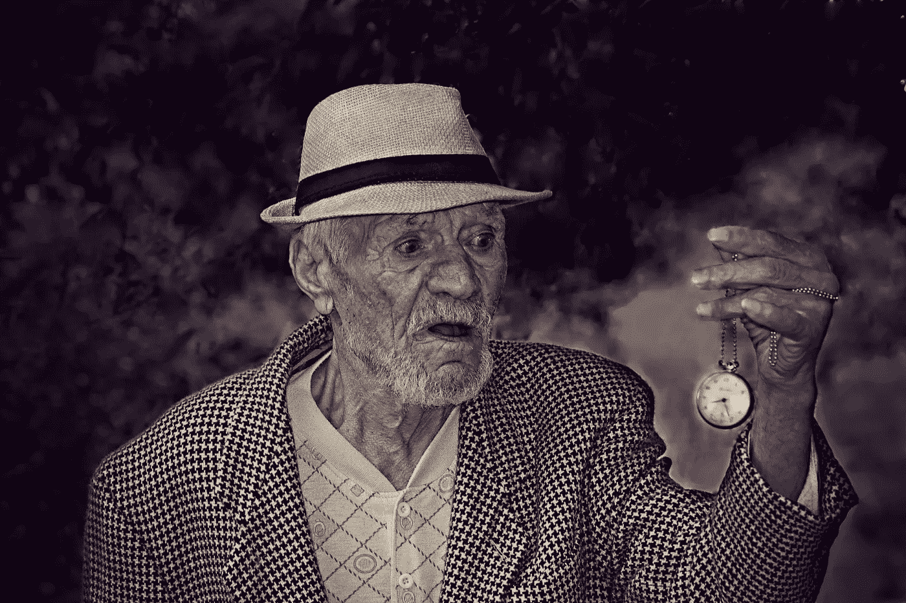

# 现在就停止管理你的时间。相反，质疑你的优先事项。

> 原文：<https://medium.com/swlh/stop-managing-your-time-right-now-question-your-priorities-instead-e52c08f9b557>

如果你活到 75 岁，你会活 27375 天。如果你 25 岁，你只剩下 18250 天了。

我们活得好像我们拥有世界上所有的时间。但事实上，时间是你拥有的最重要的资产。时间不在乎你有多富有、成功、聪明、有才华或出名。它对每个人都一视同仁。区别在于你如何对待自己的时间。

我们用钱很节俭。我们通过购买来思考。我们不会白白地施舍我们的钱。但是钱是充裕的，真正稀缺的是时间。你可以输掉 1000 美元，也可以赚回来。但是一旦你失去了时间，它就永远消失了。

> *“就像人们在财务上是亿万富翁一样，如果你的生命还剩下十亿多秒，你就是时间亿万富翁。”(十亿秒略超过 31 年)。—格雷厄姆·邓肯*

# 寻找清晰和质疑一切

> 时间管理实际上是优先级管理。

为了有意识地安排你的时间，问问你自己你正在做的事情是否真的有必要。

你这辈子可以做十亿件事。但是如果你不清楚你在生活中想要什么，你会做很多不重要的事情，然后带着遗憾回头看。

> 清晰的悖论在于，它伴随着对你不清楚的随机事物的行动。一开始，你需要尝试很多东西，才知道自己想要什么，不想要什么。

随着你变得清晰，你可以通过定期回顾你的生活来优先考虑、推迟、减少、消除或委派生活中的事情。

我见过的人们犯的两个最大的错误是，要么因为他们以前从未做过而不开始做某事，要么因为他们一直在做而不放弃某事。这两个错误都来自于对变革的抵制。

如果你想成长，想找到生活的本质，你就必须改变。改变来自于走出你的舒适区，然后回到舒适区停下来反思。

## 给你的问题

*   你可以尝试哪些你以前从未尝试过的事情，这样可以拓展你的视野？
*   你能停止做那些你从未想过不做的事吗？
*   你生活中*当前*必不可少的东西是什么？你把大部分精力都放在他们身上了吗？

# 说好的规则

说“不”是一门艺术。首先，要清楚地知道什么该说“是”，什么该说“不”。第二，真正对人说不需要勇气。最后，在个人层面上拒绝别人需要社交技巧。

这里有几个问题，你可以问自己，以决定你应该说是还是不是:

*   当你对某事说是时，你在对什么说不？
*   将来可能有用吗？
*   你会珍惜这些时刻吗？(使用[剂量原则](https://designepiclife.com/optimize-life/)不要沉溺于快乐)
*   会给你带来以下两种或两种以上吗？

1.  自由
2.  增长
3.  和平
4.  完成
5.  关系

如果问题太多，就听从你的直觉，它会告诉你该做什么。

> *“当决定是否做某事时，如果你觉得有什么不足‘哇！那太棒了！绝对的！“当然！”—然后说‘不’”—德里克·西弗斯*

每次你对某件事说好，你就在对另一件事说不。例如，我有一个[每日成功清单](https://designepiclife.com/)，它默认设置我每天都成功，甚至不用想它。当有新的事情我已经答应了，我只是推迟或取消任务。或者我减少花在清单上最不重要的事情上的时间。

# 做出明智的时间投资决策

如果我们像对待金钱一样对待时间，我们必须做出明智的投资决策，以避免浪费时间。

就像任何投资一样，你无法预测未来，但你可以学会做出更好的决定，增加获得良好回报的机会。

一些常见的陷阱和逻辑谬误值得警惕:

# 生产率陷阱

我们的文化大力提倡努力工作的理念。但是努力工作只有在你做正确的事情时才有用。努力让自己忙碌起来以逃避生活是一个要小心的致命陷阱。

# b)你违约的力量

你生活中的系统和过程决定了未来几年它将如何展开，复合效应。拥有一套默认选项也可以解放你的思想，减少能源的使用，这样你就可以更好地利用它。

# c)沉没成本谬论

当你已经在一个项目或一段关系上投入了这么多时间，你的头脑会努力证明继续投资是正确的，因为你已经在这上面花费了时间和精力。

# d)互惠偏差

当有人为我们做了一些事情时，我们会本能地回报。虽然互相帮助是好的，但是保护你的时间也很重要，不要被迫答应。

旁注:如果你想进一步探索如何做出更明智的决定，谢恩·帕里什在这里写了很多。

# 如何充分利用你在地球上有限的时间

> “并不是说我们的时间很短，而是我们浪费了很多时间。生命够长了，而且它被给予了足够的慷慨，如果整个生命都得到很好的投资，就可以完成最伟大的事情。”— *塞内卡*

死亡时钟在滴答作响。活多久不重要。重要的是你在剩下的时间里做什么。掌控自己的生活永远不会太晚。

正如我之前提到的，你可以瞄准的两个最充实的生活体验是*心流状态*和*敬畏时刻*。以下是你可以做的事情，让你的生活充满这样的经历，生活在一个美好的状态中:

# a)追求你在乎的东西

找到并活出你的激情是一条漫长的路。你可能需要一段时间才能找到你的激情，但你总能控制的是做你在乎的事情。当你追寻幸福时，你最终会发现自己的激情。

# b)回到当下

过去已经溜走，未来还在后头。当下是你所拥有的一切。正如丹·米尔曼在《和平战士之路》中所说:

> *“永远不会什么事都没有。没有普通的时刻。”—丹·米尔曼*

From The Movie “Peaceful Warrior”

# c)不管你在做什么，用心去做

> “我们做任何事情的方式就是我们做所有事情的方式。”—玛莎·贝克

我一直不耐烦。我会匆忙做事，只是为了把事情做完。直到最近，我才意识到，把自己放在当下，花时间冷静地做事，可以改善我的健康和其他所有方面的表现。

# d)管理你的想法和情绪

无论你赚了多少钱或者你变得多么成功，除非你学会[管理你的思想](https://designepiclife.com/stop-negative-thoughts/)和[情绪](https://designepiclife.com/list-of-emotions/)，否则你不可能过上美好的生活。它们决定了你的生活质量，不管你的外在环境如何。

# 死时间与活时间

> 生活中最糟糕的事情就是你讨厌的工作，你没有精力，没有创造力，也不考虑未来。对我来说，你还不如死了。”罗伯特·格林

很难把[吸魂活动](https://designepiclife.com/boost-energy/)抛在脑后。但是当你在做的时候，你仍然有能力控制你的思想去热爱你的工作。

在他的书《自我是敌人》中，Ryan Holiday 描述了罗伯特·格林所说的“活着或死去”的场景。马尔科姆在监狱时，他要做一个决定。他可以在死的时候继续受苦，或者他可以通过做让他感觉活着的事情来把它变成活着的时间。对他来说，就是读书。

[学习、玩耍和做创造性的工作](https://designepiclife.com/life-out-of-balance/)是你在地球上最好的时间利用方式。不要浪费时间沉迷于社交媒体、新闻或互联网。相反，你可以抓住不同的机会，比如在上下班途中学习，或者在上班前的第一件事就是做创造性的工作。

**相关:** [**点击这里查看生活设计师的工具包，在这里我列出了我推荐的顶级生产力和学习工具**](https://designepiclife.com/tools) **。**

认真审视你的生活，把必需品和非必需品分开，永远都不晚。你在这个星球上的时间是有限的，你必须有明确的优先事项。否则，你将永远无法逃脱[这个戏剧性的](https://designepiclife.com/focus-on-your-goals/)和这个世界的纷扰。

每一天都是一份礼物。你会质疑你宝贵的时间去哪了吗？你会对你最浪费时间的人说不吗？你会最终开始你拖延了这么久的激情项目吗？

# 今天就停止浪费时间，设计你的每日成功清单

## 为高绩效和成功设计你的每日清单。[点击这里下载](http://bit.ly/daily-success-list)你的免费拷贝。

*原载于*[*DesignEpicLife.com*](https://designepiclife.com/stop-wasting-time/)

## 这篇文章发表在 [The Startup](https://medium.com/swlh) 上，这是 Medium 最大的创业刊物，拥有+435，678 名读者。

## 在这里订阅接收[我们的头条新闻](https://growthsupply.com/the-startup-newsletter/)。

