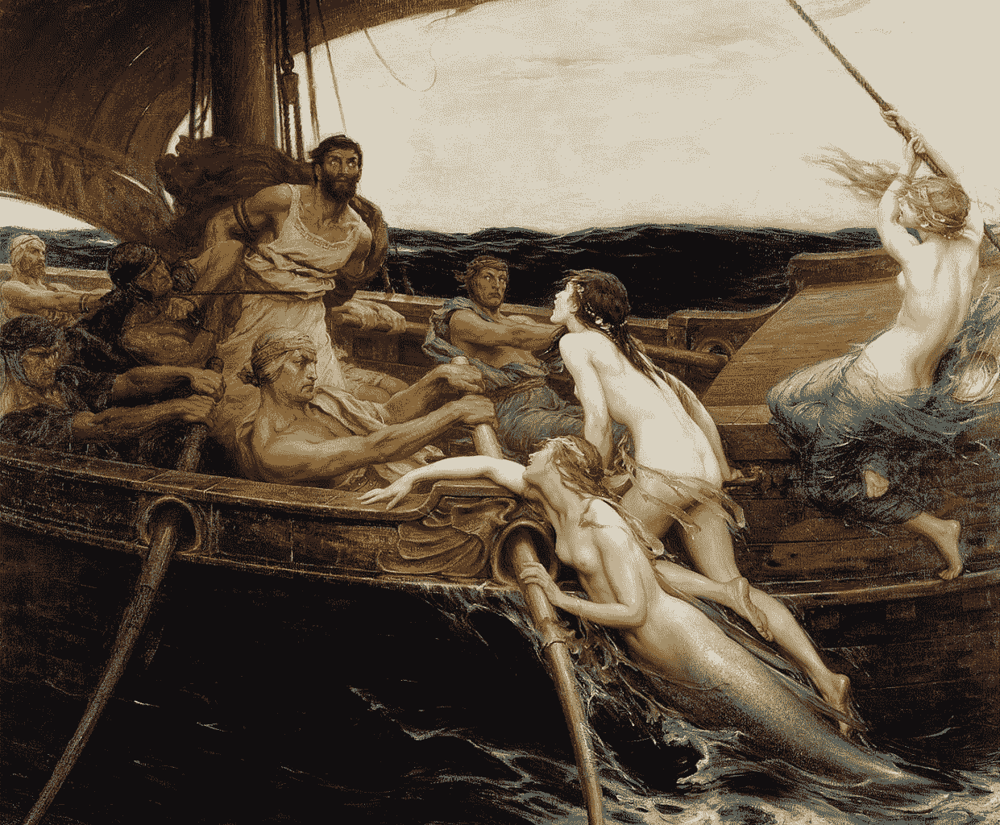

# 停止优先考虑受欢迎程度——你永远不会成长

> 原文：<https://medium.com/swlh/stop-prioritizing-popularity-youll-never-grow-8a4da47a345c>

[Odysseus tied to the mast: the only way to resist the Sirens](https://upload.wikimedia.org/wikipedia/commons/thumb/a/a3/Draper_Herbert_James_Ulysses_and_the_Sirens.jpg/1241px-Draper_Herbert_James_Ulysses_and_the_Sirens.jpg)

## 学会忽略数字(pays)

我想禁止访问我的(中等)统计数据。

在希腊神话中，[塞壬](https://en.wikipedia.org/wiki/Siren_(mythology))是用不可抗拒的声音诱惑水手，将他们引向死亡的生物。在荷马的 [*奥德赛*](http://en.maartenvandoorn.nl/books) 中，英雄[奥德修斯](https://en.wikipedia.org/wiki/Odysseus)经过，指示他的水手用蜂蜡塞住耳朵，并把他绑在…