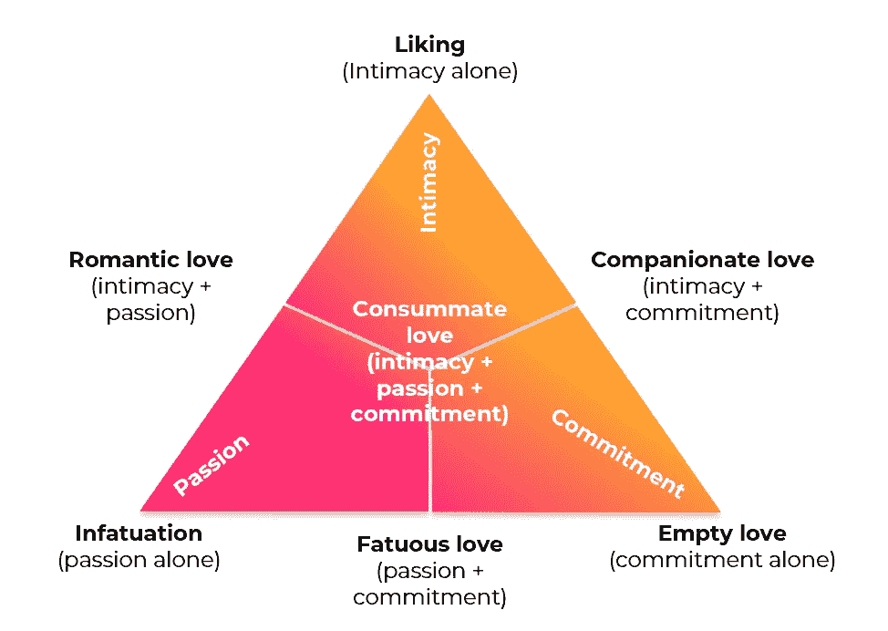

# 当涉及到关系的时候，停止谈论算法

> 原文：<https://medium.com/swlh/stop-talking-algorithm-when-it-comes-to-relationships-5b90bade2df8>

…在线约会平台如何帮助你找到你的另一半

无论是在像艾拉·莱文的《完美的一天》这样的先驱科幻小说中，还是在像迈克尔·贝的《孤岛》这样的最新电影中，未来场景经常以自己的方式描绘一个由先进技术管理的世界，最终被不怀好意的人类滥用。有趣的是，主要场景通常与两个角色之间真实的爱情关系形成对比。
反思我们的恐惧和理想，**人类关系似乎仍然被视为一个小岛，技术永远无法到达和控制，即使在最悲惨的场景下**。

自成立以来，大多数约会应用程序或网站都试图出售展示其“算法”所有好处的服务，并承诺它们将最大限度地增加你找到另一半的机会。

这一承诺引发了几个问题。一般来说，算法的目标是什么？这怎么能适用于人际关系呢？一个算法是否试图复制一个现有的人类模式？技术如何更好地培养伟大的关系？

# 我们为什么要开发算法？

算法的建立是为了实现一个明确定义的目标，这个目标可以通过一定数量的规则来实现。该算法将根据人类(带有个人偏见)建立的规则处理数据，并产生输出。通过机器学习，你可以测试规则，评估你的输出是否以更好的方式满足你的目标，从而改进你的算法。

# 这如何适用于人际关系？

要将算法应用于关系，我们首先需要定义算法的目标，然后是满足目标所需的数据和规则。

*   **数据和规则**:可以包含关于一个人的任何种类的数据，以增加找到一些特征和与另一个人匹配的机会之间的相关性(规则)的机会。这包括性格测试、你的学业和工作、你的价值观、你的“理想伴侣”描述等。
*   **目标**:耶鲁大学心理学系成员罗伯特·J·斯滕伯格定义的“爱情三角理论”涵盖了一段关系的 7 种类型或阶段。终极阶段被定义为结合了“亲密”、“承诺”和“激情”的完美爱情

Robert J Stenberg — 7 types or stages of a relationship

*   亲密感是对某人的亲近和依恋的感觉。这种感觉可以从相似或互补的亲密关系中产生。它也可以满足一种被放在一个基座上或对立面上的需要，以找到你的“自我理想”的弗洛伊德概念
*   **激情**与强烈的感情有关，这种强烈的感情可以从与性吸引有关的相遇中唤起，并超越了身体方面
*   **承诺**是有意识地决定与对方在一起。这种承诺可以通过许诺、对彼此的忠诚或者大力支持对方参与的事情来表现

迄今为止，在线约会平台一直试图培养关系，主要针对通过亲密关系和社交群实现“亲密”的概念，以及通过外表实现“激情”的概念:

*   **身体外观**以个人资料图片为中心的体验。根据你的“合意”程度，该算法允许你与同样“合意”的人匹配
*   **社交群**确保根据高教育水平、社会阶层、朋友的朋友圈子等标准进行某种选择。
*   根据你和其他人的喜好选择你可能相处的人的算法

基于收集的数据(图片、你的兴趣、你的工作等。)，在线约会平台已经建立了算法，据称可以增加找到你的另一半的机会。

# 那种算法会复制现有的人类模式吗？

犹他大学心理学系的一项研究表明，浪漫的欲望是可以预测的吗？机器学习应用于最初的浪漫吸引”，试图找出是否可以满足以下三个假设中的至少一个:

(1)对于一个给定的人，有没有一种模式可以预测这个人会被哪些人吸引？

(2)对于一个给定的人，是否有一种模式可以预测谁会被他/她吸引？

(3)最后，有没有一种模式可以预测两个人之间独特的欲望？

> 当前研究的主要目的是测试是否真的有可能使用两个人相遇前收集的测量数据来预测独特的浪漫欲望。

为了检验这些假设，他们在两个场合收集了 163 名和 187 名本科生的两个样本，男女人数相等，平均年龄为 19.6 岁。

所有学生都必须填写一份 30 分钟的问卷，涵盖多个主题，包括性格测试、交配策略、价值观、自画像和“理想伴侣”描述等。

之后，他们都被邀请参加 4 分钟的快速约会，在结束时，他们必须评论他们的约会，例如“我真的很喜欢我的互动伙伴”，“我被性吸引了”等。

> 这些结果表明，关系科学已经揭示了许多特质和偏好，这些特质和偏好可以有意义地预测人们渴望他人和被他人渴望的倾向。然而，从这些背景测量中得出的模型始终无法预测一个人对另一个人有多渴望。

换句话说，根据两个人在见面之前分享的信息，不可能预测两个人会在 4 分钟的快速约会中配对。这就对约会应用和网站迄今为止使用的所有不同方法提出了质疑，这些方法试图将人们彼此匹配起来。

# **H** 科技如何培养伟大的关系？

随着你们相互了解，你对一个人的看法在几秒钟内改变了多少次？这个你两分钟前还觉得很有魅力的男人，突然变得很普通，或者这个你觉得很丑但随后有魅力的东西照亮了她的脸的女人。

公平地说，我们都有一定程度的“可接受性”，这是由我们自己的一套基本(先验)标准定义的，这些标准基于物理外观、社会群体甚至一些亲缘关系。**我们倾向于认为，通过最大限度地缩小搜索范围，我们将找到最终的匹配，但之前提到的研究表明，没有任何标准可以预测它。**

网上约会平台当然有好处，因为它们为你提供了结识人脉之外的人的机会，有时还允许你过滤一些“最低要求”。但是没有一个能够重现你在现实生活中感受到的“化学反应”。

# 这完全是内容和时间的问题

网上约会的经历可以更进一步。它应该把更多的注意力放在内容上，让人们有机会真正花时间去发现对方，甚至在他们见面之前。

*   **内容为王**:在现有的最著名的交友应用上，你可以创建一个只有一张自拍、你的名字和年龄的个人资料，仅此而已。然而，你越了解一个人，你就越有可能产生某种感觉。很多事情已经可以在网上完成，无论是通过文本元素揭示个性特征，还是利用图像的力量展示不同于自拍的东西。最重要的是，如今几乎不存在的视频的使用可以给体验带来更多，因为动作通过微笑、眼神、态度、声音来创造感觉。内容也创造了自然的对话，因为它提供了一个合适的环境来进行讨论，避免了不幸的著名的“嘿，你好吗？”
*   给它更多的时间:它与内容密切相关。无休止的划动会适得其反，因为选择过多会降低我们做出选择的能力。你永远没有时间进入别人的世界。这就像在数百份简历中扫来扫去，从来没有详细看过应聘者的经历，然后根据谁先接电话来组织面试。
    找到合适的伴侣需要时间，人们应该承认这一点。在线约会平台应该限制每天展示的个人资料数量，并鼓励人们更好地看待彼此。

**总之**:网上约会的体验将从“超市般”的体验演变为更真实、更身临其境的体验，这将为人们展示自己的个性留下空间，并将现实生活中可能发生的更多化学反应带到网上。

到目前为止，智能手机的使用、拟议中的用户体验以及约会市场的总体成熟度，无疑限制了新的突破性产品的出现。许多公司试图推出像视频这样更有吸引力的产品，但迄今为止他们总是失败，因为他们期望用户付出太多努力，而他们还没有准备好在体验上走那么远。

这是时间问题…

## 这篇文章发表在 [The Startup](https://medium.com/swlh) 上，这是 Medium 最大的创业刊物，拥有+443，678 读者。

## 在这里订阅接收[我们的头条新闻](https://growthsupply.com/the-startup-newsletter/)。

