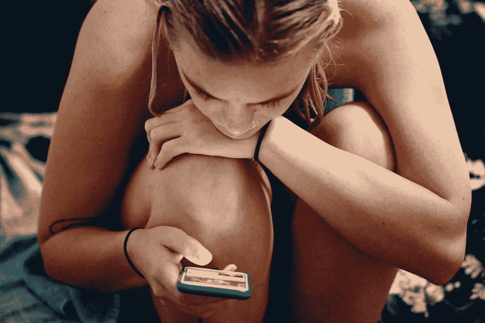

# 别再告诉我“要更外向”

> 原文：<https://medium.com/swlh/stop-telling-me-to-be-more-extroverted-3efb1de3a5b>

## 多年来，我们都被告知外向的人过着更好的生活，但现在他们安静的同伴正在反击。内向的人正在重新控制办公室、公共场所，现在是最后的战场:网络。我们即将开始生活在内向的时代吗？

Photo by [Sharon McCutcheon](https://unsplash.com/@sharonmccutcheon?utm_source=medium&utm_medium=referral) on [Unsplash](https://unsplash.com?utm_source=medium&utm_medium=referral)