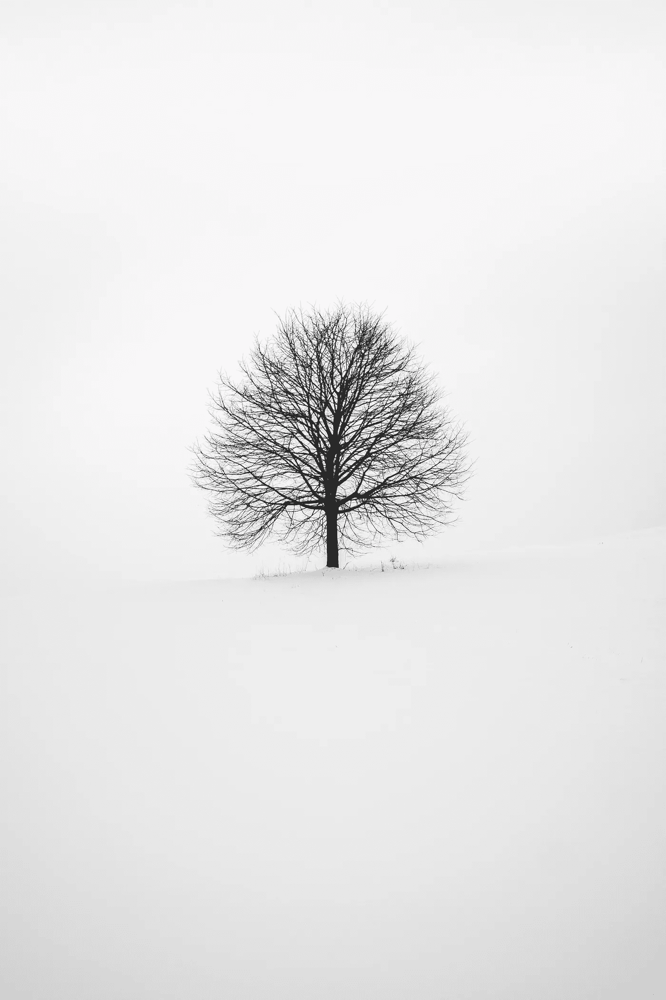

# 不要认为你很坏。它会让你变得更好

> 原文：<https://medium.com/swlh/stop-thinking-youre-bad-it-will-make-you-better-266c3cc9692>

## 没有什么是非黑即白的

Photo by [Fabrice Villard](https://unsplash.com/photos/Jrl_UQcZqOc?utm_source=unsplash&utm_medium=referral&utm_content=creditCopyText) on [Unsplash](https://unsplash.com/search/photos/black-and-white?utm_source=unsplash&utm_medium=referral&utm_content=creditCopyText)

我以前觉得自己是个不称职的家长。

我有两个学习差异很大的孩子。当人们被诊断患有阅读障碍、书写困难、执行功能问题等疾病时，我更喜欢用这个词。

我从小就是个十足的书呆子，全 A，常春藤联盟，神经科学博士…