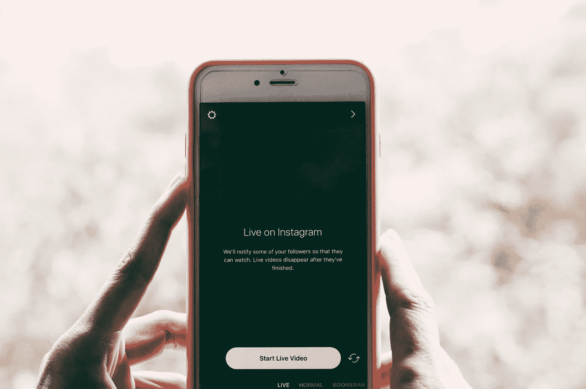

# 停止用社交媒体抨击威胁企业。

> 原文：<https://medium.com/swlh/stop-threatening-businesses-with-social-media-slams-c019ced7937a>

Photo by [Hans Vivek](https://unsplash.com/@oneshotespresso?utm_source=unsplash&utm_medium=referral&utm_content=creditCopyText) on [Unsplash](https://unsplash.com/search/photos/social-media-on-phone?utm_source=unsplash&utm_medium=referral&utm_content=creditCopyText)

在过去几年里，我们经常看到企业在社交媒体上遭到抨击的故事。现在，当你没有得到你想要的东西时，用社交媒体抨击来威胁一家企业正成为一种趋势。

这必须停止。

## 反馈会有所帮助，而且有适当的方法