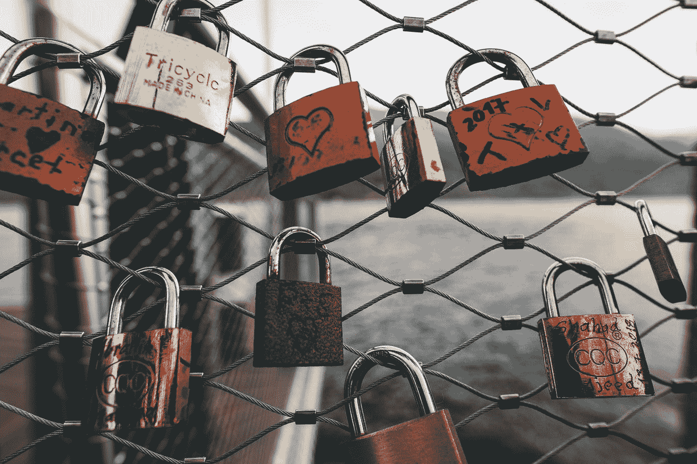

# 我到底是谁？

> 原文：<https://medium.com/swlh/stop-trying-so-hard-to-be-who-you-are-not-8837ead54bb>

Photo by [Markus Spiske](https://unsplash.com/@markusspiske?utm_source=medium&utm_medium=referral) on [Unsplash](https://unsplash.com?utm_source=medium&utm_medium=referral)

## 别再努力去做不是你的人。

你问过自己这个问题吗？我们大多数人都不喜欢自己。我们首先关注我们的错误、缺陷和瑕疵。每个人都有不同程度的自我价值或自尊。有些人会比其他人更自信。有些人性格内向，有些人性格外向。