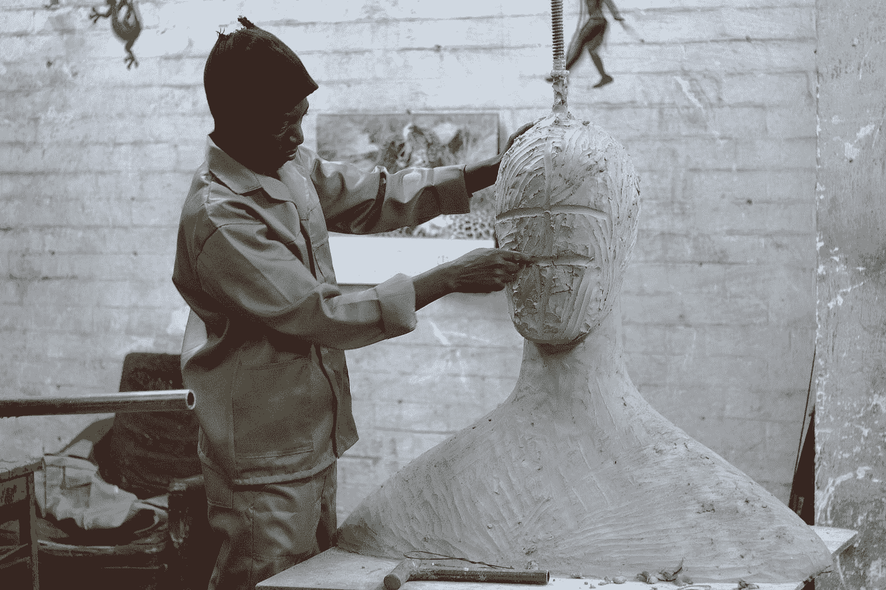

# 停止无休止的欲望循环

> 原文：<https://medium.com/swlh/stopping-the-cycle-of-endless-wanting-965de71aea7d>

## 切掉多余的部分，欣赏下面的图片

Photo by [The Digital Marketing Collaboration](https://unsplash.com/@thedmcsa?utm_source=medium&utm_medium=referral) on [Unsplash](https://unsplash.com?utm_source=medium&utm_medium=referral)

我们的生活是无止境的前进。从我们出生的时候起，我们就准备好了走路和说话。一旦我们能走路和说话，我们就被送到学校去继续学习。当我们征服了阅读、写作和算术的基础，我们就被推向了更高级的科目。