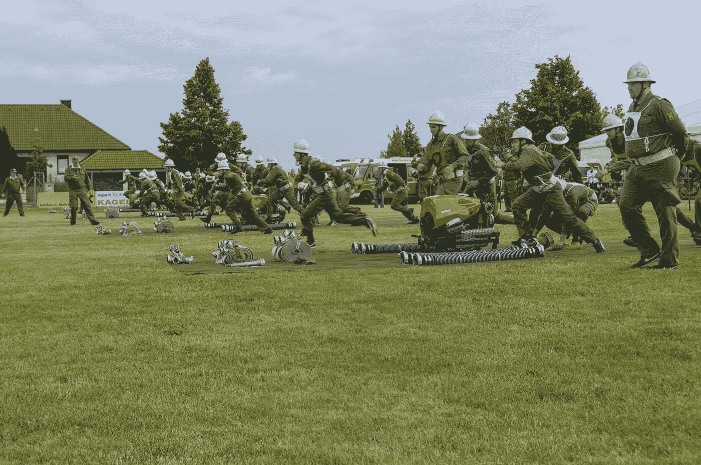

# 消防员竞赛用秒表

> 原文：<https://medium.com/swlh/stopwatch-for-firefighter-competitions-47b8e58b1508>

## Raspberry Pi 通过 GPIO 处理时间密集型数据捕获的能力如何？让我们找出答案。

Image by [Gerhard Bögner](https://pixabay.com/sk/users/bogitw-851103/?utm_source=link-attribution&utm_medium=referral&utm_campaign=image&utm_content=1155029) [from Pixabay](https://pixabay.com/sk/?utm_source=link-attribution&utm_medium=referral&utm_campaign=image&utm_content=1155029)

Raspberry Pi 是一个非常便宜的小设备，可以用于各种项目。它有出色的 Linux 支持，它的官方 Linux 发行版 Raspbian 可以在所有支持的 Raspberry Pis 上运行。