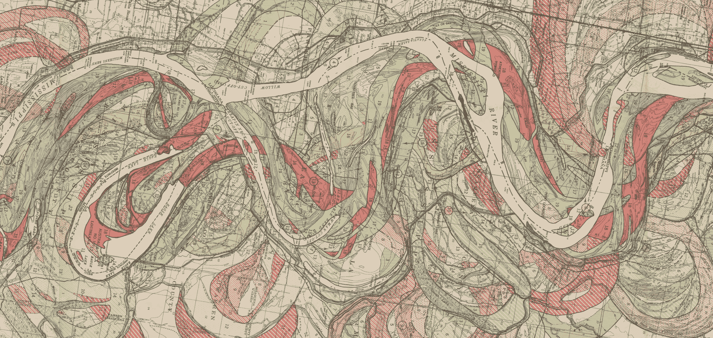

# 讲故事是第五维度

> 原文：<https://medium.com/swlh/storytelling-is-the-fifth-dimension-60f98bf19ef8>

a partial history of the Mississipi River’s course, as documented by Harold Fisk in his “Geological Investigation of the Alluvial Valley of the Lower Mississippi River” (1944)

生活充满了故事。他们唤醒了过去。他们改变了未来。他们撒谎，揭露，创造，毁灭。每个人都至少知道一些。每个人都至少有一次生命。

理解这一事实的一个方法是这样理解故事:作为一个与生活经验相邻的文字维度。我不是说“维度”是个比喻。我也不是指神秘的、不精确的“维度”