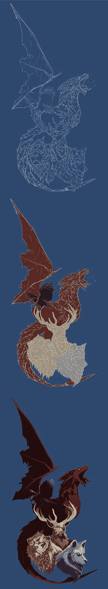

# 《权力的游戏》最后一季的故事课

> 原文：<https://medium.com/swlh/storytelling-lessons-from-the-final-season-of-game-of-thrones-7ae06c839a75>

[*“Game of Thrones Sigils”*](https://www.behance.net/gallery/5770261/Game-of-Thrones-Sigils) *by Jig Ignacio is licensed under* [*CC BY-NC-ND 4.0*](https://creativecommons.org/licenses/by-nc-nd/4.0/?ref=ccsearch&atype=rich)

包含大量剧透。已经警告过你了。

昨晚《权力的游戏》在一场壮观的虎头蛇尾的表演中落下帷幕。在第一季中每个人都得到了他们想要的。史塔克家族统治了今天。那么为什么大家都很失望呢？

《T2》和《权力的游戏》的编剧们完成了一项不可能完成的任务，那就是将该系列迅速推向高潮…