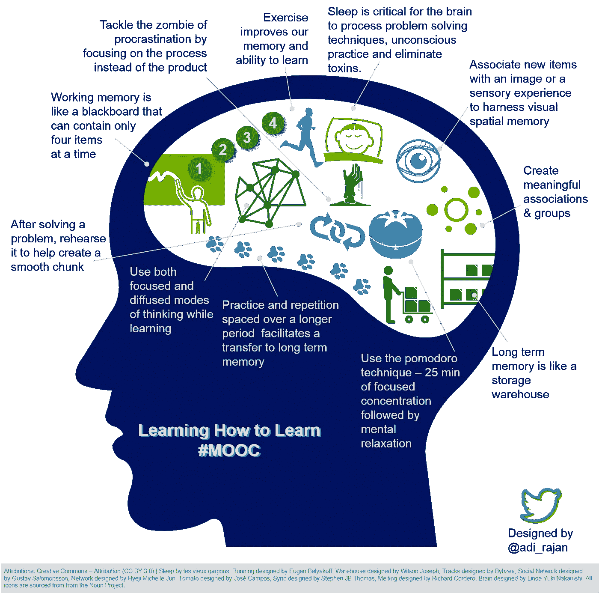
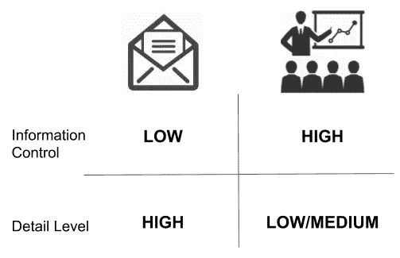
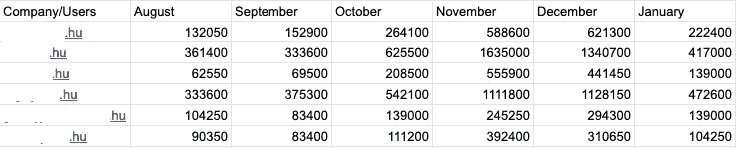
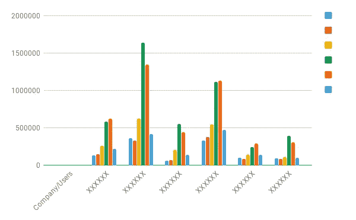
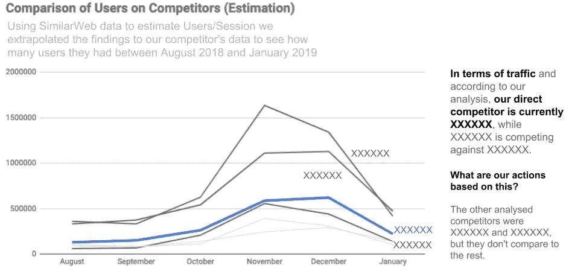

# 用数据讲故事—第 1 部分

> 原文：<https://medium.com/swlh/storytelling-with-data-part-1-a3bdd5138958>

人们已经厌倦了我鼓吹如何学习和不可思议的 T2 博士芭芭拉·奥克利，我明白了。然而，每当被问及哪项技能对我的职业发展最重要时，我不假思索地回答:**我善于学习。**

我说的善于学习是什么意思？

我掌握了如何高效(在短时间内)和有效(保留最多)地学习的错综复杂的关系，这不是火箭科学。我整合了一系列的最佳实践和健康习惯，其中大部分都来自于现有的最佳 MOOC，你知道它的名字。

但是为什么题目是用数据讲故事，而我们谈论的是学习策略呢？所以，我正在努力给我的学习过程增加另一个复杂层次，回忆和教学。奥克利博士在与[导师盒](https://www.mentorbox.com/organic-2-9-encv)的首席运营官[黄邦贤·肯德尔](https://www.linkedin.com/in/jonathon-kendall/)的谈话中，探讨了这个想法，即如果你能练习回忆技巧来教某人，这是一种非常有效的方法，以一种你能够引用材料的方式来将材料分块。此外，黄邦贤补充说，在他的实践中，每当他找不到时间或人来教时，他发现自己在一张纸上写下教科书，模拟一个班级，对材料感到舒适，能够回忆和复制。

因此，我的想法是这样的:我没有时间继续教授我一直在读的东西，但同时我感到有充分理解我的研究的冲动，将理论应用于实践。我分享我对《用数据讲故事:商业专业人士的数据可视化指南》这本书的一些章节的理解和见解，这本书来自前谷歌员工和数据可视化专家 Cole Nussbaumer Knaflic。享受一个可能系列的第一部分。

# 上下文中的一个大想法。

《用数据讲故事》第一章的两个关键概念围绕着充分理解借助数据的交流意图的背景，以及能够将演讲压缩成一个单一的“大想法”。

**语境决定一切**

我过去有过糟糕的工作经历，我的演讲基调与我的目标公众不一致，这并不是缺乏对材料的理解，而是我没有深入了解我的公众以提供正确的背景。没有必要向关注最终产出的利益相关者提供额外的技术支持。传达信息时，语境就是一切。
Cole 建议了一个快速框架来适应上下文参数，问自己以下问题:

**谁:**谁是接收预期信息的公众，他们通常如何解读这类信息。你是否已经和公众建立了信任，或者你正在建立信任？

**什么:**你希望你的公众知道什么或做什么，换句话说，在这次沟通后，预期的反应和后续行动是什么？作为分析师，你能建议下一步该怎么做吗？
*专业建议:当无法提出行动建议时，作为最佳实践，引导公众讨论行动计划。*

**How:**How 问题的两个范围，媒介和工具。就媒体而言，分析师通常通过现场演示或团队会议来展示他们的发现，或者通过电子邮件发送。

*专家提示:只要有可能选择，会议是勤奋的分析师的最佳选择。在混淆矩阵中，比较会议和电子邮件关于信息控制和必要的细节层次的会议有高度的信息控制，你引导你的公众走向你的结论，并要求低层次的细节，因为提出的问题当场回答。*

*Whenever possible to chose, meetings are the best choice for the diligent analyst*

**大创意**

我最喜欢的大创意概念的比喻是，这是一个完整分析的电梯推介，其中整个故事由一个独特的观点总结，在一个完整的句子中传达结论和建议。为了澄清这个概念，让我们回顾一下我最近为我的一个客户做的一个可视化设计。

我们将在不久的将来回到这个例子，作为用数据讲故事的其他教导的参考。

# 数据故事研究的一个实例

分析时间段:2018 年 8 月至 2019 年 1 月。

分析目的:了解竞争对手网站的用户分布。

专注于数据故事而不是推理过程的技术细节，我们有一个从 Google Analytics 提取的工作数据集，以及当数据被复制到电子表格时 Google Sheets 的 Explore 功能所建议的。

许多人会说分层条形图足以说明我们的观点，我同意不同意。

在通读了这些章节并理解了诸如视觉感知原则、可视化产生的认知负荷、饱和度和预先注意属性等概念后，我应该说我现在是一名设计可视化的设计师，而不仅仅是一名工程师。

Working dataset extracted from Google Analytics

在上表中，为了保护数据安全，竞争对手的网站已从中移除。

Suggested graph from Google Explore feature

现在你可能会问自己，如果名称标记在 x 轴上，那么图例是指月份吗？没错，而这只是这个糟糕的图表设计所引发的一系列问题之一。

注意比较竞争对手的月度表现有多困难，感受一下不必要的眼球运动的数量！

我将在下一篇文章中涵盖所有改进点及其原因，同时涵盖书中的新主题。现在，用 Cole Knaflic 的数据来比较讲故事前后的情况吧。

Same analysis after rounds of corrections and best practices

最后但并非最不重要的是，重要的想法是:

> 我们的分析表明，就流量而言，我们的直接竞争对手目前是 XXXXXX 和。我们没有预料到其他竞争对手会有这样的优势，因此我们建议继续分析前 4 名玩家之间的搜索引擎优化配置文件比较。

如果你对数字营销数据科学感兴趣，我会经常在 LinkedIn 上发表文章。

为了获得更多的生产力、商业技巧和糟糕的无聊笑话，请查看我们在[productivity alk](https://ostrowskijg.wixsite.com/talkingproductivity)的更多报道！

## 这篇文章发表在[《创业](https://medium.com/swlh)》上，这是 Medium 最大的创业刊物，有+423，678 人关注。

## 在这里订阅接收[我们的头条新闻](https://growthsupply.com/the-startup-newsletter/)。

