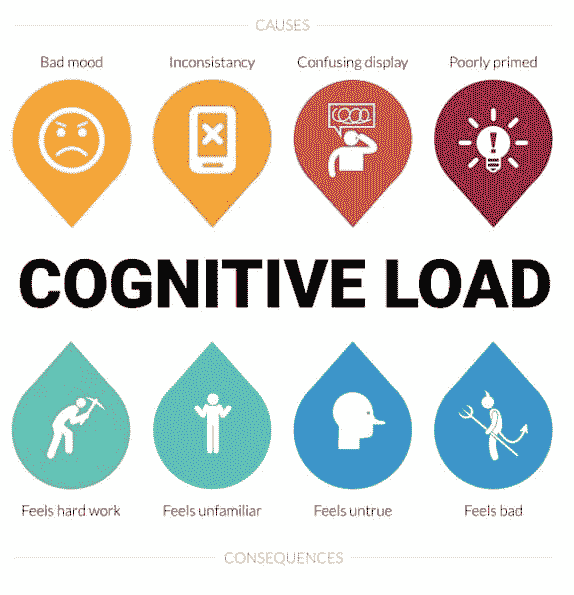
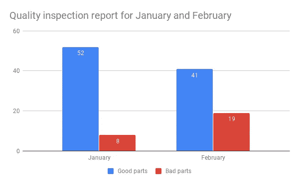
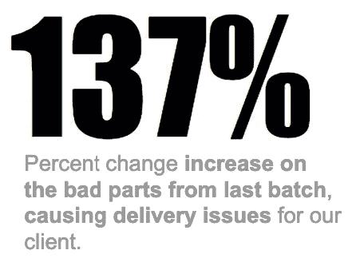
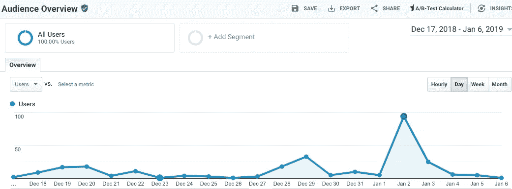
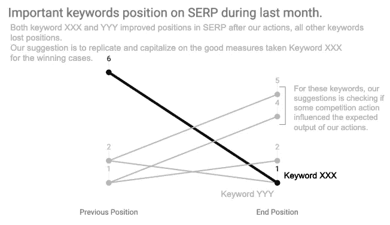
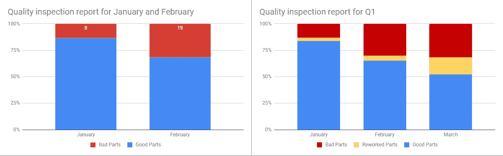
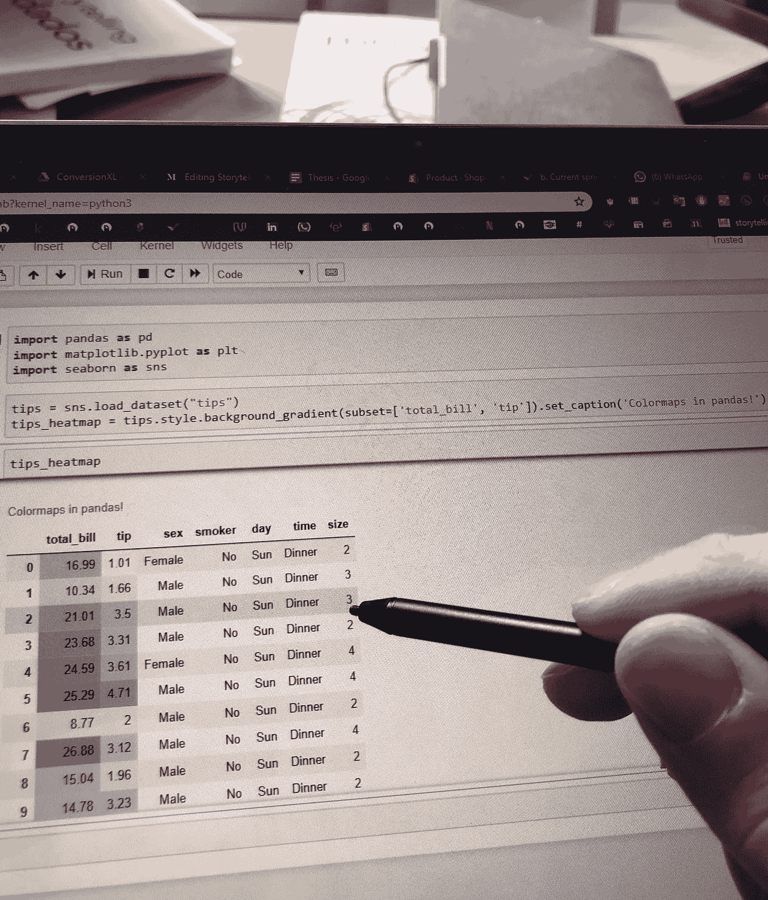
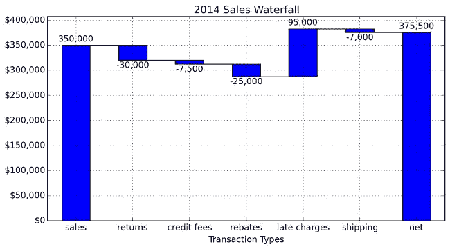

# 用数据讲故事—第二部分

> 原文：<https://medium.com/swlh/storytelling-with-data-part-2-6f4ec8a13585>

在准备和展示数据故事时，最大的挑战之一是将公众的注意力吸引到支持您的见解的兴趣点上。我们生活在一个注意力分散的社会，纽波特的《深度工作》一书对此进行了广泛的讨论，因此我们需要一些最佳实践来充分利用演示。

接下来的两篇文章将从设计和数据分析师的角度关注一些技术细节，特别是关于克服我们工作工具的限制的技巧。

在本帖中，我们将重温关于认知负荷的概念，这是数据专业人员需要采纳的简单但往往被忽视的想法，并根据 Cole 的经验绘制最佳实践。

对预期内容的快速总结:

第二部分:

*   **理解认知负荷概念**
*   **选择有效的视觉效果**

第三部分:

*   像分析师一样工作，像设计师一样思考
*   **用数据讲述故事的魅力**

此外，我正在研究这些材料，以建立我自己的关于数据故事的研讨会分支。也就是说，我希望其他数据爱好者能够从我总结的要点中受益。

正如你所注意到的，这是回顾用数据讲故事的系列文章的第二部分，从一个没有设计思维背景经验的数据分析师的角度完成。我希望所有的分析师都同意拥有并提供基于目标公众的背景是多么重要，因此，**如果您没有机会阅读第一部分，我强烈建议您** [**先在这里查看一下**](/swlh/storytelling-with-data-part-1-a3bdd5138958) **。**利用这额外的 5 分钟时间来理解和整理核心概念非常重要。

*专业提示:* [*科尔有一个播客*](http://www.storytellingwithdata.com/podcast) *，讨论了与她的书相关的许多话题，以及业内关于解释性分析的其他挑战。我不知道这是否是故意的，但在阅读这本书的章节时听她的播客片段增加了我对材料的理解。我觉得她在回答我的额外问题，这些问题在一天结束时是社区中常见的问题。*

# **理解认知负荷概念**

Typical causes and consequences from Cognitive Load, from [Paul Boag](https://boagworld.com/design/cognitive-load/).

也许我对科尔的书的整体结构所做的唯一改变是首先讨论认知负荷的概念，然后为有效的数据展示提供图表概述。本章的主题大多与设计有关，所以带着开放的心态阅读它们会在回到可视化时提供一个不同的视角。

然而，为了节省您的阅读时间，我将列出并简要描述我从本节中获得的内容，然后重点讨论图表类型的注意事项。

*   认知负荷(Cognitive load):当一个非技术公众面对一个盒子情节时的感觉，一种混乱和懒惰的混合，创造了一个信息障碍。当理解信息所需的努力太高时，脱离就会发生。简化的视觉提供了更高的解释能力，这是洞察力消费所必需的。
*   **饱和度和数据墨比:**被认为是造成脱离的主要因素，保持降低的饱和度是关键。数据-油墨比是解释饱和问题的补充概念。分析师在设计优化的可视化时，主要关心的是增加用于显示数据的墨水(或像素)的数量。
*   **对齐:**注意一下阅读时你的眼睛做出的“Z”形。这种行为在可视化中重复。只有当大脑意识到主题不是基于文本的，眼睛才会将注意力集中在标签或数据点上。
*   **对比和前注意属性:**用于引导注意力以帮助讲故事。我最喜欢的预先注意属性是使用颜色、大小和粗体文本，所有这些都是为了将公众的目光引向故事所在。

*专业提示:本书这一章中提到的许多技巧都来自于分组的格式塔法则。维基百科有一个很好的总结，但科尔在这个摘录上添加了一些令人难以置信的经验。*

*专家提示:科尔用了整整一章来讲述预先注意的属性，我必须说，学习这些属性极大地提高了我的可视化技术，在某种程度上，在把最佳实践带到会议上之后，人们会问我有什么不同，使我的演示如此独特。*

# 选择有效的视觉效果

彼得·德鲁克在他的书《有效的管理者》中阐述了学习有效性的重要性，部分讨论围绕着这样一个事实:知道正确的事情是一回事，正确地执行它是完全不同的另一回事。

这同样适用于数据可视化，分析师知道使用条形图或散点图的最佳实践，但我们不时会看到一些“食物图”四处游荡。

对我来说，这一部分的底线是:花时间去理解如何为你的公众需求有效地展示信息是可视化规划的一个积极部分。在大多数情况下，这一步被忽略了，最终被动地接受了来自我们可视化工具的“推荐 vizz ”,不再是这样了。

# 没有几个数字的图表

Bar chart for a small data set

我们在许多会议中都会看到这样的条形图。它确实传达了一些关于这种糟糕的制造工艺的基本信息，但这里讲述的是哪个故事呢？我们希望我们的观众知道或采取行动的独特点是什么？由于所需批次为 45 件，是关注不良零件的增加还是交付问题？

当然，这个图表缺乏上下文，这就是为什么我们有这样的问题。然而，回到要点，这个条形图真的有必要传达数据吗？要点是，对于小集合，专注于你想要传达的信息，节省人们的时间和认知负荷，并使用简单的文本和单个数字。换句话说，同一个图表可以概括为:

简明扼要。这种设计减少了科尔所说的**认知负荷**，这将在下一章详细描述。事实上，突出显示的数字传达了想要传达的信息，而下面的文字提供了必要的上下文。

*专家提示:在使用单个数字时，灰色文本的重要性更大，尤其是在使用百分比变化时。从 Wheelan on* [*裸统计*](https://www.amazon.com/Naked-Statistics-Stripping-Dread-Data-ebook/dp/B007Q6XLF2) *来看，百分比的变化总是相对于别的东西而言的，所以为了有一个完整的画面，了解这个别的东西是什么是必不可少的。实际上，水瓶价格上涨 100%是残酷的，但你的钱包会活下来。然而，杰夫·贝索斯净资产 1%的红利会让人们不知道该拿这么多钱做什么。*

在工具方面，每当我需要将图表总结成一个数字时，我就会切换到[谷歌幻灯片](https://www.google.com/slides/about/)，在这里你可以更好地处理文本样式。

# 时间序列和变化线

折线图主要用于以两种形式呈现的连续数据，要么将 x 轴作为一段时间(日期类型变量)，要么作为前后比较。

预先注意属性在很大程度上决定了线图的焦点。查看下面来自谷歌分析报告的例子。

Google Analytics Audience Overview report, a typical time series plot.

1 月 2 日的“好异常值”很容易被发现，即使没有标记的数据点。如果这与上下文一致，假设趋势比潜在的数字更重要，这种配置是好的。然而，标注特定的数据点，如最大值和最小值，是将注意力引向不同故事的好策略。第 3 部分将更深入地讨论这些策略。

在我看来，趋势图应该是分析师工具箱的一部分。它们以一种非常清晰和直接的方式呈现了事件之间的变化。在最近的一个项目中，我使用了一个倾向图来呈现 Google SERP 上的关键词位置变化。

Inclination graph for presenting before and after events

再一次，因为这是在一个真实的用例中使用的，我使用了所有预先注意的技术来讲述我的故事。请注意，演示的重点围绕着排在第一位的关键词，但是，在同一张图表中，关于表现不佳的关键词，还有第二个故事要讲。

Seaborn 有一个漂亮的 API 用于绘制时间序列，但是在大多数情况下，Google Sheets 用于绘制，Google Slides 用于注释，这就是上面例子中生成倾斜图的确切过程。

# 条形图保持简单

条形图因其简单和熟悉而成为最好和最受欢迎的可视化工具之一。分析师可能会在这里争辩说，简单性没有吸引力，但当谈到用数据讲述故事，展示复杂的可视化和灵活的图表定制编码肌肉并不是真正的重点。

作为讲故事的人，我们希望我们的信息被理解，就是这样。因此，使用需要较少认知处理的视觉有助于引导公众的注意力和意志力来理解所传达的见解。

从我的经验和证实科尔的笔记来看，[横条是最容易表示分类数据的](http://www.storytellingwithdata.com/blog/2012/10/my-penchant-for-horizontal-bar-graphs)，尤其是当有长标签的时候。横条遵循同样的阅读逻辑，眼睛从左向右滚动，从标签开始，到达数据，这是阅读信息最直观的方式。

Stacked bars at 100% uncertainty on intermediary subcategories (reworked parts).

总数量或 100%的堆积条形图增加了额外的深度，但也增加了可视化的不确定性。正如我们在上面看到的，当添加了返工零件的第三个子类别时，对于两个子类别，100%堆叠工作得很好，但是，很难想象一月和二月之间的区别。添加数据标签会有所帮助，但我们再次试图保持我们的视觉效果干净，避免不必要的饱和。

*专业提示:在条形图中，保持 y 轴的零基线对于准确的参考是极其重要的。该规则特别适用于条形视觉效果，如果不遵守该规则，由于在将面积与数字相关联时缺乏精确性，它可能会引入强烈的视觉偏差。* [*科尔有一个专门的帖子，用福克斯新闻频道有缺陷的例子来解决这种偏见。*](http://www.storytellingwithdata.com/blog/2012/09/bar-charts-must-have-zero-baseline)

# **表格的读取过程**

表格与人类大脑的语言部分相互作用，这就是为什么我们阅读表格而不是可视化它们的原因。用手指或鼠标指针扫描桌子的方法就是一个很好的例子。

Reading a DataFrame with heatmap from pandas!

当需要同时显示多个类别时，可以使用表格。最好的用例是让来自多个部门的涉众参加同一个会议。一个表格可能适合简化和分组信息，而不是在不同的幻灯片上一次呈现不同经理的数据片段。这使得公众能够关注与其个人目标相关的不同部分。

仍然考虑到上下文和公众，仍然有许多铁杆 Excel 用户，因此有时表格是可视化的，需要较少的认知负荷来强化您的结论。

在编码方面， [pandas DataFrame 是你最好的朋友](https://pandas.pydata.org/pandas-docs/stable/reference/api/pandas.DataFrame.html)，我是一名 python 程序员，你现在可能已经注意到了。此外， [seaborn heatmap 的](https://seaborn.pydata.org/generated/seaborn.heatmap.html)带有注释，非常适合说明简单的相关性。对于有许多列的表格，尝试使用 pandas style . background _ gradient()方法来减少饱和度。

专业提示:小心“彩虹表”，这里过度使用了颜色映射。将焦点放在太多的元素上意味着完全没有焦点，因此如果你觉得需要同时突出两个以上的类别，你可以尝试将信息分成两个不同的元素。

# 对“食物图表”说不

让我们搞清楚，没有饼状图，没有比萨饼图，没有甜甜圈图。永远对“食物图表”说不。根据我的回忆技巧，这个问题的简短答案是，人眼不善于识别图表上的区域并将其与数字相关联。因此，当您认为饼图是显示整体类别分布的好选择时，请记住，总会有更简单、更直观的方式。

Revenue breakdown, a waterfall chart use case.

科尔建议用瀑布图代替任何食物图。好消息是，这样的图表现在可以在 Google Sheets 中找到，但不幸的是，还没有在 Google Data Studio 中出现。在“代码之地”，我心爱的 seaborn 库似乎也不支持可视化，但是在这里你可以找到一个使用 matplolib 的很好的实现。对了，把 [PBP](https://pbpython.com/) 放到你的书签里。

*亲提示:来自* [*用数据讲故事播客第四集*](http://www.storytellingwithdata.com/podcast) *，取名看情况，问题“我该不该用饼状图？”是由一个听众再次提出的。科尔提到了罗伯特·科萨拉(Robert Kosara)和德鲁·斯考(Drew Skau)**2016 年的新研究，他们发现饼图实际上在视觉上可以有效地说明各部分之间的对比，表示一部分与整体相比非常小或一部分非常大。*

在一个图表中有许多故事，正如科尔所提到的，可视化可以被视为精美的食物，没有对错，而是各种“不同味道”的最佳实践。在使用正确的视觉属性的同时选择正确的视觉的过程比看起来要复杂得多，这也是我想在以后的文章中从 A 到 z 探讨用例的主题。

Focus on the story to be told, not on the tool!

从分析师的角度来看，不要害怕使用 Google Sheets 或 Slides 来完成你的工作，不是所有的事情都需要通过编码来完成，样式化图表的收益递减可能会变得难以承受和耗时。实践是绝对建议的，[成为 matplotlib 文档的朋友](https://matplotlib.org/gallery/index.html#pyplots-examples)特别是文本、标签和注释，但是不要让时间限制影响你的输出。

作为最后一个想法，无论何时，当你对你的视觉化结构有疑问时，作为一个经验法则，产生你头脑中的变化，把它们放在一起并讲述你的故事。寻找有助于阐明你观点的版本，如果仍然不清楚，寻求外部帮助，与同事练习你的故事，并寻求反馈。

同样，如果你没有机会阅读第一部分，[请点击这里](/swlh/storytelling-with-data-part-1-a3bdd5138958)，并给我关于这个系列的反馈！

如果你对数字营销数据科学感兴趣，我会经常在 LinkedIn 上发表文章。

## 这篇文章发表在[《创业](https://medium.com/swlh)》上，这是 Medium 最大的创业刊物，有+434678 人关注。

## 订阅接收[我们的头条新闻](https://growthsupply.com/the-startup-newsletter/)。

