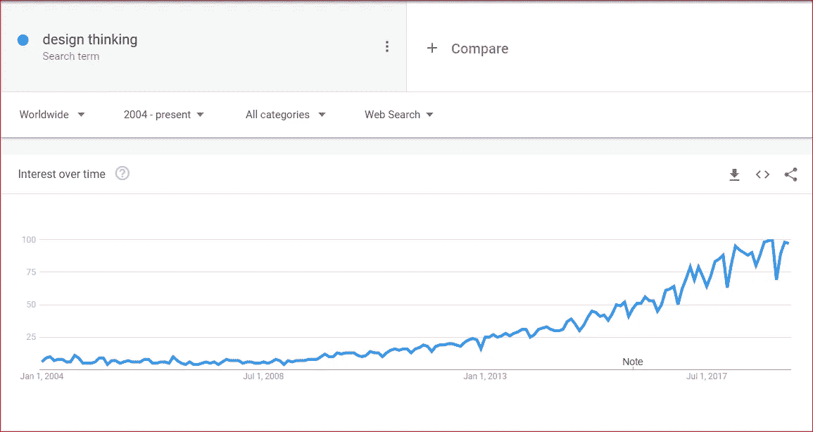
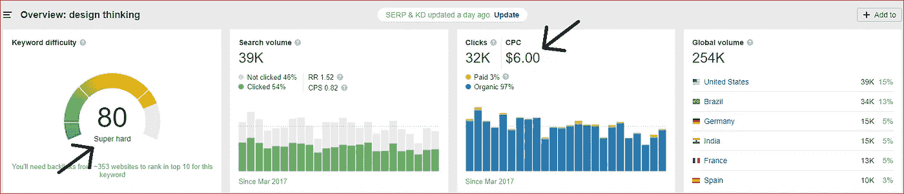
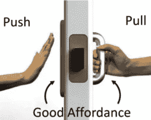
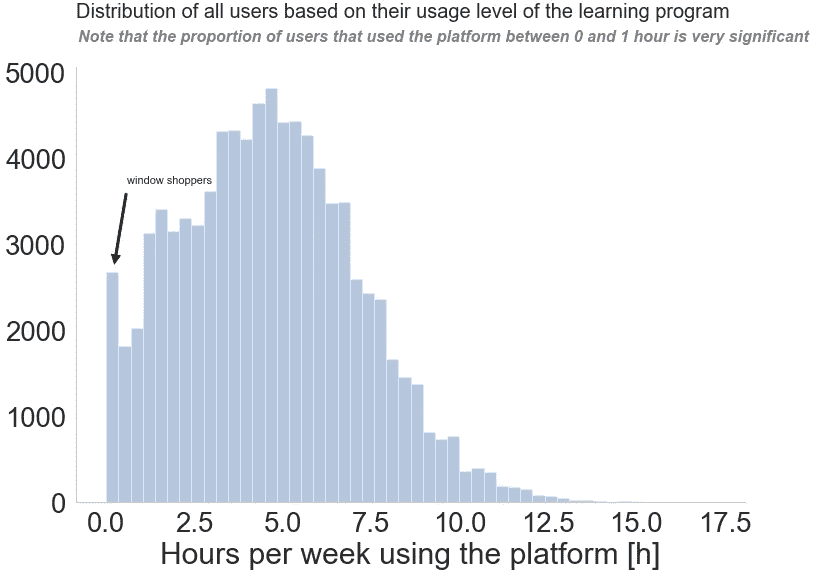
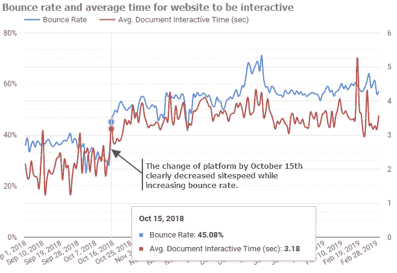
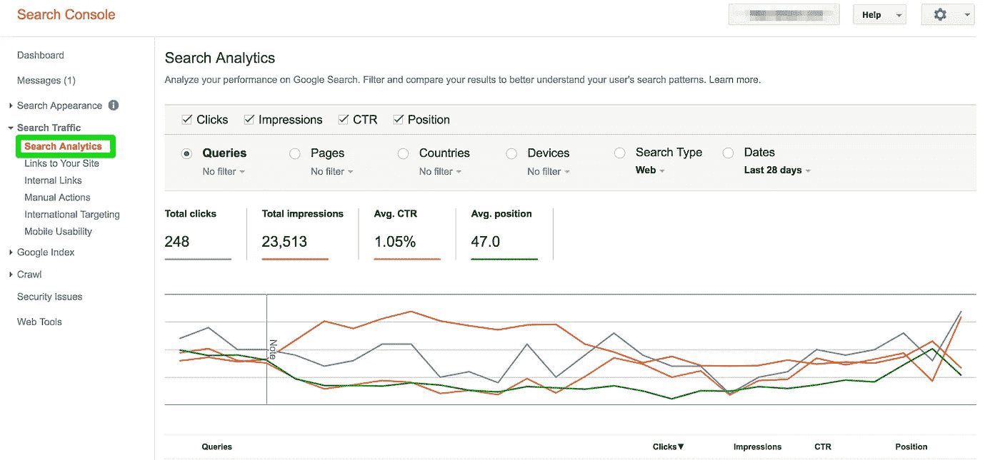
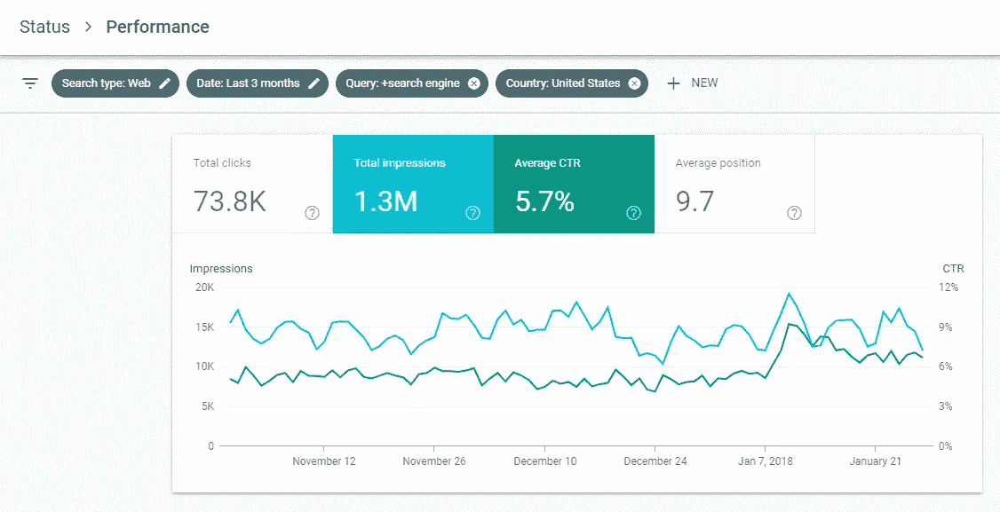
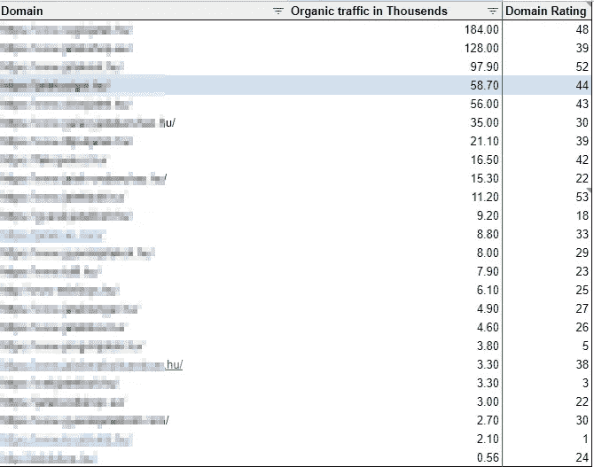
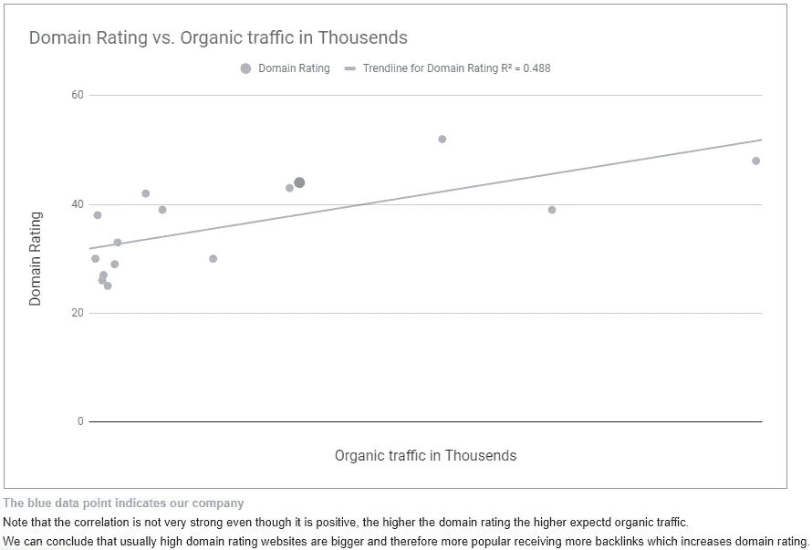
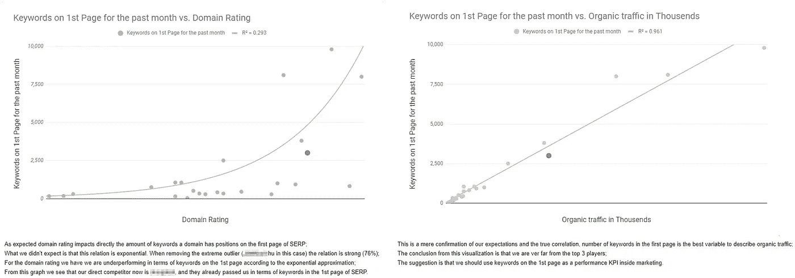

# 用数据讲故事—第 3 部分

> 原文：<https://medium.com/swlh/storytelling-with-data-part-3-c704b91a512c>

Quora 的数据科学家经理 William Chen 在回答[“数据科学家如何使用统计数据”时精辟地指出:“数据科学家是公司的故事讲述者[……]我认为这个角色是最重要的。”](https://www.quora.com/How-do-data-scientists-use-statistics)。数据专业人员的角色在公司内部再次演变，数据故事作为一种软技能从未如此相关。

此外，越来越多来自非技术背景的专业人士进入数据分析领域，增强了处理数据者和决策者之间的沟通。为了真正的效率，需要弥补这个差距。

设计思维作为[【设计师的非专属财产】](https://www.interaction-design.org/literature/article/what-is-design-thinking-and-why-is-it-so-popular)出现在许多文章和数据社区中并非偶然。谷歌、苹果和通用电气等大型科技公司采用了这种方法，从用户的角度重新定义他们当前面临的挑战。换句话说，关注上下文，瞄准在本系列的[前几篇文章中讨论过的公共话题，巩固数据故事的基础。](/swlh/storytelling-with-data-part-1-a3bdd5138958)

Design thinking trend from January 2013

Design Thinking keyword analysis for US market ranking as “Super Hard” to rank for on Google.

在分解了核心原则之后，发现设计思维和数据叙事的相关性是很容易的。形式服从功能是一个设计概念，当外推时，可以导致科尔的书中指出的所有最佳实践。

话虽如此，让我们谈谈我的观点，但首先快速总结一下本系列的最后一篇文章:

*   像分析师一样工作，像设计师一样思考
*   **简单有效的外卖应用示例**

在运用数据讲述故事时，传达信息是分析师的主要目标。在大多数情况下，由于时间限制，整个过程中使用的工具、方法和数据将被忽略。

## 像分析师一样工作，像设计师一样思考

数据科学作为一门学科的现实是，今天在该领域工作的大多数专业人员都是从 STEM 专业过渡而来的。这种迁移是众所周知的，并且有促进这一过程的激励措施，如[向数据科学](https://towardsdatascience.com/3-common-data-science-career-transitions-and-how-to-make-them-happen-588c3618942f)的转变。

关注“事物”对于理解如何正确处理数据是必要的，这也是为什么拥有技术背景可以帮助许多人学习曲线的原因。然而，“人”在处理信息时起着巨大的作用。

*专家提示:这里有必要区分数据和信息。数据是事实、数字或计算机数据。另一方面，信息是经过加工的事实，变成了一个想法或故事。因此，数据本身没有增加价值，但当人们理解和合理化时，它可以通过洞察力产生影响。我喜欢 RJ·安德鲁斯在他的书《我们信任的信息* *》中所做的类比。科尔在* [*第 15 集《用数据讲故事》播客*](http://www.storytellingwithdata.com/blog/2019/3/11/recommended-reading-info-we-trust) *中采访了 RJ，我强烈建议你听一下！*

但是有什么问题呢？

从这个角度来看，我喜欢把讲故事理解为向“人”解释“事物”的艺术。设计师在这里所做的大部分工作旨在获得公众的认可和理解，这是通过**启示**、**可及性**和**美学**为分析师配置一个简单的设计思维方法来实现的。

## 启示

当应用于产品设计时，启示以心理学的方式代表了人与物之间的强大关系。这个强大的概念改变了人们对用户体验的理解，当一个产品没有给出如何正确使用的正确指示时，用户会产生挫折感。好的设计不需要标签，这是启示被感知的时候。

A plate tells you to push. A fixed-handle asks to be grasped.

但是如何将**启示**转化为数据可视化呢？

这是通过确保在可视化中提供所有指导来实现的，这样任何人都可以获得完整的信息，即使没有分析师在场。实现正确引导的技术与[第 2 部分“应用预先注意属性时消除干扰](/swlh/storytelling-with-data-part-2-6f4ec8a13585)中所述的技术相同。

Example of text being used on title, subtitle, and in-chart for guiding attention.

*专业提示:在技术方面，我从 matplotlib API 中学到了很多，以更好地利用 plt.text 和 plt.annotate(arrowprops={})来用文本和箭头引起对某些区域的注意。下面的例子使用了许多讨论过的技术，查看我的 Kaggle 出版物* *上的* [*的完整代码。*](https://www.kaggle.com/ostrowski/elite-data-science-a-b-program-evaluation)

*专业提示:如果您想从 matplotlib 了解更多信息，但又赶时间，* [*查看 Julia Kho 在《走向数据科学》*](https://towardsdatascience.com/all-your-matplotlib-questions-answered-420dd95cb4ff) *发表的这篇伟大文章，这篇文章对所有重要特性进行了令人难以置信的总结！*

## 易接近

根据定义，可及性是容易被理解或欣赏的品质。换句话说，不是房间里的每个人都是工程师或统计学家来欣赏箱线图比较。分析师的责任是交付一个可访问的设计。

除了使用简单的图表，我戴着设计师的帽子时使用最多的技术是在可视化中使用文本。这个简单的实现被证明非常有用，节省了整个团队的解释时间。

Google Data Studio visualization aided by PowerPoint comments for improved accessibility

## 美学

好看的视觉效果更容易推销创意。分析师需要巧妙地运用美学，让公众参与到一个令人惊叹的设计中。

在我看来，从搜索控制台到谷歌广告词，谷歌营销平台的大部分改造都是为了让更多的人使用谷歌平台，从而提高审美。

Good old Search Console Search Analytics

例如，老式的搜索控制台在其复杂的菜单和丑陋的图表之间产生了一些摩擦。然而，新版本是精简的，实用的，并在最小的 UX 细节上经过深思熟虑。

Filters in a breadcrumb style improving UX, colors used strategically. The new Search Console is great.

Cole 介绍了几种不同的方法来制作更令人愉快的图表。**智能配色**、**对齐**、**留白**是我写完这本书后一直在练习的。简而言之:

*   **有策略地使用颜色:**我的图表总是以空白的浅灰色开始，如果我决定改变它，就有理由支持增加对比度；
*   **对齐视觉舒适:**旨在添加的元素之间创建清晰的线条和图案；
*   不要害怕空白:这是我设计中的一个巨大进步。更多并不一定更好，使用空白来减少认知负荷对于获得公众的正确关注是必要的。

*专家提示:Cole 在此基础上又增加了一层，他问“如果我去掉元素 X，会不会影响信息？”。这个问题现在是我的分析过程的一部分，它帮助我产生更清晰的可视化效果来处理空白标签。*

## 一个简单有效的外卖应用示例

这是我作为营销数据科学家在公司成功使用的最后一个数据案例。这是一个非常简单的故事板，但对我来说，它总结了科尔的书的精髓，即在有目的地呈现数据时创建的新思维模式。

它始于一位首席执行官要求更好地了解来自一系列竞争对手的有机流量。销售部门没有合适的数据，所以我要做的第一件事就是浏览列表网站，收集市场上所有的参与者。

你可能会认为这是一件简单的工作。嗯，差不多…我在匈牙利的一家匈牙利公司工作，因为语言障碍是真实的，所以复杂性上升得很快。

Organic traffic in thousands and domain rating, data from ahrefs domain explorer.

最初的要求是有机流量(OT)，但我一直试图将营销的注意力转移到与更高的有机流量相关的关键字的更好的 SEO 策略上。

从这个意义上来说，[域名评级](https://help.ahrefs.com/ahrefs-metrics/how-is-ahrefs-domain-rating-calculated) (DR)是 ahrefs 非常有用的计算指标，它总结了一个域名的反向链接流行度。于是我添加了新维度，按 OT 排序。

我知道接收和评估这个分析的人不是技术人员，所以选择表格是正确的方法。然而，我尝试了一个散点图可视化，就放在桌子旁边。

Scatter plot that did not tell me the whole story

起初，情节似乎不错，但正如科尔所说“那又怎样？”。

那么，DR 和 OT 之间的相关性略微呈正相关，并且显然我们相对于竞争对手的 DR 处于有利位置，这又是怎么回事呢？嗯，域名评级似乎不是我们关注的主要问题，这是什么。

到目前为止我并不开心，所以我更进一步。

如果 DR 不是描述 ot 的最佳特征，那么在 Google 首页(位置 1 到 10)排名的关键词总数可能是，DR 如何影响这个数字？

为了回答这些新问题，我不得不在数据集上增加一个特征，即 Google SERP(搜索引擎结果页面)第一页上的关键词，这是一个巨大的胜利。

Storyboard developed — A Series of visualization one beside each other contributing to the same story.

答对了。这是完整的故事，分析师点！

结论是一个快乐的首席执行官，对我的可视化表示赞赏，在感知到控制和推动关键词位置的重要性后，在营销方面建立了一个新的 KPI。

我知道这是一个非常简单的例子，但我试图证明更好的可视化的心态是简单的。**在这个案例中，开发和传播一个故事而不是一个图表是最大的不同。**

注意使用的技术:

*   考虑到目标公众，增加一个表格来帮助理解；
*   在表格和图表中战略性地使用颜色映射，使人们注意到公司在竞争中所处的位置；
*   低饱和度，浅灰色，无大量网格线；
*   简要描述可视化并指导用户得出相同结论的支持性文本；
*   故事板，有一系列的可视化来证实主要的洞察力。

简单有效。

这是我用数据讲故事系列的最后一部分，我在这个迷你项目中获得了很多乐趣。

写作是一种练习，所以我最终从这本书以及其他资料中学习了很多，把它们放在一起。计划、执行和看到结果的循环给了我的生活很多意义和满足感，所以感谢那些一路上花时间阅读和提供反馈的人。

从我一直在读的这一系列书中，最重要的一点是，书籍通过从别人的错误和成功中学习来节省我们的时间。一本书之后，只是练习和热情的问题。阅读、练习并与社区分享。

同样，如果你没有机会阅读第一部分和第二部分，请查看这里的和这里的。反馈是一门艺术，非常值得欣赏！

我经常在 [LinkedIn](https://www.linkedin.com/in/joaoostrowski/) 上发表文章。如果你对数字营销数据科学感兴趣，请保持联系！

## 这篇文章发表在 [The Startup](https://medium.com/swlh) 上，这是 Medium 最大的创业刊物，拥有+443，678 读者。

## 订阅接收[我们的头条新闻](https://growthsupply.com/the-startup-newsletter/)。

