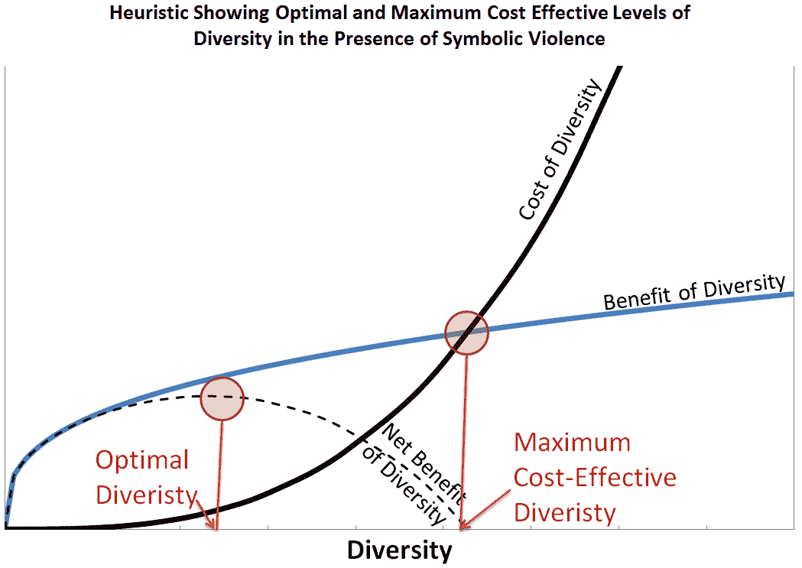
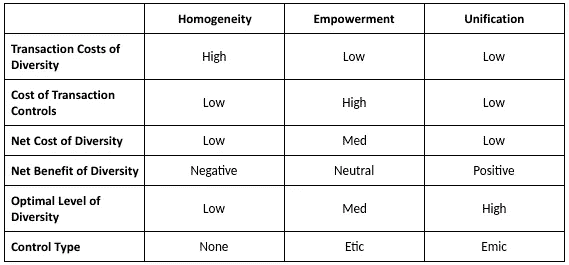
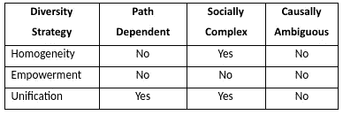

# 多元化成本的战略管理:为什么优秀的管理者努力实现工作场所的多元化？

> 原文：<https://medium.com/swlh/strategic-management-of-diversity-costs-why-do-good-managers-struggle-to-achieve-diversity-in-the-29dba37c2e08>

# 摘要

为什么在工作场所实现多元化如此困难，尽管有昂贵的多元化政策，也有真正积极的经理希望看到工作场所更加多元化？答案可能在于经济压力，这使得大多数公司很难利用多样性来获得竞争优势。

***注:此处陈述的观点为本人观点，非谷歌*** 观点

通过将多元化管理视为依赖于每个企业的文化和历史的成本收益权衡，我们可以看到，以战略优势实现多元化的能力受到制度因素的限制，这些因素使管理者难以摆脱。对于大多数公司来说，实现一个只有利益而没有成本的多元化战略是困难的，甚至是不可能的。这些公司随后被迫在不利于能够实现这种战略的公司的情况下运营。

到目前为止，研究人员已经为多样性的好处提供了证据，并为实施多样性倡议以实现这种好处提供了框架，但还没有提供一个协调的理论来解释工作场所多样性的成本和收益的权衡。本文将各种形式的资本在社会群体之间的转移描述为一种交易，并试图用交易成本经济学来解释工作场所多样性的动力。关于这些成本的战略管理的规范性声明也通过应用公司的基于资源的观点来提供。其结果是对企业中增加多样性的成本来源的解释，这些成本如何成为歧视制度化的机制，以及各种多样性战略实现持续竞争优势的潜力的富有成效的比较。该理论解释了为什么与从多元化中获得竞争优势相关的战略资源不是可以获得的多元化水平，而是实现降低多元化成本的动态能力。因此，假设企业代理人的部署对于从多样性到竞争优势的战略管理至关重要，在存在反多样性战略行为的情况下，通过层级控制使用授权无法实现战略优势。

# 介绍

仍然不清楚为什么公司有不同水平的多样性和不同水平的绩效。工作场所多元化的好处已经得到了很好的解释和记录，而且高绩效已经被证明是可能的，但没有明确的证据表明高度多元化直接转化为高绩效。这个结果是直观的，因为如果多样性本身是竞争优势的明显来源，那么随着时间的推移，具有最高多样性的公司将会获胜，多样性将成为市场中具有可观察模式的竞争资源。

本文试图通过提出一种理论来解释多样性的益处和多样性劳动力的竞争绩效之间缺乏联系，该理论将劳动力多样性的成本和益处描述为竞争因素，根据每个公司的独特情况，这些因素可以对绩效产生净正面或负面影响。

能够导致增加多样性的尝试成功或失败的环境被归因于许多因素，包括企业文化、创新的重要性和实施计划的有效性(Von Bergen、Soper 和 Parnell 2005 皮茨等人，2010 年)。根据这些因素，旨在增加多样性的战略可能无法解决根本的障碍(Brayboy 2003 夏普等人，2012 年)。增加多样性的困难也被归因于与沟通和冲突相关的不同群体的低效率(Jehn，Northcraft 和 Neale 1999)以及组内和组外效应的表现差异(Allen 和 Wilder 1975)。

围绕实施多元化战略的绩效结果的模糊性表明，积极因素和消极因素之间存在复杂的平衡，这表明多元化的隐性成本会与组织的明显优势形成竞争，有时甚至会压倒这种优势。因此，对投资多少以实现劳动力公平的个人成本收益分析将是高度特殊的，正如现有框架所提供的建议的特殊性质所反映的那样，这些框架旨在帮助经理们浏览将多样性纳入绩效战略所需的“无数个单独部分”(Clayton-Pedersen 和 Musil 2005，5)。

旨在帮助管理层评估多元化的压力、障碍和动机，以评估其公司对多元化的战略部署的框架旨在为实施多元化计划提供建议。例如，Williams 等人(2005 年)提出的包容性卓越组织变革框架整合了组织行为的多个维度，以帮助管理层确定多元化目标，Dass 和 Parker(1999 年)的框架根据多元化的阻力水平和压力水平建议了多元化计划的适当整合水平。Cox 和 Blake (1991)提出了多元化劳动力战略管理的内部和外部成本和收益，将多元化作为竞争战略的一个要素。

然而，这种框架并不试图为解释制度背景下的多样性动态提供一个通用模型。例如，Cox 和 Blake (1991 年)提供的经济框架认为，多样性的成本和收益之间的竞争可以管理为竞争优势，但并不试图解释这些成本的社会学来源。Von Bergen、Soper 和 Parnell (2005)发现，一些多元化友好型公司取得了显著的异常回报，但也阐明了这不是因果关系的证据。

如果不解释多样性的成本和收益的来源，就不清楚多样化工作场所中的公平是一种有助于有竞争力的经济回报的资源，还是一种必须由机构承担并由管理层证明合理的成本。一个对多元化工作场所中的公平成本机制提供额外澄清的理论可以描述某些企业如何能够实现比其他企业更高水平的多元化，并更好地确定这种成就是否可以构成可持续竞争优势的来源。

本文的论点是，交易成本经济学(TCE)和布迪厄的资本和象征暴力理论可以用来为这些隐性成本的来源提供一个一般性的解释，至少可以补充，如果不是取代，更多的特质解释。更具体地说，多样性的成本和收益可以理解为各种形式的资本在社会领域之间转移的交易效率的函数。用布尔迪厄斯的话来说，这种转移必然会招致抵制。因此，这一理论也解释了交易成本经济学对多样性的规范应用导致歧视制度化的机制。

# 将 TCE 应用于公司的内部结构

确定多样性的成本需要分析受企业多样性影响的交易。由于工作场所的多样性是内部结构的产物，企业的内部交易成本是高度相关的。代理人之间以及公司与其代理人之间的交易类似于公司与外部实体之间的交易，但是由于缺乏明确的合同，它们通常更加隐蔽。

传统的企业契约观认为，当使用市场的成本可以通过在等级制度的外衣下实行契约来降低时，就会出现等级制度。然而，除了由此产生的治理和代理成本(Jensen & Meckling，1976)，组织理论家还认识到，通过组织一系列内部合同，这种等级制度将外部交易成本重新定位并转化为内部成本，有时是无意的，这也可以通过交易成本经济学(TCE)的镜头进行分析。公司内部代理人之间的交易成本会影响公司的利润、稳定性、寿命和竞争地位。

在评估工作场所的多样性动态时，特别感兴趣的是监督多样性实施战略的有效性的监测成本以及取决于代理人的动机和倾向的剩余损失。

## 解决多样性的隐性交易成本

除了可以根据分配产权的简单逻辑来定义的内部承包的明确成本之外，人们还承认，公司内部还有其他成本，也可以理解为交易性质的成本，因为它们涉及交换和互惠，并产生机会主义、小数量讨价还价和不遵守的问题。这些是公司内部交易的隐性成本。一般而言，此类交易描述的是那些监控难度较大、监督不太直接的交易，以及需要内部文化或个人激励或两者兼有才能在不使用直接控制的情况下建立有效治理的交易。隐性交易的例子包括员工不工作的成本，或者部门之间的冲突导致的低效率成本，这些部门试图以公司整体利润为代价最大化自己的发展。

隐性交易成本对于理解多样性的成本很重要，因为社会领域的互动是关系的一个重要来源，可能涉及许多交易行为，这些交易行为太难分级管理，而是留给组织的社会和文化动态来管理。劳动力中社会领域之间的这些互动可以被建模为一种交易，其中公平可以被视为各种形式的资本从多数成员到少数成员的再分配，包括经济、文化、社会和象征性资本。由于在社会领域之间转移资本可以理解为构成一种交易，因此很可能存在相关的成本。

很难监控隐性交易，因为企业必须以净成本收益来管理它们。如果监督两个代理人之间关系的成本比他们冲突的成本更高，那么实施监督是没有效率的。因此，大多数隐性成本很难在净成本效益下进行监督，而是由相关代理人自行决定(Walsh 和 Seward 1990)。

在一个组织中，与各种形式的资本交易相关的成本可以以无数种方式和不同的规模出现。它们可能发生在非常小的群体之间，如公司的各个部门之间，也可能发生在非常大的群体之间，如不同性别之间。因此，实施多样性计划的框架必须提供详尽且相互排斥的输入和障碍列表，才能做到全面。因此，以前制定框架的尝试导致了重点不同的重叠建议。

例如，Williams 等人(2005)提供了外部环境输入的四个来源，包括道德劝说、人口变化和经济激励因素，以便为管理层将多样性作为一种资源纳入其竞争战略建立一个案例，然后解释了组织行为的五个相关维度，在这些维度中，管理者必须对外部力量进行“解读和反应”(19)。Cox 和 Blake (1991)提供了与多样性管理相关的七个活动领域，以及降低成本和将多样性发展为一种资源的六个论点。Dass 和 Parker (1999)提供了四个抵抗多样性的水平和三个整合多样性的水平。

## 多样性作为社会领域之间资本交易的例子

资本的交易可以从两个方面来看。资本的直接交换，如货币的转移，或者通过牺牲一个集团的资本来增加另一个集团的资本。布迪厄所描述的四种类型的资本可以作为一个有用的模型来识别和分类这种交易，因为每一种类型都有自己的困难与测量和控制交易。

当一名妇女从事以前由男子担任的工作时，该妇女的工资可被视为从男子领域向妇女领域的经济转移，因为所有妇女的净总收入因受雇妇女的工资而增加，所有男子的净总收入因男子以前的工资而减少。此外，当给予特定性别的福利时，如延长产假，结果是经济资本从*男子*转移到*妇女*。确保这种交易公平的最简单的衡量标准是监测组织中女性与男性相比的工资，而与性别相关的福利可以通过制定相关的公司政策来管理。会计和税务记录的必要程序有助于监督这些类型的交易。

虽然经济资本的交易可以很容易地通过其直接转移来衡量，但其他形式的资本，如文化资本，可以通过其权力的转移来更清楚地理解。文化资本较低的一个表现可能是拥有一个被认为不如主流学校那么有声望的学校的学位，或者说话的口音被认为听起来不聪明。当一个领域的成员在通常由另一个领域的成员持有的公司中占据一个位置时，这个人就有机会代表他们的文化并提升该文化的地位，从而构成了从一个领域到另一个领域的权力转移。

例如，如果某所大学有足够多的校友在财富 500 强公司中担任高管职位，那么该校将在这些公司的主流中变得更加知名和有声望。新员工母校声望的提高将会增加与主流母校的竞争，从而降低他们的文化资本。衡量这种权力转移需要确定围绕文化资本来源(如学校)形成的领域和子领域。

社会资本可以通过增加或减少一个领域的社会联系来直接交易，或者通过增加一个领域的社会网络的力量而牺牲另一个领域的力量来进行权力转移。社会资本可以是非常个人化的，因为一个文化或社会领域的成员可能比另一个成员拥有更多或更少。另一方面，社会资本在特定的社会或文化群体中可能是非常同质的。例如，加入特定的运动、俱乐部、宗教或文化团体，可以保证每个团体都有一定程度的社会资本。

具有密切联系的领域的成员，如宗教团体或秘密社团，可能能够很容易地与其他成员建立联系，无论他们属于哪个部门或地理位置，尽管直接联系很少，而且当地体育俱乐部的成员可能比其他人参与更多的办公室外对话。当社会资本与一个群体或社区中的成员相关联时，处于权力地位的成员的存在增加了群体中所有成员的社会权力。

在一个群体中，象征资本也可以是个人的或同质的。一方面，授予一个群体成员的奖励和声望可能会产生通过联合提高整个群体的象征性资本的效果。另一方面，对少数民族受迫害的认识的提高可能会均匀地增加象征性资本。

可能还有其他形式的象征性资本，可能更加微妙。例如，在圣诞节期间而不是在中国新年期间在工作场所展示符号，以牺牲中国雇员的象征资本为代价，向基督教和西方雇员提供象征资本，这也可能构成交易。

## 监测和控制多样性的成本

由于任何特定的雇员都可能对雇主以外的多个群体忠诚，企业社会结构中领域和子领域的重叠引入了各种代理成本来源。委托代理问题不仅存在于企业与其员工之间，也存在于各个子领域及其成员之间。例如，校友可能会努力从他们自己的母校招聘人才，少数群体成员可能会提升他们所在社区在劳动力中的地位。如果这些相互竞争的忠诚威胁到以公司为代价的竞争，那么它们必须受到适当的管理系统的监控。

社会领域之间各种形式的资本交易的独立市场和契约工具的失败是由代理人对重叠领域的这种不同忠诚的增加的道德风险造成的。这些代理成本由于效用最大化行为的存在而变得更加复杂，这些行为促使人们抵制将资本转移到其他社会领域，从而增加了监督资本从一个领域转移到另一个领域的成本。

## 将 TCE 应用于多元化工作场所中的公平和精英管理

在精英管理中实现公平需要从拥有不成比例的低相关资本的社会领域中发现有代表性数量的雇员。因此，在代表性不足的领域，对人才的竞争可能会更激烈，这可能会导致代表性过高领域的成员感到沮丧，他们可能会感觉到精英管理与公平之间的权衡。另一方面，如果企业忽视社会领域的代表性不足，并为了精英主义而长期缺乏多样性，代表性不足领域的成员可能会因其领域的相关资本较少而缺乏机会而感到沮丧。

这些挫折中的每一个都代表了每个领域策划行为的动机，以公司为代价来提升各自子领域的资本。作为一个无援助的市场，代表过多的领域将更愿意继续从代表过多的领域招聘，因为找到拥有适当资本的人才的成本更低。这种行为符合他们的利益，并防止资本转移到代表性不足的领域。由于代表性不足的领域拥有较低的相关资本，它们无法在市场上竞争，缺乏多样性的现象持续存在。

如果企业所期望的多样性水平高于独立市场所产生的多样性水平，那么就存在一个代理问题，这是一个无法缓解的风险。根据威廉姆森的承包方案(2002 年)，未减轻风险的成本最好通过可信的承包来弥补。尽管市场效率低下，但公司可以实施要求员工支持多样性的社会或正式合同。这种合同的成功取决于来自代表过多的领域的雇员是否愿意放弃独立市场给他们的领域带来的好处。签订合同意味着，如果员工没有表现出适当的行为，将会受到处罚，但是交易成本的隐蔽性会使员工有能力规避此类协议。

如果尽管存在契约，忠诚分歧的代理问题仍然存在，那么 TCE 的规范应用表明需要层级来监督资本交易。监督多样化劳动力中的资本交易的分级控制采取雇用、解雇、晋升和补偿政策的形式，以及实现多样化努力的成功的制度化措施。这些控制的成本随着员工和经理对它们的抵制程度而增加。

换句话说，如果企业的代理人不愿意合作，与多样性相关的交易成本的隐藏性质使其难以监控，结果，企业不得不升级到更昂贵的治理形式。因为这种升级是对代理人的合作程度的直接反应，所以在管理社会领域之间的资本交易的成本和对公司代理人多样性的抵制之间有很强的关系。

# 对多样性的抵制

不管有没有道德上的正当理由，代理人之间的权力追求行为激励了以牺牲公司需求为代价的对社会领域忠诚的优先化，这影响了多样性倡议的成功和内部交易成本。这种行为可以用布迪厄的社会学理论来解释。象征性暴力的制度化和策略化造成的群体对彼此的自我永久统治对权力转移造成了昂贵的阻力。通过将这些反应作为动态而非静态的阻力水平来研究，很明显，在等级和政策的外衣下管理各种形式的资本交易的成本变得越来越昂贵。

换句话说，抵制多样化的程度和由此产生的成本会随着企业的行动而改变。当这种战略和道德风险的复合效应与多元化给企业带来的好处相竞争时，多元化的最大和最佳水平都可以得到说明，减少或消除这种交易成本的好处也可以得到更好的理解。

## **社会领域在企业结构中的主导地位**

根据布迪厄的惯习理论，社会结构是强大而难以改变的。企业的社会结构是一系列关系的集合，这些关系定义并规定了成员的可接受的行为，这些成员的关系构成了企业的结构，而他们自己也受制于企业的规则。

在多个领域的复杂互动中，Jayawarna 和 Rouse (2009)确定了企业的两个子结构，这有助于说明象征性暴力和战略的影响。第一个是*主流*，它是社会领域和子领域的子结构，对支配主体代理人的结构拥有权力，第二个是*边缘*，它是领域和子领域的子结构，仍然受结构规则的约束，但对它无能为力。

社会结构抵制变革是因为主流社会成员和 T2 边缘群体成员为了维护权力而采取的策略。*主流*的成员寻求在主导领域获得权力，而*边缘*的成员寻求在结构规则内最大化他们的权力。这种反直觉的行为强化了主流和边缘之间的分歧，因为对于边缘群体的个人来说，在现状条件下获得权力比寻求改变现状或结构更有利，因为这种结构对于边缘群体来说很难改变。

这种复杂的行为被布迪厄描述为象征性暴力的制度化。为了使其适用，必须假定边缘势力和主流势力都承认主流势力对社会结构拥有权力的合法性。就公司而言，这意味着主流成员持有的资本是边缘 T21 想要的，比如在公司中担任高级职位。如果边缘群体根本不想占据主流群体的位置，那么就不会有冲突，公平可以通过追求公司外部领域的资本来实现。

举例来说，奴隶制的公开案例清楚地表明了这个体系的结构是如何强化了一个领域对另一个领域的支配和征服，以及边缘势力改变这个结构有多么困难。它也说明了一个奴隶是如何努力成为表现最好、待遇最好的奴隶，而不是试图推翻奴隶主。然而，在不太明显的情况下，如现代劳动力中的妇女，象征性暴力背后的过程可能更加隐蔽和微妙，但威力不减。

## 社交领域之间隐性策略的成本不断上升

如上所述，代理人对多个领域的不同忠诚产生了剩余代理成本，这是由于公司与其代理人之间的激励不一致造成的。主流和边缘之间的象征性暴力加剧了这一成本，因为他们彼此策划对抗。根据布迪厄的说法，这种行为很难避免，因为它主宰了社会的大多数。

然而，仍然有一种乐观的观点，看起来很直观，却没有被对象征性暴力的描述所掩盖。人们通常将多样性描述为一个组织的力量和价值的来源，这就留下了一个问题:象征性暴力能否被管理为公司提供净收益而不是净成本？

在修辞类型上有许多可能的排列，可以被主流用来捍卫他们作为主导领域的地位。在明确的情况下，员工可能会公开反对他们认为不公平或威胁到通常对他们有利的现状的政策，或者他们可能会公开反对他们认为政策被不当使用的情况。然而，由于反对多样性可能难以公开讨论，代理人更有可能会含蓄地抵制多样性。

为避免疏忽而有目的地实施的隐性战略可以比作隐性共谋的概念。隐性共谋是一种现象，组织的代理人能够在不直接交流他们的计划的情况下调整他们的策略。由于人们相互反应的方式，人们讲的笑话，甚至人们穿的衣服都是一个领域的成员相互调节的方式，社会领域的复杂性和社会沟通的微妙性为大群体创造了一种制定策略的能力，而不需要在公司的社会结构中公开沟通或根本不需要沟通。通过这种方式，代理人可能会利用无形关系的隐藏结构性条件作用过程来规避威胁*主流*首都的政策，这在布尔迪厄斯的方式中得到了很好的描述(Maton 2008)。

如果有一项政策规定，员工应该避免发表厌恶女性的言论，但男性员工只在没有女性在场的情况下，或许不在办公室的时候，才会讲厌恶女性的笑话，那么他们就能够提醒彼此，作为男性，他们有责任维持现状。这些异地提醒可以帮助男性在工作中不用一起计划就能针对女性制定策略，因为他们在工作中会保持这些态度。

以平等机会促进政策为例，当一个有色人种比一个白人被雇用时，白人成员可能会暗中策划，以确保那个人不会做得一样好。这种行为不仅强调了提拔来自*边缘*的人的困难，而且也阻止了*边缘*的其他成员想要做出同样的职业改变，导致*主流*和*边缘*都延续了权力结构。

在这种情况下，公司的成本随着多样性交易成本的增加而增加，因为新晋升的人无法尽其所能为组织做出贡献。随着时间的推移，隐性的策略可能会被注意到并变得明显，之后可能会出台新的政策来确保新的晋升机会得到公平的对待。这可能包括提供员工满意度调查、工作场所评估和干预。如果这些控制在防御中激起主流的新反应，那么在双重解释的影响下，交易成本将再次上升，因为隐性策略允许主流成员轻易地隐藏他们对寻求监督他们行为的政策的抵制。

由于企业结构中有许多领域重叠，当企业试图通过公司政策实现公平时，就有许多机会出现象征性暴力。隐性策略甚至可能在没有完全理解参与其中的代理人的情况下发生。人们可能会觉得，在没有女性在场的情况下，嘲笑厌恶女性的笑话是可以的，或者只是在公司以外的领域进行调节，比如在自己舒适的家中，以避免违反公司规则。这样，员工中的所有成员都可以与其他员工一起制定策略，而不需要彼此交谈。

隐性策略也可能出现在*边缘*以延续象征性的暴力，尽管存在控制。例如，一家公司有明确的平权雇佣政策，它的*主流*文化如此强大，以至于*边缘*的成员选择不申请，尽管该政策可能给他们带来经济机会。主流群体发出的信号可能是含蓄的、隐藏的、难以监控的，但它们足够强大，可以在不违反任何公司规则的情况下将信息传递到其他社交领域。

## 成本作为歧视制度化的机制

由于企业的代理人有可能意识到这些隐性成本，他们也有可能试图避免这些成本，以此来代表企业的最大利益。由于试图降低企业成本的代理人根据定义不会产生代理成本，因此降低多样性成本的尝试可以在 TCE 下建模为企业自身的行为。这样，多样性的代价成为歧视制度化的主要机制。

歧视的制度化使代理人能够以道德上可辩护的方式行事，因此，即使代理人从不认为自己是种族主义者、有偏见者或对其他社会群体不容忍者，也可能做出如下评论:

*   “我们没有时间培训来自其他国家的人”
*   “说一口流利的英语是这份工作的绝对要求”
*   “找到足够多能与穆斯林相处的实地工作者是不现实的”
*   “雇佣已婚但还没有孩子的女性成本太高”

注意:这些报价是假设性的，不记录任何特定的来源。

这些评论关注的是雇佣不同员工的相关成本，而不是公司子领域之间的权力动态。这样，一旦象征性的暴力成为一种规范，减少相关成本的需要可能会比主流成员对边缘的任何消极倾向更有利于同质性。

## 主流合作的必要性

主流势力对公司结构的影响力是由其代理人携带的资本来体现的。对主流来说，这种资本所代表的力量是由使用它的社会结构决定的，因此*主流*通过巩固现状来捍卫统治地位是直截了当的。

为了颠覆现状，改变结构，把权力交给自己的资本，*的边缘势力*除了通过大规模的不合规或反叛对结构施加压力之外别无选择。工会罢工、民权运动和公共游说都是施加这种压力的方法。但是，由于从定义上看，边缘群体所拥有的资本在社会结构中不如主流群体所拥有的资本强大，因此，边缘群体仍然需要主流群体的合作来重组社会结构。因此，为了增加边缘人掌握的资本的力量，必须获得主流的合作。

由于公司内的许多代理人可能不知道象征性暴力过程的延续机制，主流*的合作需要主动考虑制度化的象征，以削弱它们的力量。因此，我们在这里定义了一种*亲重组主流*，其中的成员对公司的社会结构拥有权力，但主动寻求将这种权力转移到边缘。*

# 多样性相关交易成本的战略管理

建立工作场所多样性成本模型的目的是寻求一种方法，通过这种方法可以管理这些成本，从而获得相对于其他公司的战略优势。只要存在某种程度的多样性，这种多样性至少为竞争企业带来一些利益，无论是由于道德劝说还是经济原因，那么就有机会通过以持续较低的成本实现多样性来获得相对于其他企业的战略优势。如果多样性的成本是普遍的，并且是大多数公司所产生的，那么克服这些成本的能力就满足了稀有性的条件。

不平等的普遍性可以通过美国的工资差距水平来说明，在美国，识字率和健康水平显示了平等的有力证据，但对于妇女来说，同工同酬的比率仅为 65%。性别之间的权力不平衡也是经济的一个重要组成部分，据估计高达全球国内生产总值的 16%(Jacobsen，2011)。假设其他形式的不平等造成的经济损害具有类似的规模，这种差异表明，多样性的交易成本消耗了世界生产力的很大一部分。

从战略上管理多样性成本的一个方法是完全消除多样性，导致同质企业只代表一个社会领域。如果一个企业能够对抗外部多元化压力制定战略以实现同质结构，那么这种同质性可以通过避免其他企业承担的多元化成本而成为竞争优势的来源。然而，由于同质性不能获得多样性的好处，任何能够增加多样性而不产生信息技术成本的企业都可以获得相对于同质企业的竞争优势。

## 说明多样性的成本和收益的启发式方法

Ghoshal 和 Moran (1996 年)描述的应用 TCE 的双重解释效果解释了上述应对控制的策略行为的升级。这种效应解释了代理人抵制控制措施实施的趋势，这反过来又导致实施措施的升级，因为行为和态度重新校准到控制措施本身所创造的新规范。

在象征性暴力的情况下，当一个群体处于支配另一个群体的地位时，主流成员的隐性策略对代理人来说是廉价的，对公司来说是昂贵的。因此，增加控制的速度不可能超过增加战略的速度。这种效应可以解释为什么这种控制被证明是无效的。他们被设计来检测和控制的行为由于隐含的策略而迅速隐藏起来，而*主流*的反应是针对公司的控制制定策略。结果，分级控制没有实现公平，而是实现了多样性成本和确保多样性的控制成本之间的平衡，这导致了最大的多样性水平，其净收益为零。

## 分级控制的平衡多样性

管理多样性的商业决策是实现期望的多样性水平的成本与其收益之间的平衡。使用启发式，图 1 说明了在一个应用 TCE 的公司中如何产生一个最优的多样性水平。在图表中，工作场所象征性暴力的交易成本被添加到监督这些交易的成本中。这些控制成本显示为指数增长，这是由于双重诠释对*主流*成员增加策略的影响，因为他们抵制资本向*边缘*转移。多元化的好处表现为对公司整体效用的收益递减。

**图 1——交易成本经济学的启发法，显示了最佳和最大的多样性水平**

这个启发说明，对于多元化的成本抵消了收益的公司，多元化存在一个固定的均衡水平，超过这个水平，多元化水平的增加会破坏公司的价值。对于实现这种最大成本效益水平的多样化的公司，多样化的道德动力可能至少部分得到满足，但经济动机可能不会成功。

如果存在法律要求的或由于道德劝说而维持的最低水平的多样性，企业可以在高于其最大成本效益多样性水平的多样性水平上运作。这类企业与具有较高最大成本效益多样性水平的企业相比，将处于竞争劣势。因此，企业有机会通过降低多样化的成本来获得竞争优势，从而比其他具有类似最低多样化水平的企业增加收益。

重要的是要澄清，根据这一理论，企业内部的多元化水平本身并不是一种战略资源。相反，允许降低多样性成本的动态能力符合战略资源的价值和稀有性标准。然而，为了确定这种资源是否可以持续，还必须满足 Barney(1991)的不可模仿性和不可替代性标准。

## 企业资源基础观的应用

一家支持重组主流的公司会把自己呈现为一个积极抵制象征性暴力的社会结构，或者换句话说，T2 主流愿意放弃他们自己的统治地位。在社会结构中转移权力的过程表明，子结构和领域的定义可能会变得更加灵活。在这种情况下，这种结构可能不稳定，因为可能有机会出现新的领域和子结构，从而引发权力追逐行为，开始新一轮的象征性暴力。

避免象征性暴力上升的一个方法是使用社会控制，而不是等级控制来减少机会主义行为。创造一种反战略文化可以形成一种强大的社会记忆和部落行为，这种行为将针对新的战略来源进行自我调节。根据 Ghoshal 和 Moran (1996)，当行为和结果难以精确衡量时，这种类型的交易成本管理更有效，这适合于多样性的情况。

发展社会控制以维持*支持重组的主流*从而维持更高的最大成本效益多元化水平，是将多元化作为一种战略资源进行管理的重要动态能力。应用基于企业资源的观点(RBV)有助于描述*支持重组的主流*如何在企业中作为一种有价值的、稀有的、不可模仿的和不可替代的资源得到发展和维持。

## 作为路径依赖资源的自我选择行为

由于权力寻求代理人可以针对减少权力寻求行为的努力制定策略，一旦象征性暴力在企业的社会结构中变得普遍，即使不是不可能，也是很难消除的。然而，如果一个公司能够避免其自成立以来的存在，或者在一次冲击后允许社会结构的重大重组，它可能有可能维持一个没有象征性暴力的社会结构，而不需要比创造它更少的努力。

一旦一家公司形成了一种文化，将支持重组的行为作为一种规范，这种文化将能够在前进中自我强化。随着文化的延续，有机会发展“家族”文化的某些方面，如长期系列股权预期和深厚的社会历史(Ghoshal 和 Moran 1996)。如果社会控制能够随着时间的推移提高效率，以调节企业内部领域的隐性策略，那么由此产生的多样性成本的降低将是持久的，并且由于其发展的路径依赖性质而难以模仿。

## 防止策略化成为多元化政策

阻止代理人为权力制定策略可能看起来很大胆，但是 Ghoshal 和 Moran (1996)认为代理人能够用道德规范机会主义行为。因此，主流社会的道德必须受到企业所有者的最严格的审查，以发展降低企业多元化成本所需的动态能力。

道德是由代理人的性格决定的，这种性格是由他们长期的生活历史决定的，包括他们在公司的时间。因此，通过考察雇员的生活经历来考虑他们的习惯，可能是有目的地产生一种对策划行为进行道德社会控制的文化的唯一方法。

为了避免权力追求者的升级，任何多元化战略本质上都不能是对抗性的，也不应威胁*主流*的社会、文化、经济或象征性资本。例如，平等权利行动政策或基于性别的工资配额等资本交易可能无法在不引发象征性暴力升级的情况下建立多样性。

相反，为了避免升级，政策必须完全着眼于阻止主流的战略行为，这也许可以通过只吸引和选择已经与重组战略一致的代理人来实现。如果一个公司能够检查其代理人的倾向，就有可能筛选出那些不重视股权高于个人权力或其他策略倾向指标的代理人。

由于行为者的习性很难直接监控，所以对行为者倾向的评估需要考察行为者的生命历程。企业也许能够开发出专有的方法，将历史经验、心理特征和行为反应与支持重组价值观的特定主体联系起来。从以资源为基础的观点来看，这采取了通过建立一种文化来开发一种社会复杂资源的形式，这种文化支持并鼓励在*主流*和*边缘*的个人避免隐含的策略化，并积极消除不平等的根源。

雇佣有重组倾向的代理人可能是自我选择的结果。如果支持重组的文化是有效和可见的，它可能会排斥那些倾向于隐性战略的潜在员工。另一方面，被象征性暴力弄得不舒服并寻求替代方案的员工会很兴奋地发现这样一种文化。

## 代表制作为一种股权形式的替代方案

人们普遍认为，工作场所的公平可以通过建立一支平等代表社会领域的劳动力队伍来实现。然而，如果企业的代理人抵制重组并阻止隐性资本的转移，那么比例代表制的劳动力仍然是不公平的。

将代表权等同于公平的政策，如果不考虑代理人对多样性的倾向，更有可能导致成本上升，破坏任何竞争优势。另一方面，忽视代表权而完全专注于代理人处置的政策，可能会通过*主流*对社会领域资本的估值来实现公平。

劳动力中的妇女是多样性的一个特例，它很好地说明了用代表权来代表公平的缺点。使用代表性指标来加强劳动力的多样性表明，平等的代表性意味着资本力量的平等。虽然同工同酬确实意味着某种形式的经济平等，但仍然存在一种事先假设，即妇女加入劳动力队伍比妇女占多数的其他形式的劳动更可取，如儿童保育。

在不减少系统性厌女症的情况下，增加女性在劳动力中的代表性，甚至是薪酬，可能会创造出公平的表象，但如果没有建立起*支持重组的主流*，女性的资本就不可能不受代表性水平的影响而得到充分的重视。如果一个有一百万人的公司只雇佣一个女人，但是这个女人工作而不用担心不公平地减少机会，那么这个女人工作或不工作的选择就变成了一个公平的选择，给了其他选择同等的价值。

## 文化建设政策

当一个公司选择不太可能制定策略并且支持减少他们自己权力的代理人时，目标应该是强化反对制定策略的社会行为。因此，文化政策必须既针对企业代理人的内部结构，也针对企业的外部结构，而不会招致对层级控制的负面反应。

这种政策可以包括自上而下的主导领域监管机会期间可接受和不可接受行为的例子。例如，当高尔夫球场上只有白人男性时，职位最高的人可能会开始谈论女性在工作场所的价值，而不是相反，或者一名下属可能会因为发表厌恶女性的言论而被解雇，即使没有女性在场。

其他文化政策可以使用积极互惠原则。一种公开奖励领域间积极姿态的文化，可能会比反对歧视的规则促进更多的重组活动。这可能包括文化共享、支持其他领域专有的活动以及积极努力迎合少数群体。

此类政策的任意示例包括:

*   以比大多数人更多的热情和预算，积极庆祝公司中少数群体的宗教或文化节日
*   让男性为女性经理准备并举办女性周末活动
*   允许会议按照可能不代表主流的不同种族中心主义协议进行。
*   产假，在这种情况下，妇女仍被期望以在公司常规实践中难以实现且适合早育情况的方式为公司做出贡献。

最重要的是，无论哪种形式的政策被用来促进支持重组的文化，公司代理人的内部结构必须完全与之一致。公司必须吸引并留住那些看到这种文化价值并乐于参与其中的员工。一旦政策变成口头承诺，隐性战略的机会就开始了。

如果这种文化能够被培育，那么支持重组的主流资源就可以作为一种社会复杂资源被开发，这种资源可能有助于企业的竞争优势，这种竞争优势即使不是不可能复制，也是非常困难的。如果没有其他方法来降低多样化的成本，那么效果将是独一无二的。

## 主位监测

根据 Jayawarna 和 Rouse (2009 年)的说法，将一个领域的结构隐藏在不作为背后的能力是主流和 T2 边缘之间分裂的强大来源。知识和感觉都可能导致代理人不行动，这与导致代理人行动的原因一样重要。他们还解释说，没有给予*边缘*的机会在决定该领域的权力关系方面与给予它们的机会一样重要，因为它们代表了该领域其他代理人的内部结构，这种没有机会可能是由于代理人有意识或无意识地压抑的决定，潜在地是由于结构性权力动态。

由于隐性战略使得通过不采取任何行动来维护主导地位和延续象征性暴力成为可能，因此监测努力必须能够衡量这种不作为的影响，而不仅仅是作为对企业信奉的价值观的强制执行或对负面行为的斥责而存在。

根据泰特利和 Özbilgin (2012)的说法，对社会领域进行分类的一个问题是，它造成了不必要的划分，并忽视了新类别差异的出现。从象征性暴力升级的角度来看，强化这些分歧似乎会促进战略制定，并增加多样性的成本。因此，衡量资本在企业内部各种社会领域的代表性和权力的政策可能会导致这些政策原本要避免的冲突。

此外，一旦度量标准存在，就可以对它们进行博弈。例如，如果一家公司设定了女性晋升配额，那么白人男性经理可能会确保只雇佣白人女性，从而为至少一个重叠的社会领域保留权力。如果配额扩大到种族，那么可以使用地理、语言、母校或其他区别来源。如前所述，这种升级是昂贵的，主导领域可能不会变得明显，直到象征性的暴力已经开始了内部权力斗争的反馈循环。

不会导致升级的政策的另一个基础可能是泰特利和 Özbilgin (2012)提出的监测场动态的主位方法。在战略和政策的设计中使用这种方法可能有助于避免对领域定义的自我强化的事先假设，包括主流和边缘的界限。

主位政策将基于隐性策略和象征性暴力的预期效果，而不是假设的原因，来监控和促进行为。主位过程是泰特利和 Özbilgin 为了构建社会结构的学术研究而提出的，但也可以适用于政策设计的建议。以主位方式评估多样性的步骤如下。

1.  发现什么形式的象征资本有权力，谁掌握着权力
2.  确定当权者拥有的社会和文化资本的来源
3.  理解赋予社会和文化资本权力的过程
4.  根据群体属性对多样性来源进行分类
5.  观察随着时间的推移，与组织内外的社会结构相关的多样性的发展。

## 竞争战略:异质性和同质性

如前所述，一个没有象征性暴力的社会结构的企业必须要么没有领域的划分，要么管理领域的划分而没有针对彼此的策略。然而，如果没有领域之间的策略，领域之间的划分将变得可以忽略不计，甚至可能难以分辨。在这种情况下，异质和同质企业变得非常相似。

举例来说，想象一个全是白人的男性公司，不会因为他们实现了同质性而遭受象征性暴力。可能还是有很多领域划分的来源，比如地理，教育程度，甚至外貌。然而，如果这些分工来源都不会导致代价高昂的象征性暴力，那么企业的异质性就可以忽略不计。

现在考虑一个拥有许多领域部门的公司，在更广泛的文化背景下，这些部门有望成为战略制定的来源。例如，一家公司雇佣了许多肤色、文化背景、教育背景、性取向等不同的员工。如果这个公司有可能创造一种文化来防止这些部门之间的战略，那么在降低多样性成本方面的效果与同质公司相同，然而不同背景和更广阔视角的员工可能能够为公司贡献更多的知识资源，以获得更大的整体利益。

换句话说，一个多样化的企业可能不太适合被描述为一个社会异质性的企业，因为这意味着物质领域的划分，而是一个拥有多样化知识资源的联合企业。这一观点清楚地表明，企业实现同质性的方法是任意的。成员可以根据简单的区分标准(如肤色)来识别领域之间的划分，以便制定战略，或者他们可以将他们所属领域的基础识别为公司本身。通过同质性或统一性，效果是一个单一的领域，取代了任何细分的划分。

# 授权的缺点

从这个讨论中，企业在发展多元化战略时似乎有三种选择。第一是通过同质性反对多样性，第二是制定政策，以授权政策的形式寻求控制反对多样性的力量，第三是通过发展支持重组的文化实现多样性中的统一。

表 1 比较了三种策略的成本和收益。

**表 1——成本和收益多元化战略的比较**

分析这三种方法的成本效益表明，所有公司都应采用统一的方法，然而，在实现支持重组的文化方面的困难可能会阻止公司改变其现有的文化，因此，由于经济压力，可能会选择同质而不是授权，尽管需要异质的劳动力。

使用 Barney(1991)的框架，表 2 进一步比较了发展每种战略作为竞争优势来源的机会。令人惊讶的是，授权提供了三种战略中最少的优势，由于上述路径依赖，统一对所有企业来说是不可能的，管理者可能会进一步受到系统性力量的激励，宁愿选择同质性，而不是任何关于授权的政策。

**表 2 —竞争优势来源对比**

通过使用等级制度来监督和控制企业中不同群体之间的资本转移，授权方法导致代理人越来越多地制定策略，这些代理人通过这种交易失去权力。由此产生的成本可能会达到一个均衡水平的多样性，但不能这样做作为一个持续的竞争优势的公司。

消除授权作为一种竞争策略留下了同质和统一。隐性战略的社会复杂性使得企业能够在外部压力下保持同质性，这可能是企业最直接的选择。设计一个有利于重组的社会结构的替代方案，需要进行重大的重组，这可能只有在特定的时间相关的机会下才有可能，或者导致沉重的转换成本。

因此，在与采用统一或同质战略的企业竞争的经济环境中，任何选择使用授权战略进行竞争的企业都将处于不利地位。这种制度压力可能导致管理者在日常交易成本中维持一个同质的工作场所，尽管他们的个人和专业愿望是增加异质性。

# 文献学

艾伦，弗农 l .和大卫 a .怀尔德。1975."分类、信念相似性和群体间歧视."*《个性与社会心理学杂志》*32(6):971–77。doi:http://dx . doi . org . ezxy . ie . edu/10.1037/0022-3514 . 32 . 6 . 971。

巴尼杰。1991."公司资源和持续的竞争优势."*管理学杂志*17(1):99–120。doi:10.1177/014920639101700108。

布莱恩·麦金利·琼斯。2003."在以白人为主的学院和大学中实施多元化."《黑人研究杂志》34(1):72–86。

克莱顿-彼得森、阿尔玛和卡林·麦克蒂格·穆西尔。2005.“系列介绍。”Jeffrey F. Milem、Mitchell J. Chang 和 Anthony Lising 撰写的《让多样性在校园中发挥作用:基于研究的视角》( T1)。安东尼奥。让卓越具有包容性。DC 华盛顿:美国学院和大学协会。

考克斯泰勒 h 和史黛西.布莱克。1991."管理文化多样性:对组织竞争力的影响."*主管*5(3):45–56。

达斯，帕肖塔姆和芭芭拉·帕克。1999."管理人力资源多样性的策略:从抵制到学习."*行政管理学院(1993–2005)*13(2):68–80。

戈沙尔、苏曼特拉和彼得·莫兰。1996."不利于实践:对交易成本理论的批判."*管理评审学会*21(1):13–47。doi:10.5465/AMR。56866.86868668661

雅各布森，乔伊斯 P. 2011。*性别不平等:一个关键的全球挑战:减少因性别不平等造成的损失*。评估论文。哥本哈根人类挑战共识。[http://www . Copenhagen consensus . com/sites/default/files/gender . pdf](http://www.copenhagenconsensus.com/sites/default/files/gender.pdf.)

贾亚沃纳，迪拉尼和朱莉娅劳斯。2009."管理企业家精神的机会结构概念化:生命过程理论."在*第 32 届小企业与企业家协会(ISBE)年会上*。利物浦。[http://www.isbe.org.uk/Jayawarna09.](http://www.isbe.org.uk/Jayawarna09.)

杰恩，卡伦 a，格雷戈里 b .诺斯克拉夫特和玛格丽特 a .尼尔。1999."为什么不同会产生不同:工作组中多样性、冲突和绩效的实地研究."*行政科学季刊*44(4):741–63。

詹森、迈克尔 c 和威廉 h .梅克林。1976."企业理论:管理行为、代理成本和所有权结构."*财经杂志*3(4):305–60。doi:10.1016/0304–405 x(76)90026-x

卡尔·马顿。2008.“惯习。”在迈克尔·格伦费尔编辑的《皮埃尔·布迪厄:关键概念》中。敏锐。

皮茨，大卫 w，亚里沙 k .希克林，丹尼尔 p .霍斯和艾琳梅尔顿。2010.“是什么推动了多元化管理计划的实施？来自公共组织的证据。”*公共管理研究期刊&理论*20(4):867–86。doi:10.1093/jopart/mup044。

夏普、朗达、苏珊娜·弗兰茨韦、朱莉·米尔斯和朱迪斯·吉尔。2012.“有缺陷的政策，失败的政治？挑战工程组织中管理多样性的性别政治。”*性别，工作&组织*19(6):555–72。doi:10.1111/j . 1468–0432.2010 . 00545 . x

塔特利、阿胡和穆斯塔法·özbilgin.2012."工作中多样性交叉研究的主位方法:布迪厄框架."IJMR 国际管理评论杂志 14(2):180–200。

冯·卑尔根，C. W .，巴洛·索普和约翰·a·帕内尔。2005."劳动力多样性和组织绩效."*平等机会国际*24(3/4):1–16。

Williams，Damon A .，Joseph B. Berger，Shederick A. McClendon 和美国学院和大学协会。2005.*迈向高等教育机构包容性卓越和变革的模式*。DC，华盛顿:美国学院和大学协会。[http://www . students . wisc . edu/internal/Inclusivity/towardsthemodel . pdf](http://www.students.wisc.edu/internal/Inclusivity/towardsthemodel.pdf.)

奥利弗·威廉森，1979 年。"交易成本经济学:契约关系的治理."*法律与经济学杂志*22(2):233–61。

奥利弗·威廉姆森，2002 年。"作为治理结构的企业理论:从选择到契约."*《经济透视杂志》*16(3):171–95。