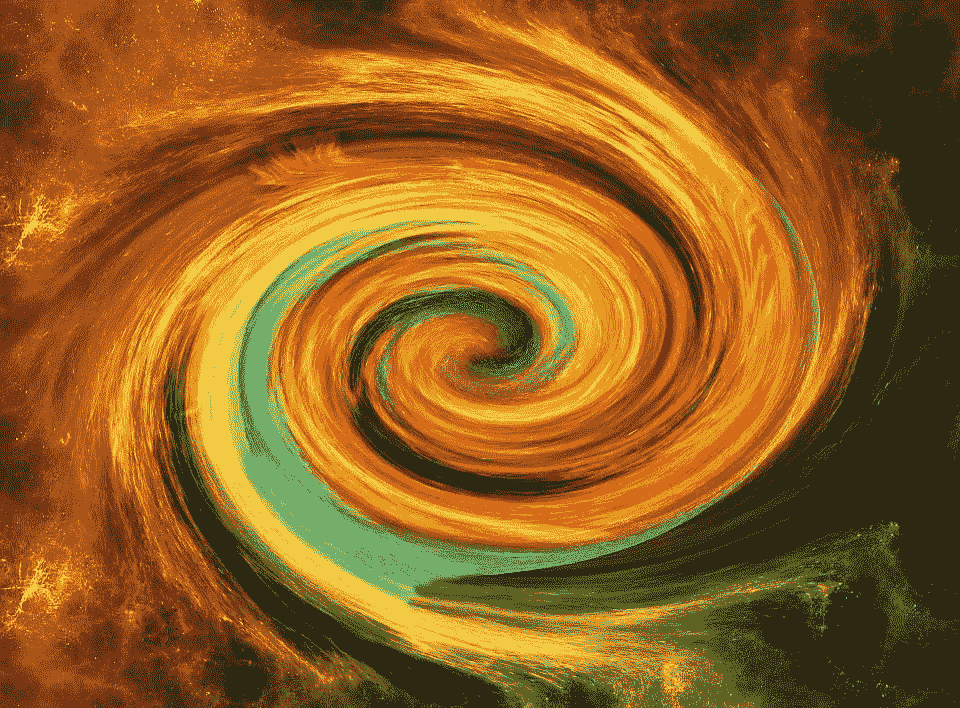

# 应对变化的策略

> 原文：<https://medium.com/swlh/strategies-for-coping-with-change-7bd72ce6fcc>

## 如何变得更有弹性和足智多谋

Credit: 1239652 @pixabay

变化发生了。

有时候突然。有时候很慢。

一些变化会让你的生活陷入混乱，让你犹豫不决，引发愤怒，或者让你陷入恐惧。

其他的变化会让你兴奋，快乐，满足，兴奋，或者只是单纯的快乐。