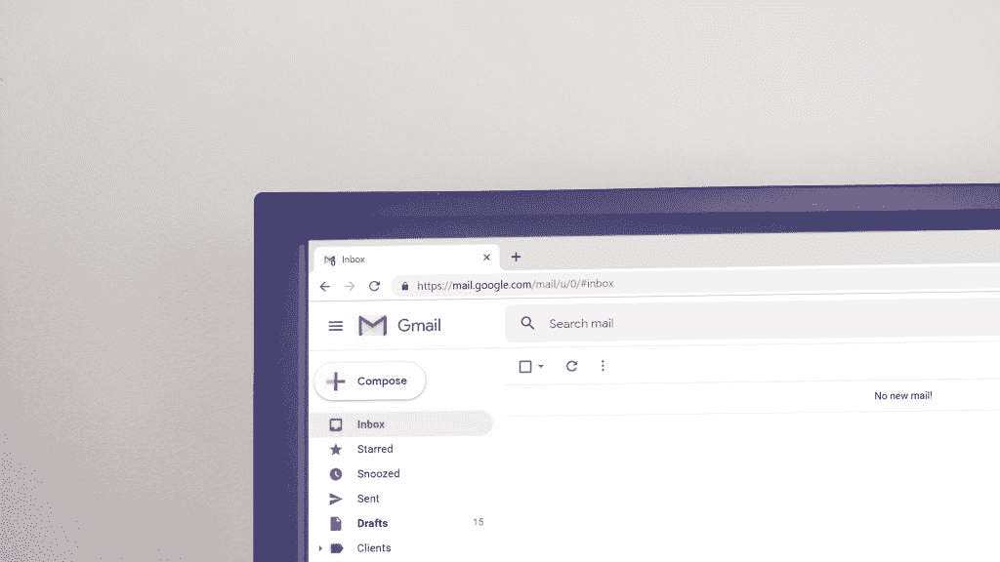

# 管理电子邮件的策略在企业界势不可挡

> 原文：<https://medium.com/swlh/strategies-for-managing-email-overwhelm-in-the-corporate-world-14739432815c>

是时候摆脱电子邮件了吗？这种想法很有趣，但也令人伤脑筋。

让电子邮件过时会让我过时吗？如果那盏闪烁的灯不再需要我的注意，我该怎么办？

作为一家大型银行的高级主管，我的电子邮件有很多来源。我对 13 个银行家的成功和…