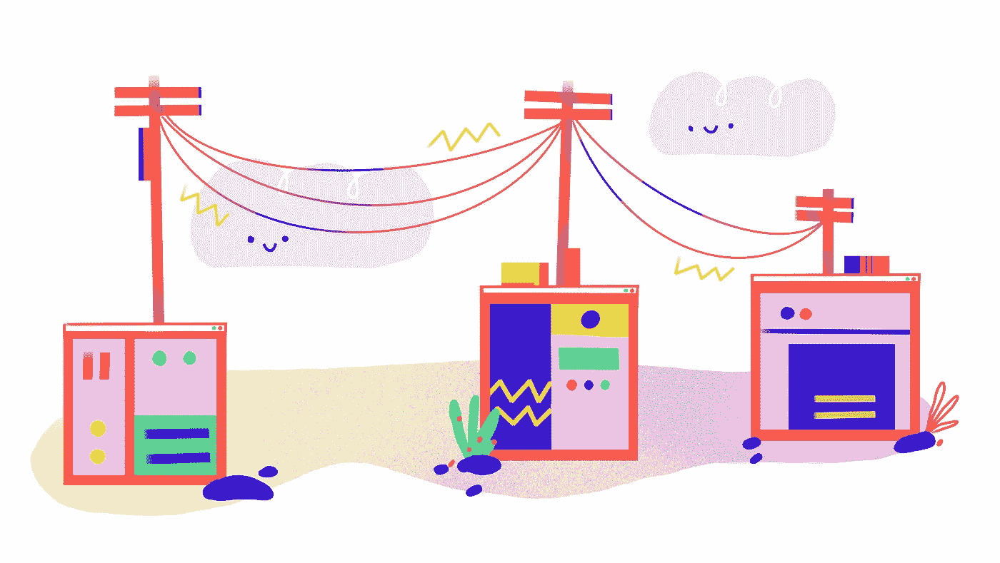

# 使用线框简化您的设计流程

> 原文：<https://medium.com/swlh/streamline-your-design-process-with-wireframing-31ef21f65437>

illustration by [magicksecrets](https://www.behance.net/magicsecret/)

绘制应用程序的界面草图是提炼你的想法并与他人交流的好方法。在许多方法中，纸和笔可能是你的首选，因为它既高效又经济——你可以只用纸和笔在几分钟内画出一组屏幕，并在一瞬间看到你的想法需要改进的地方。

但是在某些时候，使用纸上原型变得不切实际。在这种情况下，您可能需要创建一个数字低保真度原型，也称为线框。

# 什么是线框？

一个*线框*是一个界面的示意图，用于显示整体功能、布局和用户流程，没有颜色、字体、图像和文本等细节。

大多数时候，纸上原型也是一种线框，但为了清楚起见，我建议您仅将此术语用于数字低保真度模型。否则，你可能会把人弄糊涂。

# **为什么你需要线框**

线框很棒。把它们想象成你纸上原型的数字化升级。它们可以让你学到更多关于应用程序构建过程的知识，而不用把时间和金钱花在真正的设计工作上。

该工具优秀的其他原因:

任何人都可以创建一个线框。你不需要有设计背景，甚至不需要基本的布局技巧来制作线框——只需画一些简单的形状和线条，就能看到你的想法形成。

线框有瑕疵是正常的，即使是那些会让设计概念分崩离析的瑕疵。这只是一个示意图。

*线框对于细化软件需求非常有用。你可以向开发人员展示一个线框，他们马上就会明白你想要实现什么。单独使用它们，或者作为你的用户故事的伙伴。不管怎样，你的开发者会非常感谢你的。*

*线框没有会影响理解设计功能的细节。*这些是简化的、黑白的界面轮廓，所以你能看到的只是某个屏幕上可以执行的布局和动作。

*线框图非常适合协作。*由于线框是数字化的，您可以与您的远程团队成员、顾问和投资者共享它们，并就它们进行远程协作。你也可以把你的线框提升到一个新的高度，把它们变成交互式原型——只需要添加一些热点，定义动作，你的可点击原型就准备好了。

# **线框中包括什么**

你不能在线框图上显示那么多。根据您正在构建的应用程序，您通常会展示高层次的 UX 架构和信息设计。

## **用户体验**

线框是应用程序用户体验的框架。所以，你需要展示用户需要采取什么行动来达到他们的目标，以及他们对你的行动会有什么反应。当通往目标的道路太长，或者屏幕上有太多的选择，有太多的路要走时，一个简化的大纲会告诉你。

## **信息设计**

用户体验主要关注用户的路径和用户的满意度。信息设计更注重以用户可理解的方式将信息可视化。线框允许你决定何时何地你的用户将获得信息。

## **UI 设计**

UI 设计是关于界面的人体工程学。这是关于理解你的用户的限制，然后调整界面来适应他们。举个例子，如果你正在开发一个用户会在移动中使用的移动应用程序，最好把按钮这样的控制元素放在屏幕的底部，他们的拇指可以够到。另一个例子是，平板电脑版本的网站可能有更大的按钮，这样更容易在触摸屏上点击它们。

# **线框工具**

大量的工具允许你创建线框并与你的团队合作。其中一些是免费的，但大多数需要一点投资。以下是一些你可以使用的工具的综述:

## **PowerPoint 或 Keynote**

任何演示应用程序都可以用来创建线框。这些应用程序中的大部分都带有预制的通用 UI 元素库，如表单和导航元素。*和*大多数办公套件都带有这些应用程序，所以它们很可能让你几乎不用花钱。

## **图玛**

Figma 绝对是我的首选工具。你可以用它做很多事情！它允许你在浏览器中创建基于矢量的图形，与他人分享你的作品，展示它，并把它变成一个交互式的原型，只需点击几下就可以在你的手机上测试。它是免费的，可以在任何平台上运行，并且在云中工作——不需要存储那些源文件。

## **香醋**

这个工具已经存在很长时间了。其独特的手绘元素风格易于识别，它不仅仅是一种设计选择。由于 Balsamiq 的 UI 元素没有直线，你的线框中的瑕疵不太明显，即使是最粗糙的线框看起来也很好。

# **在过程中学习**

线框是了解你的应用的一个很好的工具，但是这个工具也是必须要学习的。和其他技能一样，更好地创建线框的唯一方法是练习。如果你要开发一个产品，你会有很多机会去做。随着时间的推移，你将学会通过整合团队和用户的反馈来创建清晰、易懂的线框，随着你的线框变得更好，你的 UX 和设计选择也将得到改善。

不要太早陷入细节。当你应该花更多的时间思考整个流程时，很容易开始尝试最终的外观。视觉设计和细节很重要，但是对于大多数应用程序来说，让用户喜欢它们的不是赏心悦目，而是它们的有用性和可用性。

我看到很多团队在一些粗略的草图之后直接进入最终设计，但我真的鼓励先创建一个线框。对于有设计技能的人来说，线框可能感觉是多余的一步，但这就像不先看地图就去远足一样。是的，你已经徒步旅行了很多次，你可以处理任何事情。但是，如果你先着眼于大局，预见到你面临的挑战，你会处于一个更有利的位置。