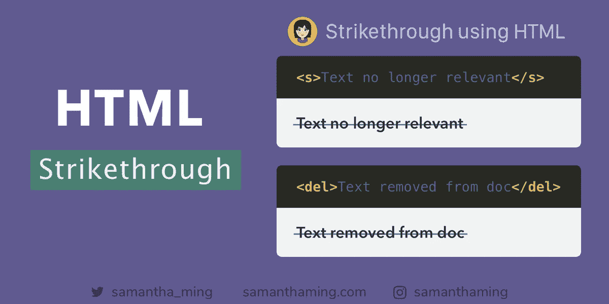

# 使用 HTML5 删除线

> 原文：<https://medium.com/swlh/strikethrough-using-html5-26fea2020a72>



Code Tidbit by SamanthaMing.com

CSS 非常适合样式化，但是不太适合提供内容的含义。这就是 HTML 语义标签的用途。当你试图删除内容时，通常是有原因的。这个原因可以用合适的 HTML 标签来描述。使用`<del>`或`<s>`来传达，并赋予你的代码语义含义🙌

```
<s>Text no longer relevant</s>
```