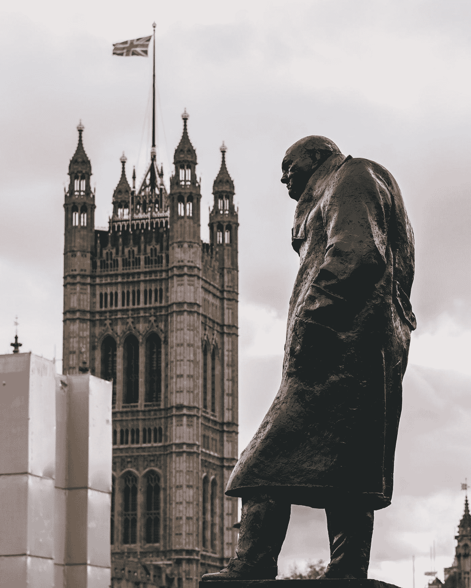

# 强有力的领导:永不屈服意味着什么

> 原文：<https://medium.com/swlh/strong-leadership-what-it-means-to-never-give-in-2a79793f9f84>

## 被误解的引自温斯顿·丘吉尔的领导力及其含义。

Photo by [Arthur Osipyan](https://unsplash.com/@arty_nyc?utm_source=medium&utm_medium=referral) on [Unsplash](https://unsplash.com?utm_source=medium&utm_medium=referral)

我们都知道温斯顿·丘吉尔强有力的领导和永不屈服的固执。温斯顿当然是第二次世界大战期间的英国首相，他的一个重要角色就是发表演讲。演讲技巧温斯顿·丘吉尔…