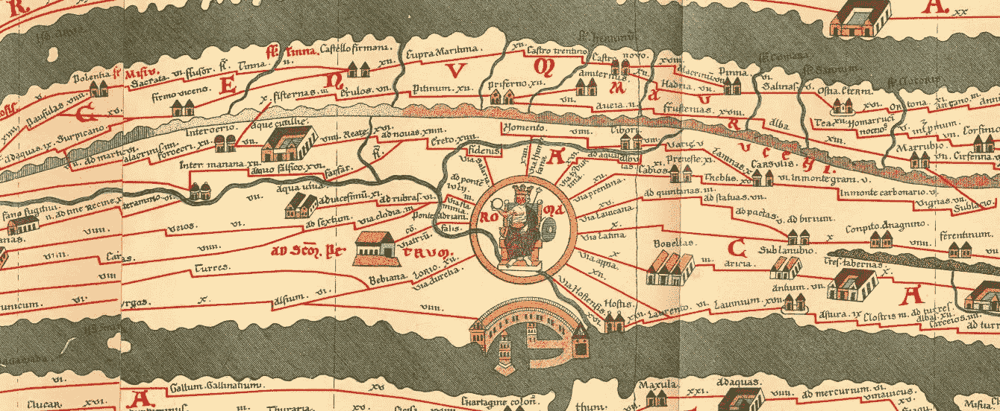

# 结构化 1.0:图形、字符串和 web 组装

> 原文：<https://medium.com/swlh/structurae-1-0-graphs-strings-and-webassembly-25dd964d5a70>

[Tabula Peutingeriana](https://en.wikipedia.org/wiki/Tabula_Peutingeriana), 13th century. Make Graphs This Great Again!

[structuraie](https://github.com/zandaqo/structurae)，这是一个高性能 JavaScript 的数据结构库，之前在这里  介绍过，它获得了一个稳定的版本，为其不断增长的集合添加了内存高效的图形、字节流形式的字符串、排序的结构等等。在这里，我想介绍一些新的结构，并涉及一些相关的主题。

# JavaScript 中的二进制注释