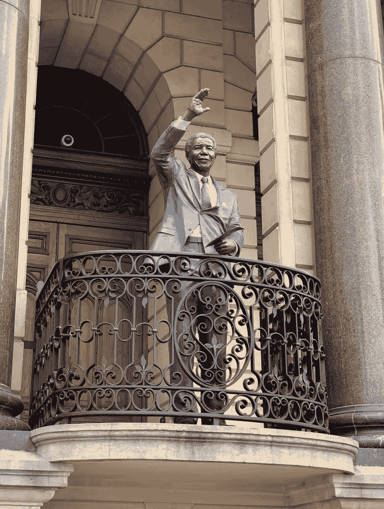
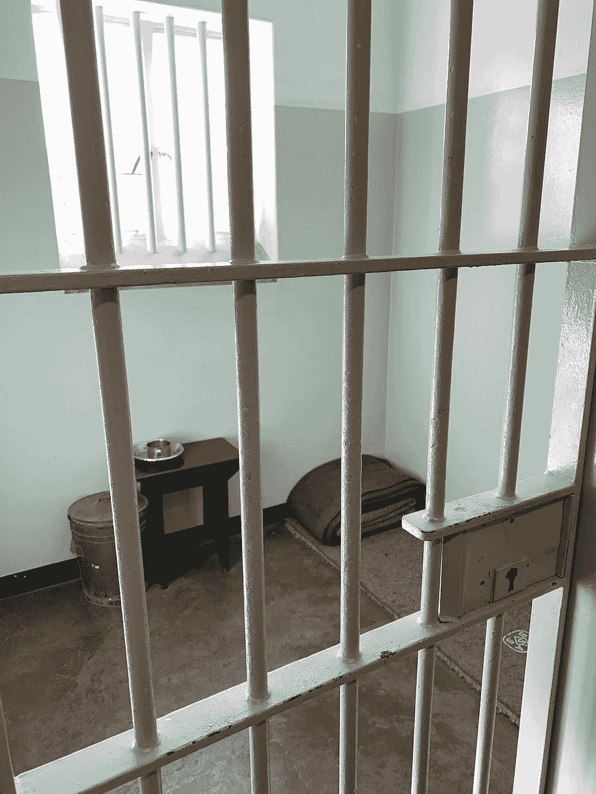
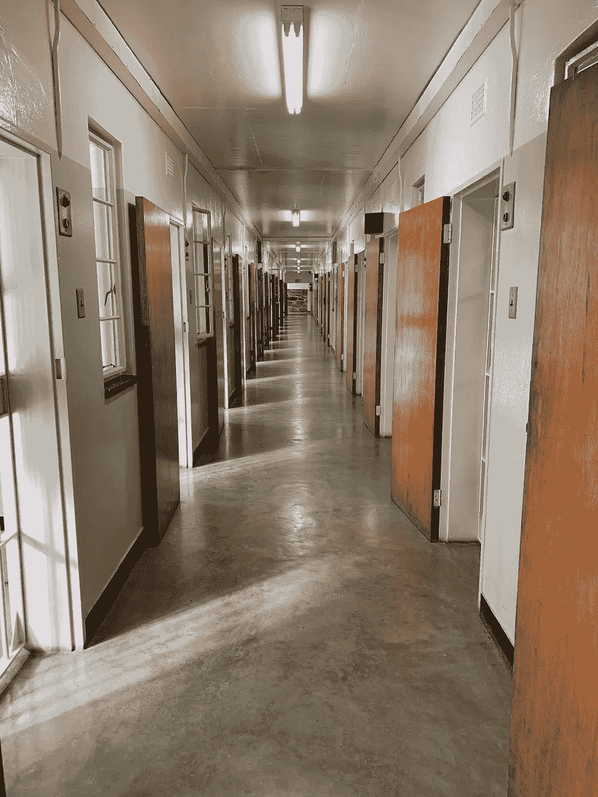
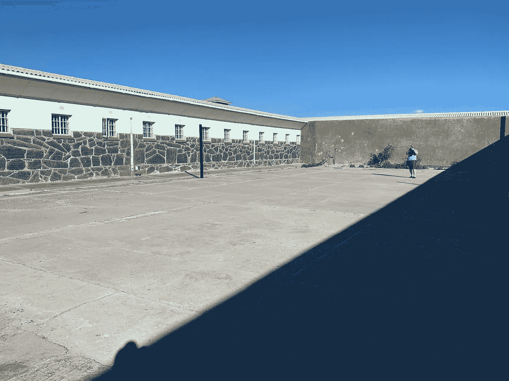

# 奋斗是力量的源泉:纳尔逊·曼德拉的一课

> 原文：<https://medium.com/swlh/struggles-are-a-source-of-strength-a-lesson-from-nelson-mandela-b15b7f339b0e>

站在罗本岛戒备最森严的监狱 B 区纳尔逊·曼德拉以前的牢房里，我感到了希望的鼓舞。

罗本岛位于开普敦海岸，是南非的阿卡特兹。他们在这里关押了两种类型的囚犯:犯有你会想到的罪行的罪犯，和政治犯。

曼德拉当了 27 年的政治犯，其中前 18 年是在罗本岛的这间小牢房里度过的。他在大陆的另外两所监狱度过了余下的 9 年，直到 1990 年被释放。

当我看到他以前的牢房时，首先想到的是“他怎么能躺着呢？”他是一个高大的人，他不可能舒服地躺在地上。这间牢房大概有 6 平方米。曼德拉不仅在那里度过了 18 年，也正是在这间牢房里，他形成了对自由的看法，并坚信自己终有一天会获得自由。

这座监狱的条件一点也不豪华。

我很幸运，我今天的导游是一位前政治犯，他从 1977 年到 1982 年被囚禁在罗本岛。在高中时期，他是反对种族隔离的积极倡导者，十几岁时被捕。通过他的眼睛和经历来了解监狱生活让他感觉更加真实。

曼德拉成功地鼓舞了一个国家团结起来，并在 90 年代避免了内战。他分享道:“当我走向通向自由的大门时，我知道如果我不把我的痛苦和仇恨抛在身后，我仍然会在监狱里。”

昨天在开普敦的徒步旅行中，我参观了曼德拉作为自由人发表第一次演讲的历史性地方。

超过 100，000 人整天等着听他的话。人群让他很难真正走上舞台。他被安排在当天下午 2 点发言，直到晚上 9 点才露面。在他向人们传达的众多信息中，有一条是关于在结束种族隔离的选举中投票的指示。

曼德拉代表着希望，是他的奋斗给了他帮助解放这个国家的力量。

当我反思我在商业、人际关系和健康(身体和精神)中经历的挣扎时，我意识到这些挣扎一直是我生活的力量源泉。我对奋斗的态度开始改变，成为一个感恩的人。

-

你喜欢这个吗？看我的博客[*find focus . today*](http://findfocus.today/)*和* [*报名我的快讯在这里*](http://findfocus.today/email/) *。*

*延伸阅读:*

[*——我的未知之旅*](http://findfocus.today/trust/)

[*——我喜欢，我希望，我好奇*](http://findfocus.today/lww/)

[*——分解我生活中的需求*](http://findfocus.today/needs/)

*更多关于我这几天在忙什么*[*ByKunal.com*](http://bykunal.com)*。*

*在*[*LinkedIn*](https://www.linkedin.com/in/bykunal/)*[*Twitter*](https://twitter.com/kunalfrompolar)*[*insta gram*](https://www.instagram.com/kunal.mindful)*或* [*Medium*](/@findfocus) 上与我连线。**

****

## **这篇文章发表在 [The Startup](https://medium.com/swlh) 上，这是 Medium 最大的创业刊物，拥有+434，678 名读者。**

## **在这里订阅接收[我们的头条新闻](https://growthsupply.com/the-startup-newsletter/)。**

****