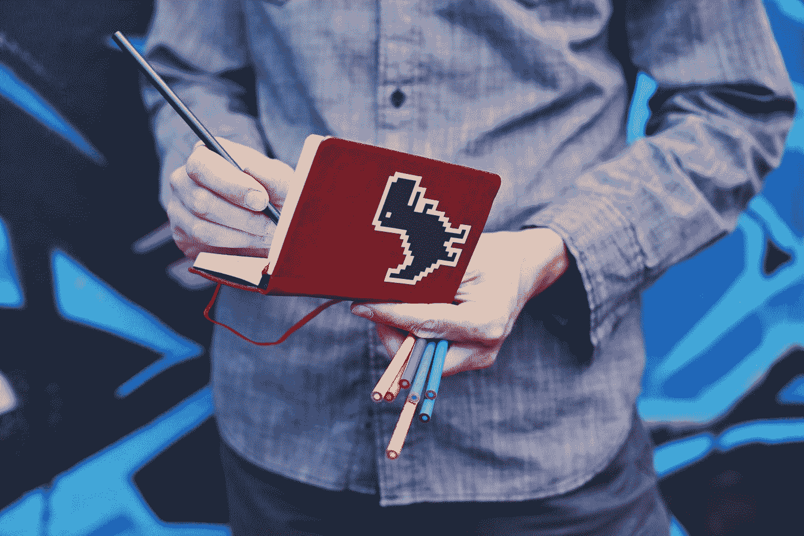

# 创造性内向者的挣扎

> 原文：<https://medium.com/swlh/struggles-of-the-creative-introvert-fc74708c8bd1>

平衡这两种属性带来了独特的挑战。

Photo by [Sticker Mule](https://unsplash.com/@stickermule?utm_source=medium&utm_medium=referral) on [Unsplash](https://unsplash.com?utm_source=medium&utm_medium=referral)

创造力被视为想象力和艺术能力的外在表现。我们可以把我们所有的想法藏在心里或隐藏起来，这并不意味着我们没有创造力，只是没有人会这么想。这就是创造性内向者的困境。有一种强烈的欲望要制作东西并与世界分享，但是…