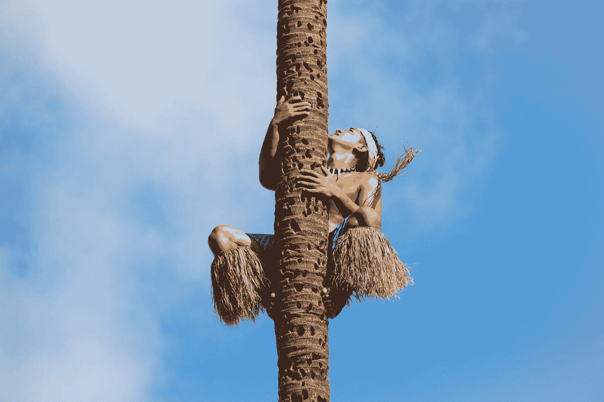

# 成功是艰难的。但是也许我们不应该以其他方式想要它

> 原文：<https://medium.com/swlh/success-is-hard-but-maybe-you-shouldnt-want-it-any-other-way-989d43aa3045>

## 最终是攀登让它变得值得。

Photo by [Michal Pechardo](https://unsplash.com/@michalp24?utm_source=medium&utm_medium=referral) on [Unsplash](https://unsplash.com?utm_source=medium&utm_medium=referral)

如果说我在 30 年里学到了什么，那就是让任何有价值的事情取得成功都很难。

成功是一次向上的攀登。你必须有意识地对待它。或者你有没有发现有人梦游爬上了一个…