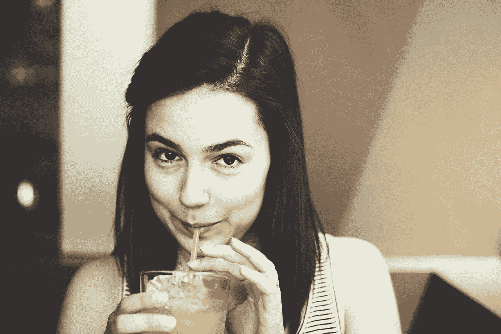

# 忍一忍吧…有时候

> 原文：<https://medium.com/swlh/suck-it-up-sometimes-deff3fa29cba>

[https://www.needpix.com/photo/798608/drink-drinking-female-person](https://www.needpix.com/photo/798608/drink-drinking-female-person)

当我大约 16 岁的时候，我在踢足球的时候扭伤了脚踝。

救护车被叫来了，我耐心地在我被不礼貌地抛弃的边线上等待，让比赛重新开始。

很疼。很多。但我知道这种痛苦是短期的。所以我在这期间通过讲笑话来分散自己的注意力。

不管是出于同情还是真正的娱乐，我的插科打诨引起了关心我的一群看护者相当多的笑声。在我喜剧性成功的鼓舞下，救护车到达时，我的情绪很高——尽管鸡蛋大小的肿块已经开始从我新获得的溃疡中突出来。

当我被塞进货车后座时，护理人员递给我一个绿色的哨子。

“吮吸它”她建议。“它会停止疼痛”。

我礼貌地拒绝了，但她奇怪地坚持，所以我顺从地吸了一口。一种令人厌恶的味道立即袭击了我。那滋味比疼痛更难受！

但是我的护理人员鼓励我继续。在她充满期待的目光下，我在救护车的旅途中假装吞下令人恶心的吗啡“点心”，同时偷偷屏住呼吸以免吸入。

从那天起，我就被我们对不适的恐惧迷住了。

无论我去哪里，我都被鼓励去沉默我最温和的抱怨。我去找我的医生开诊断书，然后带着抗生素的处方回家。轻微头痛？吃点止痛药。饿吗？快——找点吃的！

好像带着不愉快的感觉坐着是愚蠢的，甚至是有害的。一旦发现这种不适，就必须马上消除。

这让我很担心。

让我担心的是，当我们感觉不是 100%好的时候，我们可能会忘记如何应对。没有实践，我们会失去抵御逆境的能力——仅仅是因为我们回避了它。

直到我们最终不得不直面它的那一天到来。

我担心我们会不再珍惜我们的健康。我们会忘记不好的感觉，开始把健康视为理所当然——假设它是默认的。在这样做的时候，我们可以免除维护它的任何责任。

让我担心的是，当我们不断抑制疼痛时，根本原因却没有得到解决。简单地让问题消失会阻止我们首先调查它们为什么会存在。

为什么我们的血压高。**为什么**我们的皮肤发痒。**为什么我们总是感到悲伤。**

所以我们无意中延续了让我们生病的生活方式。

我们服用降压药，继续让自己从事我们讨厌的高压力工作。擦护肤霜，并不断摄入剥夺我们身体重要营养的有毒食物。吞下抗抑郁药，继续过着与世隔绝、缺乏联系和意义的浅薄生活。

不要误解我——我不是说没有一个好的老止痛药的时间和地点。我的意思是，我不希望任何人要求他们的外科医生在没有装满药物的情况下开始切片。

当在探索原因没有成功之后，疼痛仍然长期使人虚弱——当然。有时候来点小东西缓解一下压力会有帮助。即使只是为了帮助早上起床。

但是我不认为完全没有不适的生活是健康的。

不管感觉有多好。