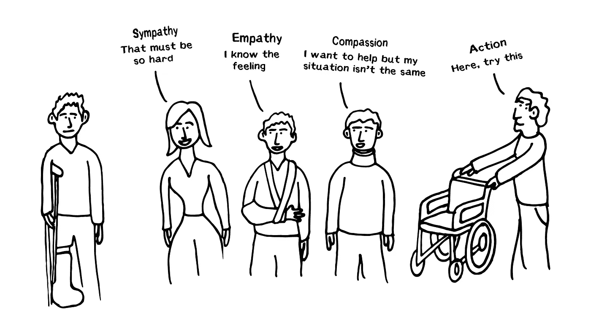

# 窒息你的自我，它正在杀死你——一个设计师的经历

> 原文：<https://medium.com/swlh/suffocate-your-ego-its-killing-you-a-designers-experience-a288e6d9cbd0>

如果说迄今为止我在设计行业学到了什么人生经验的话，那就是**同理心**是最流行的一个词，成为一名伟大的设计师需要积累技能(见鬼。甚至是伟大的人类)。我把这些技能称为你的 RES(理性情感套件)，它由以下几部分组成:

*   **透视**
*   **E** mpathy
*   C 激情
*   **一个**动作

所以，在这个故事中，我将告诉你我是如何种植出令人印象深刻的 PECA 的😉🍆。

## 自我反思和学习

我明白了，这些是你将拥有的最强大的技能，而自我是含糖的软饮料，慢慢腐蚀你，同时给你捏造的肯定，给你一个肯定。他妈的。爆炸性的。血清素去甲肾上腺素和多巴胺。

我发现这些技能非常具有讽刺意味；通过控制情绪，学会客观地看待自己和他人。这有什么意义？简单来说，就是耐心和毅力。你的个人情绪状态，或者与自我混淆，源于自我意识、焦虑、附带的成功和自恋。只有关注他人并与他人合作，我们才能实现目标。尽管面临紧急情况和膨胀的情绪状态，你对成功的坚持来自于你处理好自己的能力，当然还有…耐心。

一个导师曾经教过我，在回应前插入 3 秒。如果你的老板或客户大骂你糟糕透顶，你能保持沉默吗？问问你自己:

*   回应或辩护能获得什么？
*   他们经历了什么导致这样的评论？也许是来自其他方面的压力？期望不同？对立的观点？

最后，不要让来自不完整观点的其他评论质疑你的能力并定义你前进的道路。我们都是从糟糕开始的，但是如果你继续相信你是糟糕的，你将永远无法克服它。

所以回到我们最喜欢的术语——移情。同理心是一个非常宽泛的术语，也是一种留给想象空间很大的技能。当一个人因为他的朋友去世，而你的朋友也去世了而难过时，移情是理解吗？同理心是在争论或激烈的情况下识别背景信息和观点吗？一种是，一种不是。你的经历可能不同，因此你的同理心不平衡。

但是在我们理解共情到底是什么之前，我们必须识别共情和同情之间的区别；同理心是体验他人情绪状态的能力，而同情只不过是关心他人情绪状态的强烈欲望。同情不完全等同于理解，移情不等同于行动。理解同理心不需要行动，只需要承认。没有行动的同情是无用的，有行动的同情不仅仅是同情。现在我们有进展了。

同情是往上爬的一步。同情现在增加了你移情的动机。现在你想为此做些什么，但直到你采取行动，当你真正开始有所作为时，行动才是最困难的。你必须尝试和失败。然后你学习如何行动，风险是可怕的，努力是，嗯，困难的。

你知道大多数事情都是“容易学，难掌握”……这些都是 ***难学，更难掌握。***

## 我的历史

我是一名澳大利亚产品设计师，在企业咨询、早期创业、代理和成熟(但不太大)的产品公司有 5 年以上的经验。丰富多彩的背景使人们对这个行业有了深入的了解，在空间、人群和商业之间建立了陌生的联系。

我的职业生涯始于克里斯·海姆斯沃斯拜伦湾度假屋[大小的自我和唐纳德川普推特活动](https://www.news.com.au/finance/real-estate/buying/photos-show-huge-scale-of-chris-hemsworths-9-million-byron-bay-megamansion/news-story/d1b08fbf0a95e202a7c2533adf6dadf0)[的技术能力对比](https://www.cheatsheet.com/entertainment/trumps-worst-tweets-so-far.html/)。

我喜欢把情况归咎于他人…我真的学会了。探戈需要两个人，一个人不能在没有另一个人在场的情况下把探戈搞砸。所以事实上这不是谁的错，只是观点不同而已。当然，有些人比其他人有更多的前提，但如果一个人不知道另一种观点，那么你永远不会跳探戈，记住，跳探戈是目标。

## 我是什么时候意识到这一切的？

直到发生了一系列事件，我才终于意识到自己的行为。一系列事件包括破裂的关系、未兑现的承诺、未完成的项目和低效的流程。无论某人犯错是因为“这是他们的工作”还是你没有意识到，这都没有区别。不管头衔、角色和系统责任如何，你都要对结果负责并控制它。创造责任和问责的筒仓创造了一个失败的系统和一个情感的大杂烩。

这并不意味着什么都做。这意味着在适当的时候意识到每一个人和每一件事，并尽你所能给予帮助。

## 如何提高自己的 RES。

虽然个人成长没有线性过程，但我会把我的学习整理成一个提问的过程。面对每一种情况，挑战自己，用不同的方式思考:

1.  辨别——我现在情绪激动吗？我是在针对个人吗？我的浊音提高了吗？我的心率升高了吗？我真的在听吗？
2.  暂停——用 3 秒钟的时间来正确分析你当前的状态，并考虑他人的观点。这可能比你预期的时间要长——不要因为焦虑而觉得需要回应。
3.  思考——在头脑中运行各种场景，假设最好的、最坏的以及介于两者之间的一切。问问你自己*为什么？* 3+次。
4.  暴露你自己——即使你不相信任何方式、形状或形式是你的错……让它成为你的错。应用任何必要的细节来想象你本可以做得不同。这可能会提供对相反观点的洞察力。
5.  行动——练习完以上内容，**做点什么**。你不会把这件事做对，也没人指望你会这么做，但你会学会每次都行动起来。
6.  分享——不要止步于此，获取更多的观点和看法。不要强调某些方面或故事。你不会从被告知你的自我想听到的事情中得到任何东西。保持客观，每次讲述不同的故事，观察你得到的回应的主题。
7.  反思—我是否正确地完成了第 1 步到第 5 步？老实说。我骗自己了吗？对别人？为什么？我害怕什么？找出你的不安全感，用你的休息来克服它们。

## 对你有什么好处？

“罗马不是一天建成的”是一句谚语，暗示复杂的任务或伟大的成就需要时间和努力，不应该匆忙。罗马不是一天建成的，也不是一个人建成的。你应该把自己当成罗马，把自己的建筑当成别人的贡献。首席执行官并不比你更伟大，毕业生也并不比你更没有技能。你可以从房间里最环保的人那里学到一些你不知道的东西，同样，首席执行官也可以从你这里学到东西。

考虑由您的 RES 推动的沟通和协作，这是您成功的关键发展要素。

我一直相信，如果你有帮助他人成功的普遍兴趣，那么除了成功之外别无选择。

*   你的用户不会愚蠢到没有注意到屏幕左上角的汉堡菜单，当它出现在每一个现代移动网站上的时候。
*   你的经理没有被权力绊倒，因为他们与团队其他成员的明显愿景不一致。
*   你的客户不会因为想把按钮的颜色改成红色而感到痛苦。
*   你的同事不是狗屎，因为他们没有做“他们应该做的工作”。

可能是吧。但是首先你必须理解他们的观点，理解他们行为的根源，合理解释他们的决定，最重要的是…行动。

生活是一场多人游戏。认可他人。请记住，如果没有新南威尔士州和 QLD 团队的参与，黄邦贤·瑟斯顿就不会为 2017 年第二届起源州比赛打入[制胜一球。(蹩脚的澳大利亚体育集锦🙄)](https://www.qt.com.au/news/thurston-live-forever-immortal-after-qld-fightback/3192276/)

放下你的自我。了解更多。你会变得无所不能。

你多久花一次时间客观地思考一下情况？你多久会把它包起来，放在黑暗房间的角落里，然后忘记它？

想想上一次你因为不愉快而离职，或者客户关系以失败告终。应用上述步骤。写下来。重复一遍。

我挑战每一个人和每一个阅读这篇文章的人来开始一场讨论，提供不同的观点或质疑我所说的任何事情。知识只能从我们有机会接触的人的学习和我们接收并应用的大量观点中获得。