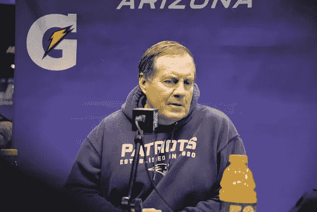

# 超级碗蔻驰比尔贝利奇克的 3 个最重要的获胜故事

> 原文：<https://medium.com/swlh/super-bowl-coach-bill-belichicks-3-most-important-stories-of-winning-9311443ca9c9>

比尔·贝利奇克，这个如今和美国体育史上任何一位教练一样成功的代名词，并不总是这样的赢家。他并不是一夜之间就获得了主教练的职位。直到他将近 40 岁的时候，才有人委托他领导一支职业足球队。然后呢？