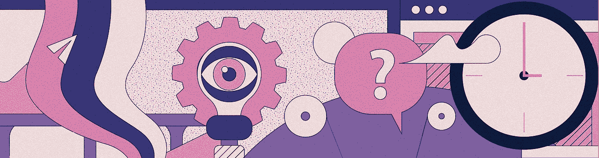

# 支持是一件永恒的事情

> 原文：<https://medium.com/swlh/support-is-not-supervision-b848a5511c5f>

## 或者微观管理是如何让创意走向失败的

每个月的第一个星期一，我会坐下来与工作室的每个成员进行一对一的混合评估/检查。正如你所料，我的一些同事担心这是一种增加审查的方式，并且害怕每个月都被放在显微镜下观察。

如果你相信一些传说，那么你就知道创意人员是出了名的“难以管理”，他们抵制监督和规则，要求自主权。

尽管最初遭到抵制，但每月一次的会议取得了巨大成功。但让这个故事值得讲述的是，我们的月度会议揭示了重要的盲点，这些盲点从相对较小的调整中带来了真正的变革。

从这些会议中得出的第一个见解是，关于管理有创造力的人和团队的普遍智慧存在致命的缺陷。归结起来就是:

1.  创作者的自主权越大，他们得到的管理支持就越少。
2.  他们得到的支持越少，就越容易失去自主权。

## 为什么这是个问题？

表面上，这听起来像是一个明显的权衡。如果自主就是自由，而伴随着自由而来的是责任。这意味着更少的监管。

但是支持和监督是两码事。那么是什么原因呢？

在六个月的每月一对一之后，我注意到一种模式正在形成:队友对他们的直接经理(在某些情况下就是我)最常见的抱怨是微观管理。这种微观管理没有从一个项目蔓延到另一个项目，对此我不太理解。但是因为这种情况，我能够更深入地挖掘最初导致微观管理的动力。

每一次，他们的经理都有“理由”更多地参与作品的制作。这些失误很少是非常戏剧性的:设计师交付的作品感觉粗糙，或者完全没有达到目标。

我进一步追问(你知道，“[问为什么直到你哭](https://en.wikipedia.org/wiki/5_Whys)”……没有*实际的*酷刑，但它押韵)，这就是事情变得有趣的地方。答案是，他们在交付日期之前很久就已经在挣扎了；有了一个概念，或获得资产或信息，或与团队或语言或技能有困难。结局总是这样:

> 我:“那你为什么不求助？”
> 他们:……
> 我:“你向【直接经理】求助了吗？”
> 他们:“不行”
> 我:“为什么不行？”他们:“嗯，我还不想放弃。”

想想吧。

遇到困难时寻求帮助等于放弃。但是没有说出来的是，他们觉得他们放弃了这项工作。当“放弃”意味着“放弃控制”时，这种感觉更有意义。

他们需要支持，但不觉得请求支持是一个选项。他们没有请求支持，因为这将意味着失去自主权。

这主要是因为最有能力成为支持者的人恰好也是管理者；比如说，项目经理或创意总监。换句话说，因为管理者同时做这两件事，管理者自己开始把支持视为一种监督形式，而事实上恰恰相反。

但是支持是在所有层面上创造性成功的一个促成因素。给予自主权但取消支持会让人们走向失败。

## 自主:复习

*不需要重述吗？跳到下一节。*

在任何职业中——但是*尤其是*创造性的工作——重要的是要勤于拆除控制的脚手架，并随着人们技能的提高给予更多的责任。否则，这种关系会变得令人窒息，并很快进入微观管理的领域。

这意味着被微观管理的感觉可以作为停滞期的一个功能出现。而微观管理是*总是*有毒的；这表明对某人的能力失去了信任。即使监督保持不变，这种感觉也会出现，这很能说明问题:人们已经超越了监督水平。未能注意到团队成员的进步并做出相应的反应是非常常见的，也是非常有害的。

当你清除了不必要的监督时，自主性就出现了:它是赢得的，它标志着对他们技能的信任(首先)，以及越来越多的对他们判断的信任。

对于从事创造性工作的人来说，自主是一件大事。这是有道理的。创造性的工作需要产生新的想法，而不是照本宣科。因为这并不简单，将创造性工作保持在一个受约束的过程中扼杀了创造性所需要的两样东西:安全感和以不同方式思考的机会。

想法需要空间来反弹。一个海军般严格的生产时间表关闭了创意人员拥有的最有价值的技能:想出新东西。从无中生有。

这并不是说自主就是乐趣和游戏——自主是伴随着越来越多的责任而来的权力和控制。但它也放开了生产手段，这意味着创意人员需要的空间由他们支配。

## 支架 101

第一步是学习如何区分支持和监督。

当你从一个人手中夺走控制权时，你是在监督下解决问题。说他们来找你是因为他们在决定如何推进一个设计上有困难。如果你为他们做了决定，你就有效地夺回了控制权。这可能会让你去查看“T8”，看看进展如何。没过多久，你就卷入了生产的细枝末节。

**你通过帮助人们扫清他们需要扫清的障碍，在支持下解决问题**。你从未掌控过。通常，支持就像问一些尖锐的问题，倾听他们寻找他们可能需要的线索一样简单。

支持有创造力的人有多种形式:

*   相信他们有能力做一些事情，帮助解决一个棘手的问题，并确保你不会干预决策本身
*   保护对资源的访问，或帮助利用现有资源
*   辅导解决问题
*   向第三方展示时，代表他们/代表他们创作的作品进行宣传
*   公开他们的成就(与他们沟通后)
*   创造和维护一个安全的创造环境(也就是说，当事情不顺利的时候承担责任)
*   成为他们职业发展目标的良好倡导者，帮助他们找到他们感兴趣的项目或工作，帮助他们发展他们想要发展的技能
*   通过过渡到根据有创造力的个人自己设定的标准来衡量绩效，来加强自主实践

## 结局如何？

在内部，这是一个有着美好结局的故事。它消除了回避所有人的“乖戾的设计师”现象。当人们能够得到他们需要的支持，而不用担心他们会被套牢时，他们就会这样做。它几乎消除了耻辱-失败-微观管理/敌意收购的循环。

总的来说，很明显工作室里有了更多的信任和善意。反过来，这也有助于培养合作精神、对工作的自豪感和不健康竞争的降级。

## 让我们回顾一下:

*   如果你管理人员，明确监督和支持之间的区别，以及如何确定这在你的环境、公司或行业中意味着什么。
*   支持是所有层面创造性成功的促成因素。没有监督的支持会让人们走向失败。
*   给予更多的自主权是一种信任的姿态，这种信任可能是来之不易的。在出现并发症的第一个迹象时就把它夺走，会侵蚀人们对你的信任。
*   学会做一个不牵缰绳的盟友。
*   记住:支持创造安全，而安全是创造性冒险的关键组成部分。
*   向你的队友展示你在他们身边，他们可以向你倾诉担忧，或者向你寻求帮助，而不用担心被排挤

*嘶…喜欢你读的书吗？注册* [*我们的时事通讯*](http://bit.ly/YayLetsBeFriends) *，每月获得一份设计和创意方面的好东西！❤*

想和我们一起工作吗？访问[我们的网站](https://weareinhouse.com)或[问好](https://www.weareinhouse.com/contact)。

## 这篇文章发表在 [The Startup](https://medium.com/swlh) 上，这是 Medium 最大的创业刊物，拥有+444，678 名读者。

## 订阅接收[我们的头条](https://growthsupply.com/the-startup-newsletter/)。

