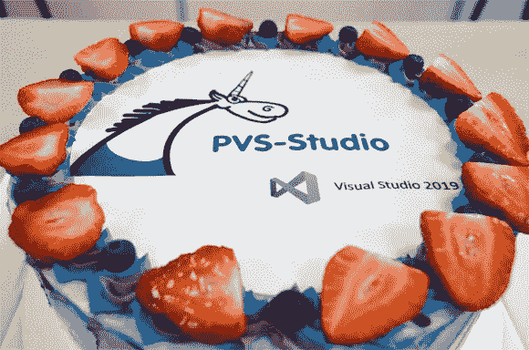

# PVS-Studio 中对 Visual Studio 2019 的支持

> 原文：<https://medium.com/swlh/support-of-visual-studio-2019-in-pvs-studio-819ec6d972a4>

PVS-Studio 中对 Visual Studio 2019 的支持影响了许多组件:插件本身、命令行分析器、C++和 C#分析器的核心以及一些实用程序。在本文中，我将简要解释我们在实现 IDE 支持时遇到了哪些问题，以及我们如何解决这些问题。