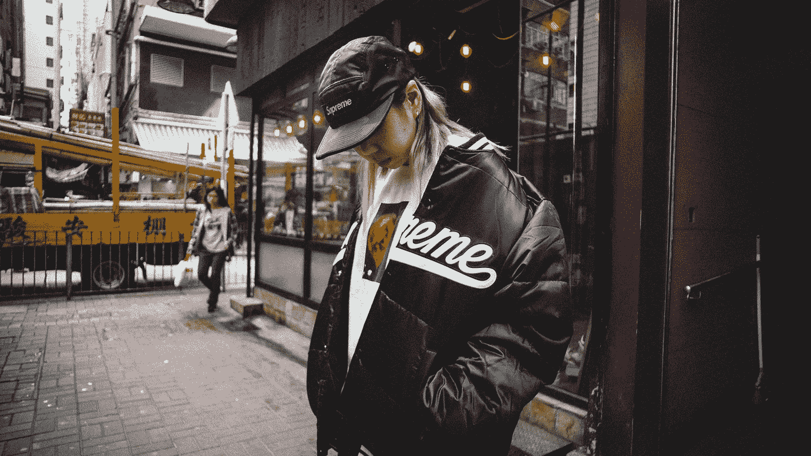

# 至尊，威格曼和抵制贪婪的好处

> 原文：<https://medium.com/swlh/supreme-wegmans-and-the-benefits-of-resisting-greed-for-your-own-good-dbe13daa1475>

Photo by [JC Gellidon](https://unsplash.com/photos/81fEanp-xXc?utm_source=unsplash&utm_medium=referral&utm_content=creditCopyText) on [Unsplash](https://unsplash.com/search/photos/streetwear?utm_source=unsplash&utm_medium=referral&utm_content=creditCopyText)

乍一看，它们毫无共同之处:一个为世界各地的嬉皮士所穿的街头服饰品牌，以及一个始于纽约北部的地区性超市。

但是 Supreme 和 Wegmans 都激发了狂热的忠诚。他们这样做的方式并不复杂——他们分享价值。