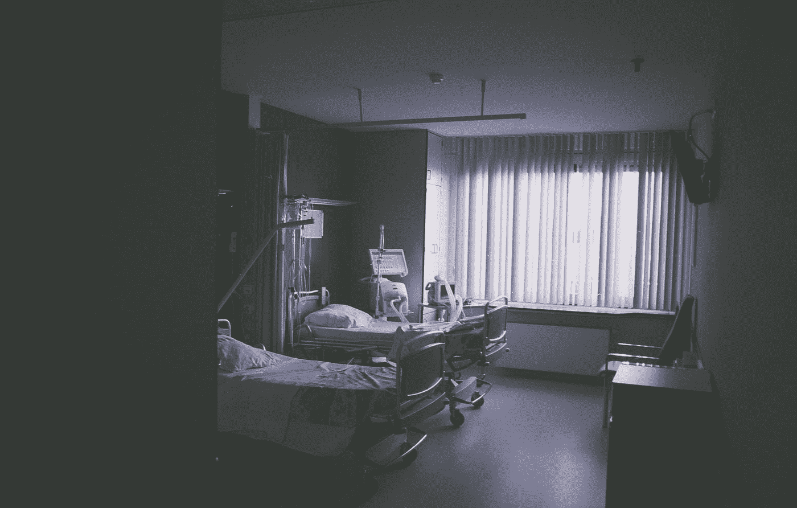

# 从癌症和心碎中幸存

> 原文：<https://medium.com/swlh/surviving-cancer-and-heartbreak-9d48b70f2fe6>

## 分享我混乱的课程

Photo by [Daan Stevens](https://unsplash.com/@daanstevens?utm_source=medium&utm_medium=referral) on [Unsplash](https://unsplash.com?utm_source=medium&utm_medium=referral)

当我六岁的时候，跳着舞，唱着《珍宝》，我想可以肯定地说，我并没有完全理解心真的“每天都在破碎”这个事实。我没有注意到那种令人恶心、似乎令人心碎的状态，几乎每个人都分享着一生中至少忍受一次的快乐。