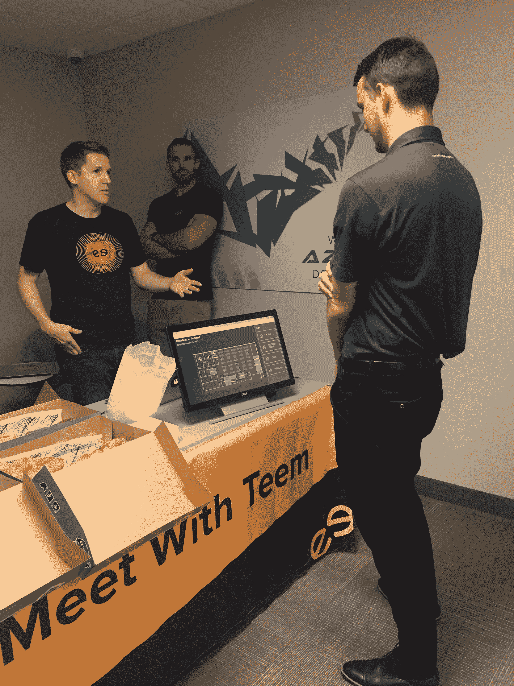

# 群体测试是针对初创公司的快速用户测试

> 原文：<https://medium.com/swlh/swarm-testing-for-startups-64dfd3492314>

## 对于启动项目经理:我们如何让 300 多名用户在 1 个月内测试我们的 B2B 原型

## 语境

在 [Teem](http://www.teem.com) ，我们构建消费者体验软件，并出售给企业。我们为日常员工开发应用程序，以更有效地处理他们的日常事务。在这种动态中，我们的客户是企业公司，但我们的用户是这些企业中的“消费者”。我们的客户联系人通常是 IT 主管，他们向公司内的最终用户提供我们的产品。

想法，没有执行，只是想法。执行一个想法，并将其转化为产品的主要部分是测试你的假设，并根据你的发现进行迭代。这是确保您的产品具有影响力并最终找到产品市场契合度的关键部分。在[我如何构建产品](/swlh/how-i-productize-an-idea-a7dafee247ac)的一个重要步骤是用户测试。

> 我们在寻找消费者类型的用户来测试我们的产品，没有针对我们产品的特定议程。

# 不要走阻力最小的路

很容易让人测试你的设计并提供反馈。在 B2B Saas 中，识别和吸引能够提供**无偏见输入**的**目标用户**并不容易。你的测试人员对你的产品越熟悉，输入就越有偏见。来自公司内部人员的反馈是阻力最小的途径，但也是最受污染的途径。您最喜欢的客户中的高级用户或联系人很容易接触到，但在“测试”您的设计时，通常会有功能驱动的议程。我们在寻找消费者类型的用户来测试我们的产品，没有针对我们产品的特定议程。

> 确定**能够提供**无偏见输入**的目标用户**并让其参与进来。

# 让 300 多名用户测试你的设计

***秘密？糖和赃物。*** 我们是这样做的:

我们没有让它成为客户的负担，而是将用户测试变成了一种利益。我没有太多的预算，所以我必须找出如何激励人们测试原型。我们发不起礼品卡，特别是因为人们不重视 10 美元以下的卡，所以我们选择了大多数人喜欢的东西——油炸圈饼。

我们打电话给当地的顾客，询问我们是否可以去他们的餐厅摆一张桌子。桌子上会有 75 个免费的甜甜圈、几件 t 恤和一个很酷的原型，任何人都可以测试。就这样，我们承诺在不到两个小时的时间内完成设置并离开办公室。一旦我们为他们的同事提供免费甜甜圈，我们在公司的联系人就兴奋起来*(因为他们会是促成免费甜甜圈的人)*并促成了这件事。

Photo by [Anna Sullivan](https://unsplash.com/@aesullivan2010)

很简单。当人们走过时，我们问他们是否想要一个甜甜圈——大多数人想要一个甜甜圈。然后我们说，如果他们花 30 秒钟测试我们的原型，他们就可以有一个——大多数人认为 30 秒是甜甜圈的一个很好的妥协。

在第一次[群体测试会议](http://morganwilliamsdesign.com/kiosk.html)中，我们有大约 80 人测试原型并提供输入。然后我们回到办公室，花了几天时间从我们所学的东西中迭代原型，并在另一个办公室又做了一次。每次会议后，我们在设计迭代中这样做了大约 6 次。

> 群体测试的效率和效果令人难以置信——但并不适合所有产品。

# 在使用此方法之前，请执行此操作

1.  首先确保这种方法对你的产品有意义。我们正在为办公室建造一个交互式信息亭，群体测试方法非常适合。
2.  准备一个策略，在短时间内用您拥有的空间处理大量用户。你想避免拥挤和排长队。
3.  为测试你的原型准备入门、问题和任务。引物是你的假设和未知。然后把问题放在一起，具体阐明你的初级读本。任务是你想让用户用你的原型去尝试和做的事情，看看产品是否足够直观。

我们现在称之为群体测试，是出于与难以接触到的用户联系的需要。我对它的有效性感到惊讶，但这就是初创公司的乐趣——我们想出了这个主意，并在一周内知道我们是否在做什么。[负责产品设计的摩根·威廉姆斯](https://medium.com/u/3187009faa6a?source=post_page-----64dfd3492314--------------------------------)在[写了一篇关于这一相同经历的报道](http://morganwilliamsdesign.com/kiosk.html)；在我看来，这是一本更好的读物。

> -达尔
> 
> 我们在 2018 年第三季度就这样做了

**感谢阅读！如果你觉得我的漫谈很有帮助，那就继续说吧👏这样别人就能找到了。**

## 这篇文章发表在 [The Startup](https://medium.com/swlh) 上，这是 Medium 最大的创业刊物，拥有+426，678 名读者。

## 在这里订阅接收[我们的头条新闻](https://growthsupply.com/the-startup-newsletter/)。

