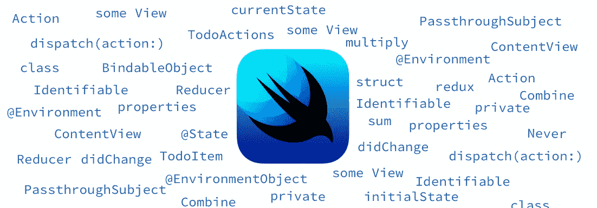

# 使用 Redux 概念的 SwiftUI 视图状态管理

> 原文：<https://medium.com/swlh/swiftui-view-state-management-using-redux-concepts-a1ffe3373475>

状态和所有绑定属性去掉了许多样板代码，使 SwiftUI 变得非常有趣。然而，经过一段时间，当应用程序代码库增长时，管理这些属性可能会变得令人头痛。

即使我们决定对本地数据依赖使用状态，对外部数据依赖使用 Binding/ObjectBinding，拥有单一的事实来源…