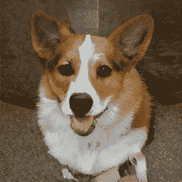

# 合成内容

> 原文：<https://medium.com/swlh/synthetic-content-9cf5838d8e80>

我们已经进入了假新闻和深度造假的时代。在数百万个内容不相关或完全错误的网站中找到一条有用的信息比以往任何时候都更成问题。它能变得多糟糕，有什么好处吗？

This dog doesn’t exist

# 假新闻 vs 合成内容

作为一名人工智能企业家和科学家，我每天都在关注机器学习研究。随着最近对…的强烈抗议