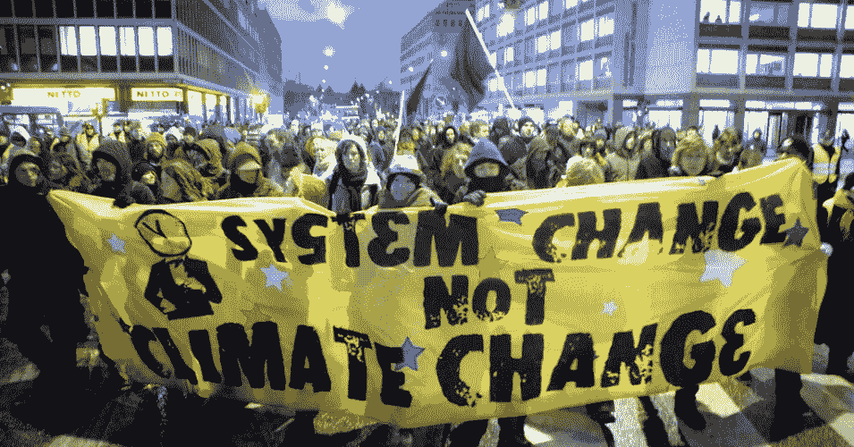

# 体制变革？那是什么？

> 原文：<https://medium.com/swlh/system-change-what-is-that-815f48e2fbb1>

## 我们的全球经济体系如何分化我们。

***本文摘自作者的著作*** [***流离失所。欧洲和全球难民危机。***](https://www.amazon.com/Displaced-Europe-global-refugee-crisis/dp/1789263263/ref=sr_1_1?keywords=displaced+wanrooij&qid=1558671369&s=gateway&sr=8-1)

我们面临的气候紧急情况没有给我们留下多少时间来采取果断行动。专家估计，在为时已晚之前，我们还有大约 12 年的时间。因此，至关重要的是，我们的运动要解决一些关键问题…