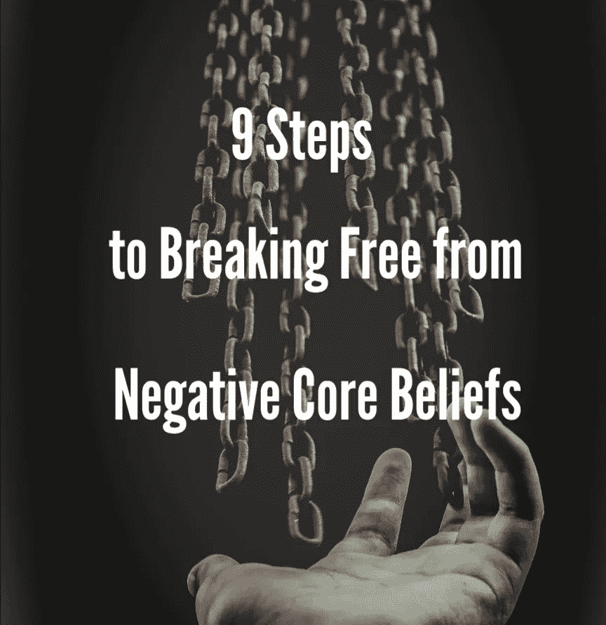

# 解决消极的核心信念

> 原文：<https://medium.com/swlh/tackle-negative-core-beliefs-7211a8b3521>

征服你最古老的想法，获得新的平静的 9 个步骤。

核心信念是我们一生中形成的关于我们自己和我们的世界的真理。它们是在我们不知情的情况下从经验中发展出来的。我们对生活的有意识的想法都源于这些基本的核心信念。你一生中遇到过几个。有些已被采纳为关于我们的世界及其人类居民的积极陈词滥调，如:

> *爱是善良的*
> 
> *团队合作让梦想成真*

其他消极的，如:

> *大自然是残酷的*
> 
> 无知是福

你可能也遇到过这样的人，他们清楚地表达了自己的核心信念，却没有意识到这一点。听过有人说这样的话吗:

> 我值得拥有幸福
> 
> *我不配*

这些是他们的核心信念。

当我们的核心想法被生活事件触发时，我们的行动和反应是情绪多米诺骨牌效应的直接结果。当消极或不准确的信念让我们做出反应时，问题通常就会出现。

以下 9 个步骤**将带您从识别阶段进入解决方案阶段。**

那么，你如何知道你是在消极的核心信念上运作的呢？

大多数负面能量的典型反应都会发生——你就是感觉不舒服。你可能会感到过于焦虑、愤怒、沮丧、嫉妒、兴奋或紧张……这些情绪可以自成一篇。无论是积极还是消极的感觉，你都会感觉到你感受太多了。现在流程开始了，下一步是:

# **1。注意别人的反应。**

感情是混乱的，情绪会压倒我们。对于一个强烈激怒你的情况，你很自然地会觉得你必须立即做出反应。虽然自我克制是一种值得尊敬和追求的做法，但它并不总是发生。没关系！不可以的是拒绝采取正确的行动，以防止重复不良反应。

**那么，第二个迹象是什么，表明你正在一个由虚假信息构成的系统上运行？**

其他人的反应。

问问你自己:

人们是否对我的行为或反应感到不快、不信任、沮丧或担忧？多人有相似的负面反应吗？陌生人被冒犯了吗？我爱的人对我不耐烦了吗？

对任何一个问题的回答都是肯定的，这可能表明消极的核心信念被激活了。

注意别人用语言、肢体语言、语调和动作告诉你的东西。他们告诉你什么了？有主题吗？

意识到你的情感，现在是时候检查你的动机了。做这个…

# **2。说说吧。**

与你信任的人交谈；还是三个！需要多少就有多少！最重要的是，你要一直说下去，直到你开始对手头的问题感觉更好。如果是关于重复的行为问题，这可能会持续一天或几年。永远不要停止寻找你不舒服的根源！

那么，你怎么知道自己做得对不对呢？

诚实是做正确的事…或者至少意识到不诚实。

抵制夸大或戏剧化事件的冲动。当你为不良行为提供借口、理由或合理化时，要注意。如果你发现自己说了一些不真实或不诚实的话，大声说出来。说“那是个谎言”并不丢人不停地说话，变得脆弱，直到诚实变得容易。确保你…

# **3。用你的话！**

那是感情的话。英语中有超过 4000 个单词来描述感觉，所以你不应该缺少选择。

**感觉永远不会错，但你的注意力可以是**

如果焦点仍然停留在事件的发展或可能、应该、将要或我的意愿上，说出来会变得没有疗效。这些事情对于听者理解发生了什么和开始你自己的解释是很重要的，但是不要陷入困境！一旦每个人都跟上了，就开始表达你在事件之前、之中和之后的感受。专注于你的意图，找到问题的根源，抵制把感觉和意图强加给别人的冲动。如果你不…说话是没有用的

# **4。听听你自己。**

将你的注意力转移到你想要的结果上。

你希望从你的反应中获得什么？结果你希望别人怎么做？你试图控制一个人、一个地方或一件事吗？

这些也被称为动机。请记住，这是可以预期的，你不会喜欢你说的每一件事或发现你如何运作，但不要停止诚实！当你达到一个点，你觉得你已经最大限度地发挥了诚实的能力，那么是时候密切关注了。

**无所畏惧地生吃！**

我知道你听到你在说什么…但是你到底在说什么？找到你话语背后的意图。

拥抱完全自我意识的勇气和正直！注意你正在做的陈述。它们通常开始表现为你对人所持有的笼统的观点或关于世界如何运转的知识的例子。你会发现在你的生活中会有太多的例子引导你去相信这些。这些想法会吓到你，因为消极的信念根植于恐惧。

写下你的发现。你的陈述越离奇、越笼统，你就越接近核心信念。有很多你生活中的例子与这些想法相关吗？如果是，那么好；你越来越暖和了！那么现在你该如何处理这种信息顿悟呢？

# **5。休息一会儿...然后开始挖。**

*我在害怕什么？*

哇，慢点！

你刚刚面对了你最大最古老的恐惧。休息一晚，这是你应得的！实行一些自我保健，好好休息一晚。慢慢来，让自己冷静下来。但是不要拖延——当你再次召集会议时，你的结论应该还在你的脑海中。

在一天中你没有太多计划的早晨重温你的笔记。随意地继续与同一位值得信赖的治疗师、导师、朋友或家庭成员进行口头交流。通过日记、调解、艺术项目或自言自语的独立工作也是选择。不管你怎么做——自由写作、流程图、口头描述、意象、绘画或拼贴——关键是你要开始以一种有形的表现形式发展你的想法。

**以小见大！**

许多想法可以从一个核心信念中显现出来，并由此产生多个层次。你在日常生活中对一个信念越有意识，它就离你最初的核心信念越远。

核心信念是非常基本和一般的陈述。它们通常不太新颖。我保证你以前听过它们，只是还不明白它们如何适用于你。

示例包括:

> *我不可爱，*
> 
> 我不能相信任何人
> 
> *所有人都会抛弃我，*
> 
> *世界会伤害我等。*

信不信由你，它仍然变得更深，然后…

# **6。记住一切都从死亡开始！**

哎哟，听起来很刺耳，但这是事实。这意味着我们所有的恐惧都源于对死亡的恐惧。听起来很极端？很好，因为正是你认识到这种恐惧是多么不现实，才会带来极端的改变。

**那么，这怎么可能呢？**

问问你自己，

我在这里做什么？

我还没有询问一个更大的精神目的。我指的是我们为什么做我们所做的事情的终极基础。答案是:

你活下来了。

在我们最基本的功能水平上，我们都只是在从一个时刻到下一个时刻避免死亡。

现在，将你的核心信念转化为关于死亡的陈述。

> *不被爱会要了我的命，*
> 
> *相信和依赖别人会要了我的命，*
> 
> 如果我被抛弃，我会死
> 
> 如果我感到受伤，我就会死去

如此等等。这看起来很荒谬，因为事实就是如此。这也不是真的。

# **7。用自己的想法反驳自己。**

虽然每件事背后都有一些事实基础，但生活中的每件事都有极性。是的，在某些情况下，被抛弃可能会导致字面上的死亡，但是今天你处于其中的机会是很少的。人类不必像动物一样，从一秒钟到下一秒钟躲避真实或想象的死亡。我们是被赋予了更高的智慧和能力来理解我们的世界的灵性存在。

**解决方案……**

问问你自己，

*我真正相信的是什么？*

可能消极的核心信念仍然不适合你。你是在大喊大叫吗

”*等等！但我不太相信这一点？”*

恭喜你！你正处在变革的边缘。

那你相信什么？

你会惊喜地发现，你因渴望洞察力和成长而激活的精神自我对世界有了更积极的看法。当你对自己积极的核心信念有了一个概念时，试着把它表达成一个基本的陈述。如果感觉不太对，那就继续尝试，直到感觉完美为止。如果它不完全与你的负面核心信念针锋相对，那是可以的。更重要的是陈述反映了你的绝对真实。

的例子

> *这个世界会伤害我*

可以表现出许多矛盾，如:

> *经常有人帮我，*
> 
> *每个人都值得原谅，*
> 
> *凡事皆有因，*
> 
> *或者这个世界是个美丽的地方。*

可能性是无限的，而且百分之百是你独有的！为了保持积极的流动，你必须…

# **8。培养你积极的信念。**

写下你的陈述，沉思，记日记，祈祷，与他人分享，或者为一个或所有人奉献一个艺术项目。

志愿服务或帮助他人永远是尊重你对世界的积极真理的可靠选择。如果你的新信念是“人们经常帮助我”,那么为别人复制那些善意的行为。但是等等，还有更多！

# 9。原谅自己！

是的，你还没做完。保持精神进步和自我成长的最重要的因素是接受我们的人性。所以你开始会觉得有点缺乏风度…没关系，我们都这样做！最棒的是你努力去改正它。给自己一个鼓励，因为你越来越健康了！