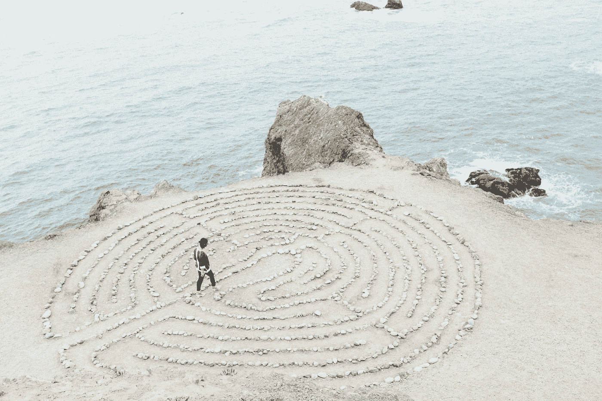

# 看看里面

> 原文：<https://medium.com/swlh/take-a-look-inside-b6b72d82d9b8>

你知道你脑子里在想什么吗？这没什么可怕的。

Photo by [Ashley Batz](https://unsplash.com/@ashleybatz?utm_source=unsplash&utm_medium=referral&utm_content=creditCopyText) on [Unsplash](https://unsplash.com/search/photos/meditation?utm_source=unsplash&utm_medium=referral&utm_content=creditCopyText)

如果你和我一样，你脑子里想的很多东西都不会以任何方式、形式或形式供公众消费。

有许多糟糕的想法、欠考虑的计划、无益的评论、讽刺、幽默和其他一些别人不需要看到或经历的东西。