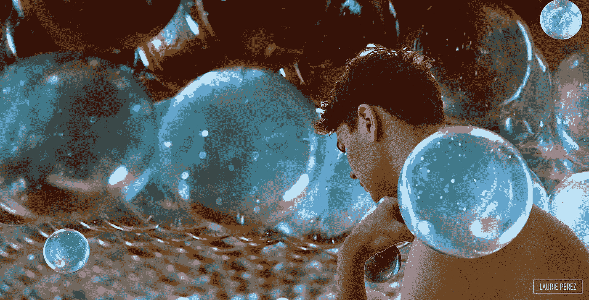

# 当生活不堪重负时，振作起来

> 原文：<https://medium.com/swlh/take-the-bounce-e1725a5c543c>

游戏开始了。球和桨碰撞。在大竞技场打乒乓球。你从远处的廉价座位上听到的那些回声——你在琢磨它们。更清晰，更近，更近:现在你伸出手抓住它！手里拿着一个光滑的白色球体；沉默，静止和神秘藏在里面。里面有空气吗？空虚，如此整齐地被包容。轻盈，中性，有潜力。当你释放它…