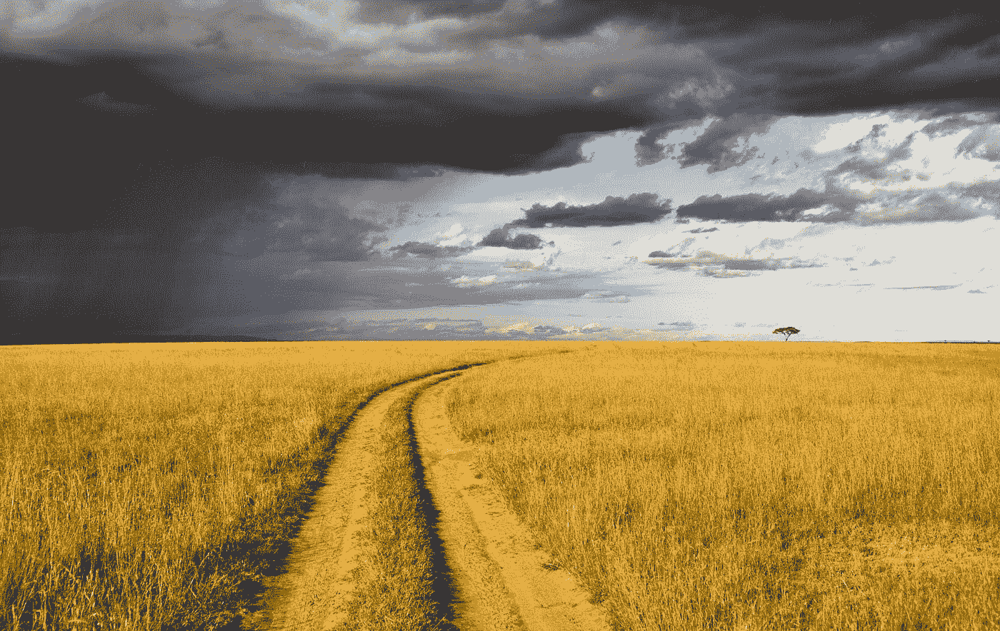

# 走自己的路

> 原文：<https://medium.com/swlh/take-your-own-path-f062bab24637>

## 希望你不要听那些让你原地踏步的话。

Photo by [Pop & Zebra](https://unsplash.com/@popnzebra?utm_source=medium&utm_medium=referral) on [Unsplash](https://unsplash.com?utm_source=medium&utm_medium=referral)

从我们出生的那一刻起，我们的父母和监护人就开始希望我们，为我们梦想，为我们计划。

也许你的父母开始攒钱以便你能上大学。或者他们可能会在工作日结束时抽出几分钟给你读书。也许他们的周末不再…