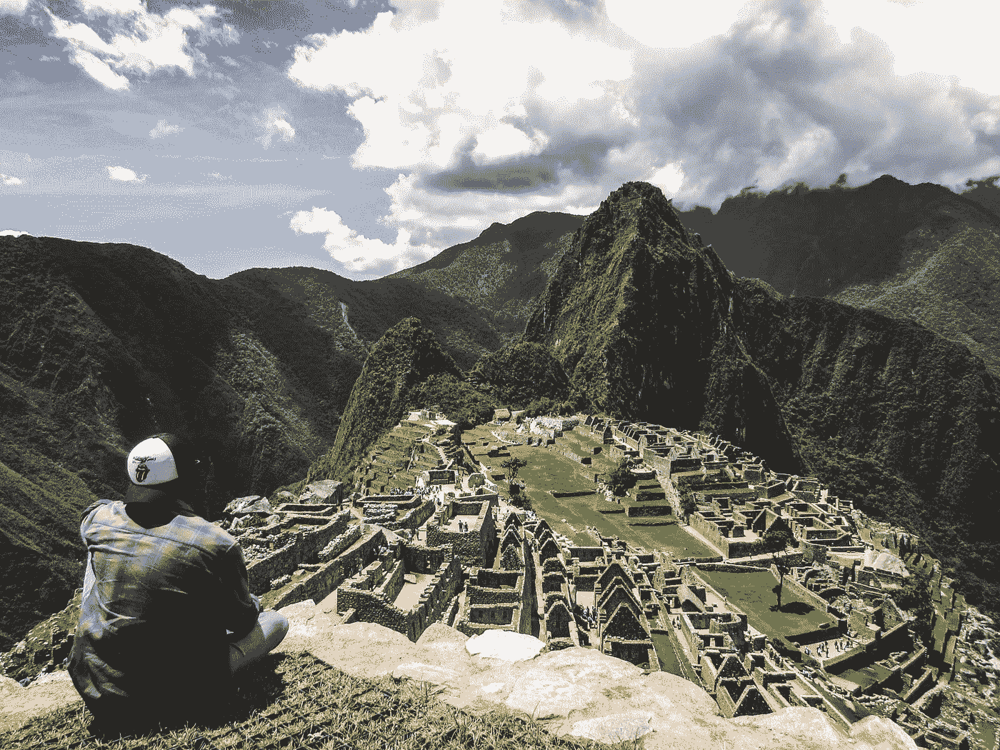

# 在野外休息

> 原文：<https://medium.com/swlh/taking-breaks-in-the-field-ancient-explorer-c0953126b751>

在我们忙碌的生活中，很难找到时间放松下来，然后在这样做的时候获得高质量的休息。然而，休息对健康至关重要；首先，它帮助我们的身体补充能量。在这篇博客中，我分享了我在秘鲁野外观察到的一个帮助进入这种状态的简单做法。

# 实地学习埃尔德坎索