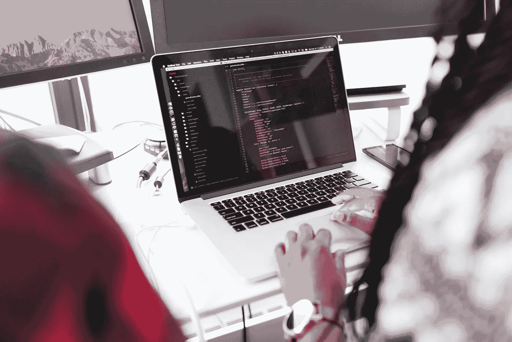

# 宝藏的故事:谦逊

> 原文：<https://medium.com/swlh/tales-from-the-cache-humility-571834666658>

Photo by [Christina Morillo](https://www.pexels.com/@divinetechygirl?utm_content=attributionCopyText&utm_medium=referral&utm_source=pexels) from [Pexels](https://www.pexels.com/photo/black-and-gray-laptop-computer-turned-on-doing-computer-codes-1181271/?utm_content=attributionCopyText&utm_medium=referral&utm_source=pexels)

最近，我非常幸运地遇到了一些刚开始从事软件开发或者正在认真考虑的人。有些人刚刚毕业，有些人找到了第一份工作，有些人还在经历新兵训练营。我喜欢听他们讲述自己的经历，以及他们打算如何运用自己的技能。也许是因为我所交往的人，这些资料堆积如山，但是这些软件开发新手没有一个会说“这只是一份工作。”他们都有梦想，我喜欢与那些带着他们的梦想并召唤创造力来实现梦想的人联系。

*编程是一种创造力。稍后会详细介绍。*

*随着我们的交谈，不同的问题频繁出现——我想我会将这些想法汇编成几篇帖子:* ***《宝藏的故事》。***

*我已经全职发展了十多年，我有很多好的和不好的经历，这些经历塑造了我的视角。我的视角并不局限于软件开发，它也捕捉到了影响我余生的想法。如果你认为这些在你自己的经历中是正确的，请告诉我。*

**宝藏的故事:谦逊**

我记得有一集豪斯医生给年轻的医学院学生做客座演讲，他说，“如果你不愿意接受有时你会做出错误的决定并杀死一个病人，你现在需要停下来。千万不要当医生。”

当我思考软件开发的时候，这个场景会在我的脑海中出现。他不是说“你们中的一些人会杀死一个病人”，而是说“有时你们会杀死一个病人。”每个人都不可避免地会犯错误。永远不会有一天我是完美的。

鉴于此，我认为不谦逊是致命的虚荣心。至少对我自己来说，当我认为我不屑于犯错时，我犯的错误最多。

我们引入 bug。有时它们会让公司损失成千上万美元。当我开始我的职业生涯时，我搞砸了一些第三方 API 调用，结果是按请求收费。我将业务成本提高了两倍，但没有人意识到这一点，直到银行在部署后两天打电话给公司。"你是故意花掉这些钱的吗？"

当我这样做的时候，我感觉很糟糕，但老实说，我们都经历过。每个开发者都有一个故事。我的好朋友是我所知道的最好的开发人员之一，他是一个可以独自完成三个开发人员工作的强人，他在一天的发票开具之后，在任何备份有机会运行之前，意外地放弃了生产数据库。那天晚上，他和我一直呆到晚上 11 点才恢复，然后在接下来的几个星期里编写脚本，重现我们丢失的发票。

我是认真的，每个人都有故事。每个人都“杀了一个病人”。作为一个社区，我们已经接受了我们的易错性，并采纳了阻止和禁止我们拥有太多权力的最佳实践。我们限制我们帐户上的特权，使用源代码控制来保存我们更改的文件的历史，编写代码，然后编写更多的代码来测试原始代码，让其他人进行代码审查，让 QA 部门的人员进行一整套用户测试，等等。尽管如此，我们的错误还是会出现。永远不要低估完美风暴的必然性。

无论你在职业生涯的哪个阶段，这都是令人羞愧的。

Photo by [Christina Morillo](https://www.pexels.com/@divinetechygirl?utm_content=attributionCopyText&utm_medium=referral&utm_source=pexels) from [Pexels](https://www.pexels.com/photo/person-using-silver-macbook-pro-1181467/?utm_content=attributionCopyText&utm_medium=referral&utm_source=pexels)

**凝视深渊**

但是，除了承认我们没有人是完美的这一显而易见的事实之外，还有一种更深层次的谦逊。一种导致怀疑的更丰富的谦逊，这是我生活中最珍视的东西，尤其是在编程之外。

你听过那句话吗“你不知道你不知道的事？”软件开发尤其如此。我曾多次步入一个有遗留代码的项目，并在假设事情必须如何工作的情况下开始编程。“它一定是这样工作的，因为他们说这就是它的工作方式。”

然后就出问题了。有些东西停止工作了。

所以我开始拉这根线，我知道我能做的最好的事情就是顺着线走到哪里。我避免认为我已经知道是什么问题导致我不经意地跳过步骤，相反，我挖掘到底部。永远不要相信表面上的东西，因为有时所有的路标都是错的。“通往纽约市的 23 号出口”原来是一条穿过一座摇摇晃晃的桥的土路，把你留在了 WTF 县。我已经学会质疑我所有的假设，当我一步一个脚印地走下去时，我会反复检查我认为我知道的一切。

有时我读到最后，我会问自己最困扰的问题——“这个系统是如何运作的？”

这才是真正的谦卑——我认为有意义的事情，解释了我所知道的，结果证明是完全错误的。因为我不知道我不知道的事情，我有一个足够好的傻瓜黄金知识。面对深海之谜，我最终找到了尼斯湖水怪的答案。意识到我是多么容易受到这些幻觉的影响，我学会了质疑一切。我学会真正关心真相，而不仅仅是什么“有效”软件开发让我一遍又一遍地实践这种怀疑主义，这是我不得不在宗教、政治、人际关系和生活的各个方面练习的东西。

我必须继续跟进线索，每一个艰难的步骤。

但是我怎么知道去哪里挖呢？我如何发现我不知道的东西？从定义上来说我难道不知道吗？

Photo by [Tim Gouw](https://unsplash.com/@punttim?utm_source=unsplash&utm_medium=referral&utm_content=creditCopyText) on [Unsplash](https://unsplash.com/search/photos/software-developer?utm_source=unsplash&utm_medium=referral&utm_content=creditCopyText)

**例外**

如果我不注意这些错误，我永远也不会抓住问题的核心。例外说明了事实。当什么东西坏了——这是诚实和不妥协的。如果我只关注我所期待的，我会迷失在自我确认的回音室中。例外的是从迷宫中走出来的线。

有时例外很容易被忽略或掩盖，因为一个错误的解释可以回答 99%的问题，并给我们一个错误的信心。但是那最后的百分之一——才是真相所在。

在精神上，你必须做好准备，就像你要去狩猎大猎物一样，即使你最终追求的是一个 bug。但是这是值得花费精力的——任性是极其有限的。你会听到一些企业主甚至开发商说，“如果它没坏就别修”或者“即使它坏了我也不想知道它。”另一个有毒的——“假装直到你成功。”

他们错过了机会，丧失了真正理解事物的能力。他们让自己忙于旧的做事方式，而新奇的东西可能就在他们的眼皮底下。我们都这样做。这是人类的事情——挑战我们的信仰、我们的知识和我们的关系是很伤人的。但是，如果我们所做的只是编造我们认为可以瞒过真相的故事，我们就没有机会成长，没有支点。

这让我想起了皇帝没有衣服，在一个谄媚者的王国里，有时只有一个孩子才能承认这一点。

这也是科学的美妙和恐怖之处——探索未知。我们挑战的假设越多，我们就越能理解。这种理解发展成艺术、技术，最棒的是——更多的例外。我们走得越远，获得的真理越多，我们的创造力就越强大。如果不接受太阳不围绕我们转，我们就永远不会登上月球。令人谦卑——但也非常有力量。

我把卡尔·萨根的话记在心里——“我说，严酷的事实胜过令人欣慰的幻想。在最后时刻，事实往往比幻想更令人欣慰。”

所以我追求例外——他们说出了真相，即使它们可能是严酷的事实。

虽然这会很痛，但如果你杀死的病人是你以前的样子，那也没关系。无论是作为软件开发人员还是普通人，我们都需要这种谦逊来走出自己的路并成长。

一个警告——我会写更多的《T2 的密室故事》来详细阐述这一点——但是不要让谦逊变成自我贬低。作为软件开发人员，我们都会犯错误，这个事实应该是令人鼓舞的。所以，我经常和那些不愿意从事这个领域的人交谈，因为他们认为在别的地方会犯更少的错误。

这个领域需要更多的人性，每犯一次错误，我们都会找到新的方法来拯救自己。接受冒名顶替综合症是真实存在的，无论你选择哪个领域，它都可能困扰你。这是谦逊的力量的一部分，它让我们不再有任何义务去假装我们不是我们自己。这看起来很矛盾，但当我学会承认和管理自己的局限时，我拥有了最大的潜力。

这是我必须不断重新学习的一课。

谢天谢地，有很多机会。