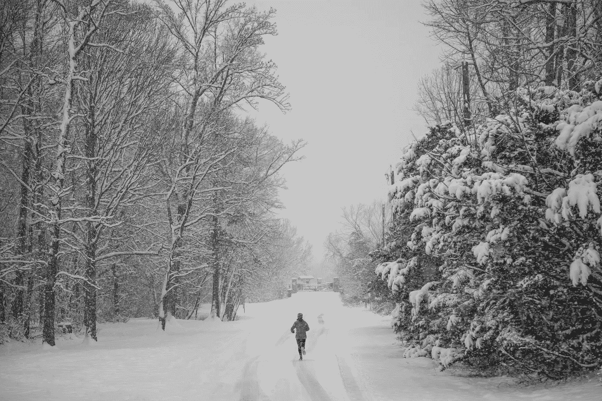

# 宝藏的故事:不放弃

> 原文：<https://medium.com/swlh/tales-from-the-cache-not-quitting-1b1d1889fc07>

Photo by [Vlad Tchompalov](https://unsplash.com/@tchompalov?utm_source=unsplash&utm_medium=referral&utm_content=creditCopyText) on [Unsplash](https://unsplash.com/search/photos/endurance?utm_source=unsplash&utm_medium=referral&utm_content=creditCopyText)

最近，我非常幸运地遇到了一些刚开始从事软件开发或者正在认真考虑的人。有些人刚刚毕业，有些人找到了第一份工作，有些人还在经历新兵训练营。我喜欢听他们讲述自己的经历，以及他们打算如何运用自己的技能。也许是因为我所交往的人，这些资料堆积如山，但是这些软件开发新手没有一个会说“这只是一份工作。”他们都有梦想，我喜欢与那些带着他们的梦想并召唤创造力来实现梦想的人联系。

*随着我们的交谈，不同的问题频繁出现——我想我会将这些想法汇编成几篇帖子:* ***【来自宝藏的故事】。***

*我已经全职发展了十多年，我有过许多好的和坏的经历，这些经历塑造了我的视角。我的视角并不局限于软件开发，它也捕捉到了影响我余生的想法。如果你认为这些在你自己的经历中是正确的，请告诉我。*

**来自宝藏的故事:不放弃**

我曾经在 Rev1 Ventures 的一家初创公司工作，这是一家很棒的设施和风险投资公司，拥有许多初创公司和独立承包商。我喜欢我们分享的志趣相投的精神和能量，我们每个人都在努力做着某件事，希望有一天会成为现实。每当我需要休息的时候，我都会绕着大楼散步，路过其他创业公司的窗户。其中一家的墙上贴着一张来自华特·迪士尼的标语:

"赢和输的区别通常在于不放弃."

我喜欢这句话。虽然看起来很简单，但这只是思想上的简单。在实际操作中，这非常困难。“不要放弃”听起来像是毫无创意的建议，但当我处于狗屎风暴中时，它变成了尼西亚信经。

例如，有一天晚上，我从祖母家开车回哥伦布，发现自己遭遇了一场可怕的暴风雪。她住在克利夫兰，所以湖泊效应会造成非常危险的情况。我想把车停在车道或沟里，但我知道我会被卡住。暴风雨越来越猛烈，我越来越无法控制我的车，我越来越期待最终会掉进沟里或者出车祸。我确信那天晚上我没有回家，我想停下来结束焦虑。但我一直在告诉我内心尖叫的那部分——“专注于接下来的十米。如果我偏离了道路——这是我完全期待的——那么我就偏离了道路。但是不要让它发生。不要选择它。专注于接下来的十米。”

四个小时后，我到家了。我成功了，一次走了 10 米。

我发现最好的开发人员就是这么做的。他们不一定比其他开发者懂得多，但肯定不会放弃。他们不靠边停车。他们系好安全带继续开车，每次十米。当面对不知道该做什么时，他们不会用“那我什么也做不了”来回应，而是“那我就什么都试试。”一点一点地，他们想出了办法，直到他们走远了。每个人都认为他们是专家，但大多数时候他们是最顽强的。他们明白知道如何解决特定问题和知道如何解决问题之间的区别。这些是我的榜样，是我非常尊敬的开发人员，他们激励我坚持走完下一个 10 米。

Photo by [Wil Stewart](https://unsplash.com/@wilstewart3?utm_source=unsplash&utm_medium=referral&utm_content=creditCopyText) on [Unsplash](https://unsplash.com/search/photos/stuck?utm_source=unsplash&utm_medium=referral&utm_content=creditCopyText)

**卡住**

我一直在做一个兼职项目，这个项目曾多次让我陷入低谷。我花了整个晚上试图让简单的东西工作，但它们就是不工作。尽管阅读了文档和所有我能找到的博客，我开始认真地相信“哦，我的上帝，就是它了。这真的是我的极限。我没有足够的能力完成这件事。”尽管我很绝望，但一小时又一小时后，我继续尝试另一件事，它突然起作用了。有时候是故意的，有时候不是。

例如，我试图使用一个相对较新的框架在移动应用程序中实现一个第三方认证插件。我花了一周时间去碰壁，一次又一次地犯同样的错误。我可以凭记忆一字不差地背诵出来。最后，我决定尝试直接联系插件的作者。准备加载到 GitHub 与他分享，我把我的代码转移到一个新项目，去掉我的专有逻辑，然后编译。因为这是一个全新的项目，所以它下载了一个新版本的插件并从头开始构建。

突然间，它成功了。

所以我去了我原来的项目，删除了插件，重新下载，并从头开始重建整个项目。

又成功了。

最初安装时出了点问题。有些东西被损坏了。在兴高采烈和随后的庆祝之后，我意识到这种情况下我不一定需要学习更多或有更多的经验。让我挺过来的唯一一件事就是不要放弃，在通过接触其他开发人员来尝试新事物的过程中，我意外地修复了错误。

我还意识到，深入研究代码和配置，阅读博客和文档，本身就能教会我们很多东西——即使它不能解决最初的问题。它扩大了我的知识和经验的广度，并给我留下了一个工具箱，下次可以尝试。

当我写这篇文章时，我意识到我让它听起来像是一次愉快的穿越恶作剧之地的短途旅行。别搞错了，这都是后见之明。当我遇到一个又一个错误时，我就在但丁的地狱最深处。当我发现自己在那里，我能做的最好的事情就是散步。或者任何一种突破。任何能让我的思想转移到其他地方，让它从已经陷入的困境中走出来的事情。然后我用一个新的想法重新开始，或者用一种新的方法找到一个新的想法。我尽我所能。十米。

Photo by [Fernanda Latronico](https://www.pexels.com/@latronico?utm_content=attributionCopyText&utm_medium=referral&utm_source=pexels) from [Pexels](https://www.pexels.com/photo/woman-standing-near-glass-window-763849/?utm_content=attributionCopyText&utm_medium=referral&utm_source=pexels)

**窗口**

我有一个范围，一个能力的窗口。窗口的一边是对我来说容易的事情，另一边是对我来说难的事情，我做的每件事都落在这个窗口的某个地方。这是我向世界敞开的大门。我对它的看法。我对它的访问。

我对自己的目标是不断扩大这个窗口，让过去很难的事情变得容易，让我觉得很难做的新事情变得似乎不可能。当我打开窗户时，我看到了更多的世界，并能与世界上更多的人互动。作为一名开发人员和一个普通人，永远不会有一天我或任何人会说“一切都很容易”

我认为，如果我只选择做简单的事情，那么它会适得其反。我的窗口会越来越小，然后简单的事情会变得更难，困难的事情会变得不可能。只做简单的事情会导致我萎缩。

所以对我来说，不断挑战自己是非常重要的。每当我盯着下一个障碍时感到恶心、恐惧或焦虑，我就强迫自己再走 10 米。

但这很难，而且一直都有戒掉的想法。

这种想法并不总是穿着印有“放弃者”的腰带。它打扮自己。有时候它表现得很体贴和理解。“你需要等待合适的时机，但现在不是合适的时机。”"你已经尽力了，没人能责怪你。"“你赢得了一场网飞狂欢，”然后在某个地方出现了流行词“自我保健”。其他时候，这个想法穿上全副武装，试图找到那部分相信我能做到的我。“我要把那个狗娘养的揪出来。他是个梦想家，很危险。他会让我们受伤的。”

但我必须屏住呼吸，让这个想法过去。精通来自无数的错误。就连世界重量级拳击冠军走出拳击台的脚步也血迹斑斑。生活不是胜利的游行。我喜欢海明威的说法:“一个人可以被毁灭，但不能被打败。”

只剩十米了。

**差异**

随着我变得更加足智多谋，开发了自己的优势，我越来越少与其他开发人员进行比较。我还是一直在向人学习，但是对自己的地方少了一些不安全感。这让我想起斯蒂芬·金在《论写作》中谈到年轻作家最初是如何模仿他们最喜欢的作家的——他承认这对于最终找到自己的声音是必要的。你只要坚持下去，很快你就会发现你找到了自己的路。

我前面提到的边项目已经成熟，我已经将它部署到谷歌 Play 商店，处于私有测试状态。它调用 AWS 上托管的后端服务器，利用去年这个时候对我来说是新的技术栈。还没完，但是越来越近了。十米加起来，我真的很激动。因为尽管有些时刻很低落，但仍有其他纯粹的胜利。

所以，坚持下去。无论你在努力什么——编程或者任何事情。如果这对你来说很重要，如果这是你的梦想，那就走下一个 10 米。你没有错，只是因为路难走。如果不先损伤肌肉，你就无法锻炼肌肉——所以当你感到酸痛时，力量就来了。当远见失效，你不知道该怎么办时，后知后觉是你最好的朋友。尝试一切，然后看看什么工作。

走下一个十米，惊讶你走了多远。

就像珀修斯说的:忍耐的人，征服了一切。