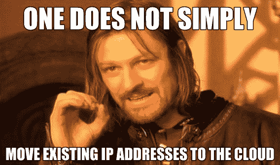

# 使用 IP 地址与互联网对话

> 原文：<https://medium.com/swlh/talk-to-the-internet-with-ip-addresses-8f315ea28496>

管理数百个 IP 地址——跨越服务器、负载平衡器、防火墙、DNS 服务器、NAT 网关和代理服务器——是一件令人头疼的事情，我会竭尽全力去避免。然而，本地系统的*关键*之一是积极使用 IP 地址来平衡、分散和管理进入您环境的流量。这些都是内置在你的硬件和软件的配置中的，每次你转头的时候，这些配置似乎都会翻倍？

当您展望云时——闪亮的新地平线，承诺简单和易于管理——重要的是要记住隐藏在阴影后面是一个常见的运营商挑战。你花了几年时间调整和完善的 IP 地址逻辑不会像边斗一样随着你的虚拟机移动，至少不会处于同一状态。它需要以各种方式进行改变，因此，**提前计划可能影响您的工作负载的 IP 地址变化**，以及它们如何与内部和公共网络流量交互，这一点至关重要。换句话说，你不能简单地将你现有的 IP 地址和你的服务一起转移到云中。

为什么不呢？云提供商和数据中心拥有有限的 IP 地址池，就像一个豪华的宾果乒乓球笼，根据工作负载的要求耗尽和补充地址。**症结在于，提供商通常会重复使用之前分配的 IP，以便最大限度地利用它们。**这意味着您的服务将获得一个动态分配的内部/外部 IP 地址。默认情况下，这些地址是短暂的，这意味着如果您重新启动实例，您将丢失这些 IP 并接收新的 IP。没错，就像在伯尼家过了一整个周末才意识到有些事情非常非常不对劲。这可能会成为比您在内部开始时更令人头疼的问题。

# 常见的解决方案

如果你发现自己处于这种痛苦的境地，基本上有两种解决方案可供你选择:

*   通过使用标记而不是 IP 地址来定义防火墙规则

*   通过具有静态 IP 的托管负载平衡器转发流量

当然，这两种方法都可行，但是它们都有一个很大的缺点:随着你的云 IP 的改变，你的服务对这些 IP 的任何依赖都将被打破。硬编码的 IP 通常需要网络管理员手动更改，这意味着这可能很快变成维护的噩梦，就像修补管道中的漏洞，同时不断出现新的漏洞。

假设您在云中启动了第一台后端机器，并决定在一段时间内停止运行以节省成本。突然，当您准备让它们重新启动并运行时，您注意到您丢失了那些动态分配的 IP，却发现了新的 IP。现在，您需要重新配置您的本地应用程序和任何防火墙规则，以指向您的云后端的新公共 IP。在大型环境中，这可能会变得令人厌倦且难以操作。

# 谷歌云 IPs

谷歌云给你一个可靠的解决方案，保留静态 IP。如果您的虚拟机关闭，当您重新启动实例时，您可以保留相同的内部和外部 IP。如果您从 VPC 网络内部或外部将转发规则、防火墙规则或应用程序指向您的云实例 IP，您无需在每次关闭实例时都重新配置 IP，这让您感到轻松。如果您的工作负载依赖于一个特定的 IP 地址，并且您厌倦了阻止您的队友使用该 IP 地址，这将非常方便。*最精彩的部分？*你甚至可以将以前短暂的 IP 提升为静态 IP，帮助你在一些地方偷工减料。

# 使用静态 IP

对于计算引擎，您可以为每个虚拟机分配一个内部和一个外部 IP 地址。对于内部和外部 IP 地址，您可以选择临时和静态 IP。使用内部 IP，Google 会从您的子网范围内为您的虚拟机分配一个临时 IP，除非您在您的子网范围内指定了一个内部 IP。但是，如果您决定需要一个静态内部 IP，您可以稍后保留一个并将其分配给您的虚拟机。

对于外部 IP，同样适用。除非你给你的虚拟机分配一个保留的静态外部 IP，否则 Google 会从池中随机分配一个临时的外部 IP。或者，您可以选择不分配任何公共 IP，这有助于降低安全风险并防止实例暴露于公共互联网。同样，您可以稍后分配一个静态外部 IP。如果您想保留内部 IP，也可以创建自定义外部 IP，这样可以避免重新映射依赖的应用程序。*只要记住，没有分配给实例的静态外部 IP*[*会产生一个小成本*](https://cloud.google.com/compute/pricing#ipaddress) *。*这有助于为需要 IP 的实例保留 IP。

# 内部/外部 IP 设置

让我们看一下内部/公共 IP 设置:

## 使用私有 IP 以获得更好的性能

在上面的视频中，我提到了使用内部 IPs 提高网络性能的巨大优势:

No public transport needed for VM communication within a Google VPC

使用内部 IPs 时，与其他内部虚拟机通信的内部虚拟机具有最佳网络性能。否则，您的内部虚拟机的流量必须通过公共 IP 返回到公共互联网，这会降低速度。例如，维护同一个 VPC 网络上的数据库服务器和 web 服务器之间的内部流量，或者将[私有 Google Access](https://cloud.google.com/vpc/docs/private-access-options) 与 Google APIs 和服务一起使用。

另一方面，如果您需要虚拟机与公共互联网或不同 VPC 网络中的虚拟机通信，您的虚拟机必须有一个公共 IP 地址，除非您已经设置了到其他网络的代理或 VPN。我进行了一项测试，以了解在相同的 VPC 中使用内部 IP 和外部 IP 时的性能差异。

我发现，当您在各种机器类型之间使用内部 IPs 时，TCP 吞吐量性能的变化较小，而 Mbps 吞吐量要高得多。

# 找到平衡

一旦您理解了 IP 地址是如何受到影响的，以及您的操作可能对您的整体架构产生的级联效应，您就会看到拥有可重新映射的 IP 地址是多么有用。如果您计划在云中部署前端服务器，这可以让您在以后的工作中避免巨大的麻烦。GCP 为您提供了灵活的选项，例如将临时 IP 提升为静态 IP、保留特定 IP 的能力以及通过移除外部 IP 来保护虚拟机的能力。**要考虑的事情太多了！**

在进行 VPC 对等和本地互连等操作时，当涉及到 IP 地址范围重叠时，有一些[警告](https://cloud.google.com/vpc/docs/vpc-peering#restrictions)，但我将留给您这个:*规划 IP 范围和使用是您应该明确规划的第一件事*，它是关于找到平衡的。创建一个更加严格和安全的 IP 地址拓扑结构通常意味着更少的灵活性和更多的摩擦。考虑如何创建一个具有 IP 范围的 VPC 拓扑，让您可以自由扩展，尽可能开放，同时仍然安全。考虑因素包括:生产与测试环境、对等和本地 IP 范围预留，以及通过使用不可路由的 IP 来节省您的 IP 空间。这是一个挑战，像谷歌这样的 SDN 领导者正在重新定义和[使之更容易接近](https://cloud.google.com/solutions/best-practices-vpc-design)，以便您可以尽快开始。

# 现在怎么办？

1.  点击深入了解 IP 地址[。](https://cloud.google.com/compute/docs/ip-addresses)
2.  订阅 [GCP Youtube 频道](https://www.youtube.com/user/googlecloudplatform)并关注我的视频系列[端到端联网](https://www.youtube.com/playlist?list=PLIivdWyY5sqJ0oXcnZYqOnuNRsLF9H48u)。
3.  想要更多内容？在[推特](https://twitter.com/swongful) @swongful 上关注我。
4.  查看您身边的[谷歌云事件](https://cloud.google.com/events/)。

请继续关注本系列的更多内容，并感谢您和我一起开启这场揭开云网络神秘面纱的旅程。